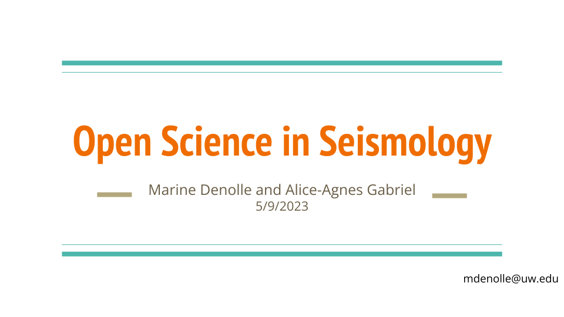

# 1.1 Open Reproducible Science

🖥️ [**Lecture slides — Session 01 (Wed Sep 30)**](https://geo-smart.github.io/mlgeo-book/slides/2026/lec01_why_ml_geosciences.html)

🖥️ [**Lecture slides — Session 02 (Fri Oct 2)**](https://geo-smart.github.io/mlgeo-book/slides/2026/lec02_your_workbench.html)

Open, reproducible science is the working standard for this course. Every homework and the final project are graded partly on whether someone else could rerun your analysis and get your result. This page explains what that means in practice: open science, the FAIR principles, licenses, data citation, preprints, and why reproducibility matters more now that AI writes a lot of the code.

Two complements to this lesson (not substitutes for it):

[](https://docs.google.com/presentation/d/1SCrx65-Q_CB8JRMN81Uk-QniPvPE-wozRD7YDDQEapc/edit?usp=sharing)

[](https://www.youtube.com/watch?v=WeZ2vJxBuTg)

## Why a lecture on reproducibility?

Because most published computational results cannot be rerun. That holds across science and in the geosciences specifically, and it has been measured.

**Across science.** The well-known audits come from outside our field:

| Study | What was tested | Outcome |
|---|---|---|
| Begley & Ellis (2012), *Nature* | 53 "landmark" preclinical cancer papers, repeated at Amgen | findings confirmed in 6 (11%) |
| Open Science Collaboration (2015), *Science* | 100 psychology experiments, rerun with new participants | 97% of originals significant; 36% of replications significant; effects half as large |
| Baker (2016), *Nature* survey | 1,576 researchers asked about their own experience | 72% had failed to reproduce someone else's result, 56% their own |
| Stodden, Seiler & Ma (2018), *PNAS* | 204 computational papers in *Science* after its 2011 code-sharing policy | artifacts obtained for 44%; results reproduced for 26% |
| Kapoor & Narayanan (2023), *Patterns* | published ML-based science in 17 fields | data leakage found in 294 papers |

Baker's survey numbers are recomputed from the raw survey data that *Nature* published on figshare (doi:10.6084/m9.figshare.3394951). Earth and environmental scientists made up 95 of the 1,576 respondents: 61 of them (64%) had failed to reproduce another group's result and 39 (41%) their own. We are no exception.

**In the geosciences.** Audits of our own literature give the same picture:

| Study | Corpus | Outcome |
|---|---|---|
| Stagge et al. (2019), *Scientific Data* | 360 of 1,989 articles from six hydrology and water-resources journals, 2017 | results reproduced for 1.6% of the articles tested; 95% confidence interval 0.6–6.8% for all 1,989 |
| Nüst et al. (2018), *PeerJ* | 32 award-nominated GIScience conference papers (AGILE), 2010–2017 | none reached the top reproducibility level in any category; 19 of 32 at the lowest level for data |
| Konkol, Kray & Pfeiffer (2019), *IJGIS* | R code of 41 open-access papers (31 Copernicus geoscience articles from 2016–2017, plus the 10 most-cited *Journal of Statistical Software* R-package papers), rerun in a clean container | code ran without issues for 2; 33 ran after fixes, 2 partially, 4 not at all; 15 required contacting the authors; 173 issues in 39 papers; 46 of 97 regenerated figures differed from the published ones in content |
| Ireland et al. (2023), *Seismica* | 200 geophysics articles and the policies of 20 journals | ~86% carried a data availability statement, but the original data were accessible for 54% and the software was named in 49% |
| Massonnet et al. (2020), *Geoscientific Model Development* | one Earth system model (EC-Earth3) run on different high-performance computing (HPC) systems | the older model version gave statistically different climates on different machines |

The Konkol et al. survey of 146 geoscientists recruited at the 2016 European Geosciences Union General Assembly shows the same gap from the authors' side: 49% said they often or always publish results others can recompute, but 33% linked to their data and 12% to their code. Massonnet et al. conclude that "the default assumption should be that ESMs are not replicable under changes in the HPC environment, until proven otherwise." A data availability statement is not the data, and a named model is not the run. Hutton et al. (2016) put the consequence bluntly in the title of a *Water Resources Research* commentary: "Most computational hydrology is not reproducible, so is it really science?"

**Three geoscience cases worth knowing in detail.**

- *Ocean heat uptake, 2018.* Resplandy et al. published in *Nature* an estimate of ocean warming from atmospheric O₂ and CO₂. An independent reader, Nicholas Lewis, worked through the published numbers and found that systematic errors had been treated as random. Correcting them left the central estimate close to its original value but increased the uncertainty roughly fourfold. The paper was retracted in 2019 and a revised version appeared in *Scientific Reports*. The analysis was reproducible; that is how the error was found. The claim of a tightly constrained, high value was not supported.
- *Deep learning of aftershock locations, 2018–2019.* DeVries et al. (2018, *Nature*) trained a neural network with 13,451 parameters on more than 131,000 mainshock–aftershock pairs and reported an area under the curve (AUC) of 0.849, against 0.583 for Coulomb stress change. Mignan & Broccardo (2019, *Nature*) showed that logistic regression with two free parameters reaches AUC = 0.85. Separately, a data scientist argued that the same earthquakes appeared in both training and test sets; the authors disputed the claim. The headline number reproduced. The interpretation, that deep learning had extracted physics that simpler models miss, did not survive a baseline.
- *The "hockey stick", 1998–2019.* Mann, Bradley & Hughes (1998, 1999) reconstructed Northern Hemisphere temperature over the past millennium. McIntyre & McKitrick (2005, *GRL*) argued that the principal-component centering choice could produce a hockey-stick shape from red noise. Wahl & Ammann (2007, *Climatic Change*) reimplemented the method independently, tested the criticisms, and found the reconstruction robust to them. The PAGES 2k Consortium (2013, 2019, *Nature Geoscience*) then used a new global proxy database of 692 records and seven statistical methods, and reached the same conclusion: recent warming exceeds anything in the Common Era. This is the full path from a contested result to a strong one, and the next section names each step.

The common thread is that reproducibility did not prove any of these results right or wrong. It made them checkable. The Turing Way lists "being reproducible does not mean the answer is right" as one of its barriers to reproducible research, and that is the point of the next section.

## Reproducible, replicable, robust, generalisable

*The Turing Way* {cite:p}`the_turing_way_community_2025_15213042` organizes the vocabulary as a two-by-two table. Hold the research question fixed; then ask whether the data and the analysis are the same as the original or different.

|  | **Same data** | **Different data** |
|---|---|---|
| **Same analysis** | **Reproducible**: the same steps on the same data give the same answer | **Replicable**: the same analysis on different data gives a qualitatively similar answer |
| **Different analysis** | **Robust**: a different workflow on the same data gives a qualitatively similar answer | **Generalisable**: the answer holds across new data and new analyses |

```{figure} https://raw.githubusercontent.com/the-turing-way/the-turing-way/main/book/figures/reproducible-definition-grid.svg
:width: 80%
:name: turing-way-definition-grid

The four combinations of same or different data and analysis. *The Turing Way* project illustration by Scriberia. Used under a CC-BY 4.0 licence. DOI: [10.5281/zenodo.3332807](https://doi.org/10.5281/zenodo.3332807).
```

Read in machine-learning terms, for a model of GNSS displacement or seismic detection:

| Cell | What changes | What you would do in this course |
|---|---|---|
| Reproducible | nothing | fresh clone, locked environment, documented command regenerates the figure |
| Robust | the analysis | change the random seed, the train/validation/test split design, the preprocessing, or the model family, and compare with a simple baseline |
| Replicable | the data | apply the same pipeline to other stations, another region, or a later time period |
| Generalisable | both | independent groups, data and methods converge on the same conclusion |

The phrase has a geophysical origin: Claerbout & Karrenbach (1992, SEG Annual Meeting), at the Stanford Exploration Project, argued that a seismic-imaging paper should ship with the programs and data that regenerate its figures. Other communities use different words. The National Academies report *Reproducibility and Replicability in Science* {cite:p}`engineering2019confidence`, used in [Chapter 5.1](../Chapter5-ModelWorkflows/5.1_reproducibility.md), defines reproducibility as "obtaining consistent results using the same input data; computational steps, methods, and code; and conditions of analysis," and replicability as "obtaining consistent results across studies aimed at answering the same scientific question, each of which has obtained its own data." Those match the top row of the table. Some fields swap the two words entirely. When you write an assessment, state the operational test (same or different data, same or different analysis) rather than relying on the label.

## What makes a result strong?

A strong result is one that keeps its conclusion as you move across the table. Each cell rules out a different way of being wrong:

| Test passed | What it rules out | What it does *not* rule out |
|---|---|---|
| Reproducible | missing steps, undocumented choices, an environment nobody else can build | a bug, a leak, a bad metric — these reproduce perfectly |
| Robust | a conclusion that depends on one seed, one split, one preprocessing choice, or a missing baseline | something peculiar to this data set |
| Replicable | a conclusion that depends on this station, this region, or this period | a shared blind spot in the method |
| Generalisable | dependence on one data set and one pipeline | nothing is ever settled for good; it is the best available evidence |

So a strong result in this course:

1. reruns from a fresh clone (reproducible);
2. beats a simple baseline and keeps its conclusion under reasonable changes to seed, split design and preprocessing, with the spread reported as an uncertainty (robust);
3. holds on data the model never saw, chosen to differ in location or time from the training data (replicable);
4. states the conditions under which it is expected to fail.

The aftershock case above passed step 1 and failed step 2. The hockey stick passed all four, over two decades, through work by other groups. Homework in this course is graded on step 1. Hidden-test leaderboards (Chapter 3) and the final project push toward steps 2 to 4.

## What is open science?

Open science is the practice of making the products of research — data, code, methods, and papers — available for others to inspect, reuse, and build on. In the geosciences this is not an abstract ideal. Most of the data we use in this book (seismic waveforms, GNSS positions, satellite imagery, climate reanalyses) exists because agencies and researchers published it openly. When you publish your own work the same way, you close the loop.

Open science has several components:

- **Open data**: observations and derived data sets deposited in archives, with documentation.
- **Open source**: analysis code published under a license that permits reuse.
- **Open methods**: workflows described well enough (or scripted well enough) to be repeated.
- **Open access**: papers readable without a paywall, often via preprints.

Reproducibility is the thread through all four: without open data, code and methods, nobody can occupy any cell of the table above except the original team.

## FAIR principles

The FAIR principles (Wilkinson et al., 2016) describe what makes data useful to others:

- **Findable**: the data has a persistent identifier (a DOI) and rich metadata, and is indexed somewhere searchable.
- **Accessible**: the data can be retrieved by a standard protocol (HTTPS, not "email the author").
- **Interoperable**: the data uses open, documented formats (CSV, NetCDF, HDF5, GeoTIFF) and standard vocabularies, so it can be read across languages and tools.
- **Reusable**: the data carries a clear license and enough provenance information that someone else can judge whether it fits their purpose.

When you assemble an AI-ready data set in Chapter 2, you will apply these to your own products: archive the data, document the provenance, attach a license, get a DOI.

Geoscience data is often data about place, and data about place can carry obligations that a license file does not capture — local regulations, community agreements, or national data policies. Before assuming open publication is appropriate, check the terms under which the data were collected.

## Licenses

Without a license, others legally cannot reuse or modify your work, even if it sits in a public repository. "Public" does not mean "licensed." So every repository you create in this course carries a license file.

**Software licenses.** The common open source choices:

- **MIT** and **BSD**: permissive. Anyone can reuse the code, including commercially, as long as they keep the copyright notice. Most scientific Python packages (numpy, pandas, scikit-learn) use these.
- **GPL**: copyleft. Reuse is allowed, but derivative works must carry the same license.

[choosealicense.com](https://choosealicense.com/) walks you through the choice. For coursework, MIT is a sensible default. The [Turing Way licensing chapter](https://book.the-turing-way.org/reproducible-research/licensing) has a longer discussion.

**Data and text licenses.** Software licenses are written for code and fit data poorly. For data sets, documentation, and figures, use Creative Commons:

- **CC-BY**: reuse with attribution. The common choice for data sets and papers.
- **CC0**: public domain dedication, no conditions. Common for data where attribution tracking is impractical.

A repository that contains both code and data can carry two licenses — say, MIT for the code and CC-BY for the data — with the split stated in the README.

## What a reusable repository contains

Beyond the license, a repository that others (including future you) can use has:

- **README.md**: the center piece of the documentation. What the project is, how to install it, basic usage, how to cite it, how to get help. See [awesome-readme](https://github.com/matiassingers/awesome-readme) for good examples. A citation block in BibTeX belongs here:

  ```
  @software{MLGeo,
  authors = {The GeoSMART team},
  year = 2023,
  doi = {10.5281/zenodo.7838345}
  }
  ```

- **LICENSE**: as above. You may need separate language for software and data.
- **CONTRIBUTING.md**: what contributions are welcome and how to make them. [Awesome contributing guides](https://github.com/mntnr/awesome-contributing) has examples.
- **An environment specification**: `pixi.toml` and `pixi.lock`, or `environment.yml`, or `requirements.txt`, so the software environment can be rebuilt (see [1.3](1.3_python_environment.md)).

The [Software Carpentries Intermediate Research Software Development](https://carpentries-incubator.github.io/python-intermediate-development/) lessons cover this in depth {cite:p}`software_carpentries_intermediate`.

## Data citation and DOIs

A DOI (Digital Object Identifier) is a persistent identifier that resolves to a data set, paper, or software release forever, even if the hosting URL changes. Data with a DOI can be cited like a paper, which is how data producers get credit — and why archives require you to cite the data you use. When this book downloads GNSS data from the Nevada Geodetic Laboratory in [1.7](1.7_get_geodetic_gnss.ipynb), we cite Blewitt et al. (2018). Do the same for every data set in your project.

[Zenodo](https://zenodo.org), operated by CERN, mints DOIs for free and integrates with GitHub: link your repository once, and every GitHub release is archived on Zenodo with its own DOI automatically. This is how you make your final project citable. GitHub documents the workflow [here](https://docs.github.com/en/repositories/archiving-a-github-repository/referencing-and-citing-content). Domain-specific archives (PANGAEA, EarthScope, national data centers) serve the same role for observational data.

## Preprints

A preprint is the manuscript posted publicly before (or during) peer review. In the Earth sciences, the main servers are [EarthArXiv](https://eartharxiv.org/) and [ESS Open Archive (ESSOAr)](https://essopenarchive.org/). Preprints make results available months to years earlier than journals, carry DOIs, and are citable. Most geoscience journals permit preprinting; check the journal's policy. Reading preprints is also part of the weekly literature work in this course, with the standard caution: a preprint has not yet been peer reviewed, so read it with the same critical eye you will learn to apply to AI output.

## Reproducibility in the AI era

You might expect AI assistants to make reproducibility concerns obsolete: if the code can be regenerated on demand, why archive it? The opposite is true.

- **AI-generated code is not deterministic.** Ask the same assistant the same question twice and you get different code. The only record of what you actually ran is the code you committed, in the environment you locked.
- **Volume goes up, scrutiny per line goes down.** An assistant can produce a working-looking analysis in minutes. Whether it computed what you think it computed is a separate question, and the answer lives in the committed code, not in your memory of the prompt.
- **Provenance now includes the AI.** Disclosing which tools were used, for what, is part of the methods, exactly like naming the software packages and versions. The course policy is in [1.8](1.8_ai_in_your_workflow.md).
- **Verification is the new bottleneck.** When code is cheap, the reproducible artifact — locked environment, pinned data, scripted workflow, committed outputs — is what lets a human (you, a teammate, a reviewer) check the work efficiently.

Chapter 5 develops this into a full workflow: environments as lockfiles, data versioning, and experiment tracking. For now, the rule is simple: everything that produced a figure or a number in your project is committed, licensed, and rerunnable.

## Further reading

- [The Turing Way](https://book.the-turing-way.org/) {cite:p}`the_turing_way_community_2025_15213042` — the reference handbook for reproducible research
- Wilkinson et al. (2016), [The FAIR Guiding Principles](https://doi.org/10.1038/sdata.2016.18)
- The Turing Way: [definitions](https://book.the-turing-way.org/reproducible-research/overview/overview-definitions), [barriers](https://book.the-turing-way.org/reproducible-research/overview/overview-barriers), and [benefits](https://book.the-turing-way.org/reproducible-research/overview/overview-benefit) of reproducible research

**Cases and audits cited above**

- Begley, C. G., & Ellis, L. M. (2012). Raise standards for preclinical cancer research. *Nature*, 483, 531–533. [doi:10.1038/483531a](https://doi.org/10.1038/483531a)
- Open Science Collaboration (2015). Estimating the reproducibility of psychological science. *Science*, 349, aac4716. [doi:10.1126/science.aac4716](https://doi.org/10.1126/science.aac4716)
- Baker, M. (2016). 1,500 scientists lift the lid on reproducibility. *Nature*, 533, 452–454. [doi:10.1038/533452a](https://doi.org/10.1038/533452a)
- Stodden, V., Seiler, J., & Ma, Z. (2018). An empirical analysis of journal policy effectiveness for computational reproducibility. *PNAS*, 115, 2584–2589. [doi:10.1073/pnas.1708290115](https://doi.org/10.1073/pnas.1708290115)
- Kapoor, S., & Narayanan, A. (2023). Leakage and the reproducibility crisis in machine-learning-based science. *Patterns*, 4, 100804. [doi:10.1016/j.patter.2023.100804](https://doi.org/10.1016/j.patter.2023.100804)
- Stagge, J. H., et al. (2019). Assessing data availability and research reproducibility in hydrology and water resources. *Scientific Data*, 6, 190030. [doi:10.1038/sdata.2019.30](https://doi.org/10.1038/sdata.2019.30)
- Hutton, C., et al. (2016). Most computational hydrology is not reproducible, so is it really science? *Water Resources Research*, 52, 7548–7555. [doi:10.1002/2016WR019285](https://doi.org/10.1002/2016WR019285)
- Claerbout, J., & Karrenbach, M. (1992). Electronic documents give reproducible research a new meaning. *SEG Technical Program Expanded Abstracts 1992*, 601–604. [doi:10.1190/1.1822162](https://doi.org/10.1190/1.1822162)
- Nüst, D., et al. (2018). Reproducible research and GIScience: an evaluation using AGILE conference papers. *PeerJ*, 6, e5072. [doi:10.7717/peerj.5072](https://doi.org/10.7717/peerj.5072)
- Konkol, M., Kray, C., & Pfeiffer, M. (2019). Computational reproducibility in geoscientific papers: Insights from a series of studies with geoscientists and a reproduction study. *International Journal of Geographical Information Science*, 33, 408–429. [doi:10.1080/13658816.2018.1508687](https://doi.org/10.1080/13658816.2018.1508687)
- Ireland, M., et al. (2023). How reproducible and reliable is geophysical research? *Seismica*, 2(1). [doi:10.26443/seismica.v2i1.278](https://doi.org/10.26443/seismica.v2i1.278)
- Massonnet, F., et al. (2020). Replicability of the EC-Earth3 Earth system model under a change in computing environment. *Geoscientific Model Development*, 13, 1165–1178. [doi:10.5194/gmd-13-1165-2020](https://doi.org/10.5194/gmd-13-1165-2020)
- Resplandy, L., et al. (2018). Quantification of ocean heat uptake from changes in atmospheric O₂ and CO₂ composition. *Nature*, 563, 105–108. Retracted 2019, [doi:10.1038/s41586-019-1585-5](https://doi.org/10.1038/s41586-019-1585-5); revised in *Scientific Reports*, 9, 20244, [doi:10.1038/s41598-019-56490-z](https://doi.org/10.1038/s41598-019-56490-z)
- DeVries, P. M. R., et al. (2018). Deep learning of aftershock patterns following large earthquakes. *Nature*, 560, 632–634. [doi:10.1038/s41586-018-0438-y](https://doi.org/10.1038/s41586-018-0438-y)
- Mignan, A., & Broccardo, M. (2019). One neuron versus deep learning in aftershock prediction. *Nature*, 574, E1–E3. [doi:10.1038/s41586-019-1582-8](https://doi.org/10.1038/s41586-019-1582-8)
- McIntyre, S., & McKitrick, R. (2005). Hockey sticks, principal components, and spurious significance. *Geophysical Research Letters*, 32, L03710. [doi:10.1029/2004GL021750](https://doi.org/10.1029/2004GL021750)
- Wahl, E. R., & Ammann, C. M. (2007). Robustness of the Mann, Bradley, Hughes reconstruction of Northern Hemisphere surface temperatures. *Climatic Change*, 85, 33–69. [doi:10.1007/s10584-006-9105-7](https://doi.org/10.1007/s10584-006-9105-7)
- PAGES 2k Consortium (2019). Consistent multidecadal variability in global temperature reconstructions and simulations over the Common Era. *Nature Geoscience*, 12, 643–649. [doi:10.1038/s41561-019-0400-0](https://doi.org/10.1038/s41561-019-0400-0)
