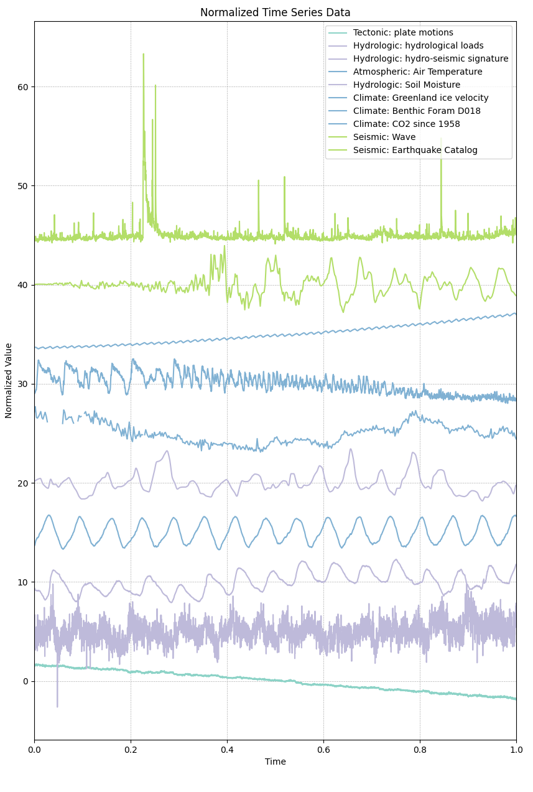

# 1.6 Data Gallery

This course provides various tracks for students in geosciences. The data sets can be downloaded and used throughout to use in the various exercises (e.g., classification, regression, clustering ...)

The tracks are: geophysical sciences (seismology and geodetic tracks), cryospheric sciences, atmospheric sciences, ocean sciences, hydrology, and forestry.

We provide a series of small, curated data set for the course. These data set are open-access data, with their own licenses.

To download similar data, we made a MLGEO-dataset (https://github.com/UW-MLGEO/MLGeo-dataset).


# How to Download a File from a MLGeo-dataset Repository

To download a file from a GitHub repository, follow these steps:

1. **Identify the File URL**:
   - Navigate to the CSV file in the GitHub repository.
   - Click on the file to view its contents.
   - Click the "Raw" button to get the direct URL to the file.

2. **Construct the Download URL**:
   
   The URL format is:
   ```
   https://raw.githubusercontent.com/UW-MLGEO/MLGEO-dataset/main/data/file.csv
   ```

4. **Download the File**:
   You can use various methods to download the file, such as using a web browser, `wget`, or `curl`. Open your terminal and run:
   ```sh
   wget https://raw.githubusercontent.com/UW-MLGEO/MLGEO-dataset/main/data/EarthRocGranites.csv
   ```

## Description of data

The collection of data aims to represent the diversity of data sets encountered in the geosciences.

The data includes time series of various time scales (from the second to the 100ka). The data is stored either in CSV files for the class, but typically is stored in CSV, Arrow, H5, NetCDF, TileDB, mseed and other disciplinary-specific format.

<!-- For Vscode -->


<!-- For Jupyter Book -->
```{figure} geocast-alldata.png
:width: 400px
---
name: Geoscientific Temporal Data 
alt: PhD Comics, Version Control of a PhD
---
```
*Figure 1: Geoscience Temporal Data: x-axis represent time normalized, y-axis is normalized time series offset by indexing in the data set. The data sets includes extreme events, dynamic seismic waves, CO2 rising, seasonal pattern over 15+ years such as hydrological and weather signals.*
