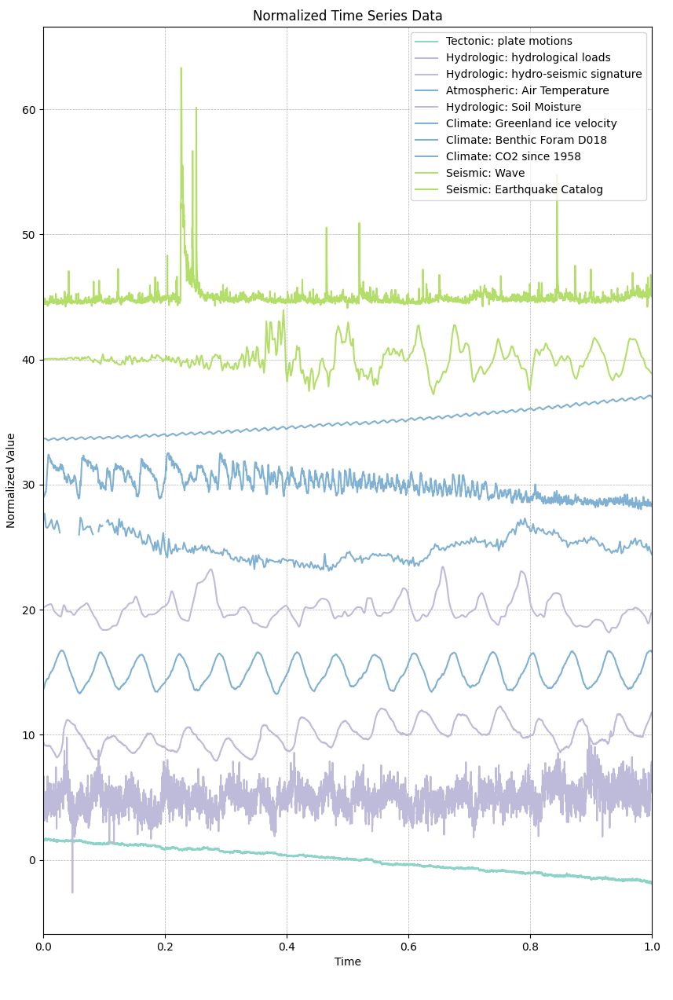

# 1.6 Data Gallery

This course provides various tracks for students in geosciences. The data sets can be downloaded and used throughout the various exercises (e.g., classification, regression, clustering ...).

The tracks are: geophysical sciences (seismology and geodetic tracks), cryospheric sciences, atmospheric sciences, ocean sciences, hydrology, and forestry.

We provide a series of small, curated data sets for the course. These are open-access data, each with its own license.

The collection lives in the [UW-MLGEO/MLGeo-dataset](https://github.com/UW-MLGEO/MLGeo-dataset) repository.

## How to download a file from the MLGeo-dataset repository

To download a file from a GitHub repository, follow these steps:

1. **Identify the file URL**:
   - Navigate to the CSV file in the GitHub repository.
   - Click on the file to view its contents.
   - Click the "Raw" button to get the direct URL to the file.

2. **Construct the download URL**:

   The URL format is:
   ```
   https://raw.githubusercontent.com/UW-MLGEO/MLGeo-dataset/main/data/file.csv
   ```

3. **Download the file with pooch**:

   [pooch](https://www.fatiando.org/pooch/) is a small Python library made for exactly this: fetch a file from a URL, cache it locally, and check its integrity.

   ```python
   import pooch

   fname = pooch.retrieve(
       url="https://raw.githubusercontent.com/UW-MLGEO/MLGeo-dataset/main/data/EarthRocGranites.csv",
       known_hash=None,
   )
   ```

   `pooch.retrieve` downloads the file once, stores it in a local cache, and returns the path; later calls reuse the cached copy. With `known_hash=None`, pooch prints the SHA256 checksum of what it downloaded. Paste that checksum back into `known_hash="sha256:..."` in your code: from then on, pooch verifies every download against it and raises an error if the file on the server has changed. That is a small, cheap piece of reproducibility — you know your analysis ran on the file you think it did.

   As an aside, the shell equivalents work too, without caching or checksums:
   ```sh
   wget https://raw.githubusercontent.com/UW-MLGEO/MLGeo-dataset/main/data/EarthRocGranites.csv
   # or: curl -O <url>
   ```

## Description of data

The collection of data aims to represent the diversity of data sets encountered in the geosciences.

The data includes time series across time scales (from the second to the 100 ka). The data is stored in CSV files for the class, but is typically stored in CSV, Arrow, H5, NetCDF, TileDB, mseed, and other discipline-specific formats.

### Licenses and citation

Every data set page in the MLGeo-dataset repository must carry two things: the license under which the data is distributed, and the citation for the data producer. When you reuse a data set, carry both forward into your own repository. For the flagship data sets, where known:

- **Mauna Loa CO2 record** (`data_co2.csv`): produced by NOAA Global Monitoring Laboratory; as a US government work it is in the public domain. Cite NOAA GML.
- **LR04 benthic stack** (`lr04.csv`): published research data; cite Lisiecki & Raymo (2005), doi:10.1029/2004PA001071.
- **Global earthquake catalog** (`Global_Quakes_IRIS.csv`): from EarthScope (formerly IRIS) services, openly distributed; cite EarthScope/USGS.
- **PNSN earthquake catalogs** (`pnsn_catalog.csv` and related): openly distributed by the Pacific Northwest Seismic Network; cite PNSN.
- **Arctic sea ice concentration** (`noaav4_nh_monthly_sic_1978_2024.nc`): NOAA/NSIDC Climate Data Record, openly distributed; cite the NSIDC data set.
- **Jakobshavn ice data** (`data_ice_jakobshavn.csv`): cite the original data producer listed on the data set page.
- For the remaining files (e.g., `water_potability.csv`, SDSS Skyserver extracts), the license is stated on the data set page; if a page is missing one, that is a bug — open an issue.




```{figure} geocast-alldata.png
:width: 400px
---
name: Geoscientific Temporal Data 
alt: Geoscientific Temporal Data 
---
Figure 1: Geoscience Temporal Data: x-axis represent time normalized, y-axis is normalized time series offset by indexing in the data set. The data sets includes extreme events, dynamic seismic waves, CO2 rising, seasonal pattern over 15+ years such as hydrological and weather signals.
```
*Figure 1: Geoscience Temporal Data: x-axis represent time normalized, y-axis is normalized time series offset by indexing in the data set. The data sets includes extreme events, dynamic seismic waves, CO2 rising, seasonal pattern over 15+ years such as hydrological and weather signals.*
