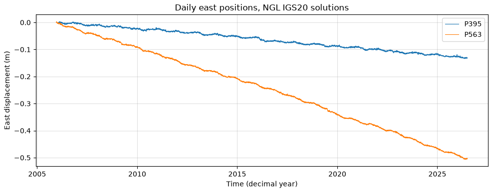

## {background-color="#faf7f2"}

[🌋]{.lecture-icon}

### Today's question

An AI assistant can draft a working analysis in minutes.

**What is left that only the scientist can do?**

::: {.dim}
Reading: [1.1 Open reproducible science](https://geo-smart.github.io/mlgeo-book/open-reproducible-science)
:::

::: {.notes}
Welcome to ESS 469/569. Before this slide: names, who is in the room (geophysics, oceanography, geology, hydrology, engineering — this course is built for you, not for CS majors), and the one-page syllabus tour. Then pose the question and let it sit: in 2026 the code is cheap. The course's answer, which every week develops: framing the problem, judging the evaluation, and interpreting the science stay human. Ask for a show of hands — who has already used an AI assistant for research code? Most hands will go up; that is the starting condition of the course, not a confession.
:::

## This lecture in the literature



::: {.takeaway}
Two maps of the opportunity, one measurement of the failure mode. The refs file updates as the field moves — bring me candidates.
:::

::: {.notes}
Two minutes per paper. Bergen et al. is the Science survey of what ML has already done in solid-Earth geoscience — earthquake detection, pattern discovery in lab friction data, emulation of expensive simulations; it is the optimistic map, and one of the two anchor readings for the reading arc. Karpatne et al. is the other side: why our data resist off-the-shelf methods — physical constraints, correlated samples, rare events, few labels; it reads like a syllabus for Chapter 2. Kapoor & Narayanan is the caution: a systematic review finding leakage-driven overoptimism in ML-based science across 17 fields — the exact failure the fair-evaluation thread of this course exists to prevent. Point students at these as the first entries of their reading arc.
:::

## Twenty years of ground motion, measured daily

{.r-stretch}

::: {.takeaway}
GNSS stations P395 and P563, Pacific Northwest — daily positions to a few millimeters (Nevada Geodetic Laboratory). The smooth drift is plate motion; the wiggles are seasonal water loading.
:::

::: {.notes}
This is the course's first data set; notebook 1.7 downloads it live and it returns in Chapters 2 and 3. A permanent GNSS station measures its own position every day to a few millimeters. Read the slope aloud: P563 moves west about 2.5 cm/yr — plate tectonics visible in a pandas dataframe. P395 gives 7,418 daily data samples for one component alone. Ask the room: what could you extract from this? (Velocities, seasonal loading, earthquake offsets, slow slip.) Also the open-science point: this exists because NGL publishes it freely — cite Blewitt et al. (2018, Eos) when you use it. That habit, data citation, is part of section 1.1.
:::

## What ML does for the geosciences

- **Automation** — catalog events at rates no human analyst can match
- **Discovery** — structure nobody labeled, in data nobody can read whole
- **Emulation** — fast stand-ins for expensive physical simulations
- **Forecasting** — the next value, with honest uncertainty

::: {.dim}
The fifth canonical use, signal processing — denoising, gap filling — rides with automation. Matching method to question is learning outcome #1.
:::

::: {.takeaway}
Every one of these already runs in production somewhere in the geosciences.
:::

::: {.notes}
Give one concrete example per line. Automation: deep-learning phase pickers now build earthquake catalogs with many times more events than analyst catalogs. Discovery: clustering found new families of repeating signals in continuous seismic data and unexpected regimes in ocean color. Emulation: ML surrogates for ground-motion simulation and ocean models run in milliseconds instead of node-hours. Forecasting: streamflow and shaking forecasts, where the uncertainty statement matters as much as the number. The pattern across all four: the geoscience question comes first, the method second — the ordering this course enforces on every slide. The next four slides make this concrete: four cases where ML genuinely transformed a science.
:::

## Transformation 1 — a fifty-year problem, solved

::: {.big-number}
200,000,000+ [predicted protein structures, released open]{.unit}
:::

Protein structure prediction reached experimental accuracy — a problem open since the 1960s — and the 2024 Nobel Prize in Chemistry followed.

[Jumper, J., et al. (2021). Highly accurate protein structure prediction with AlphaFold. *Nature*, 596, 583–589.]{.ref-cite}

::: {.takeaway}
Scientific discovery: ML answered a question the field could not.
:::

::: {.notes}
AlphaFold 2 at CASP14 (2020): median backbone accuracy comparable to experiment. The database now covers essentially every catalogued protein. Why show a biology example in a geoscience course? Because it is the cleanest existence proof that ML can *solve* a scientific problem, not just speed one up — and because its recipe (a hard benchmark, honest held-out evaluation, physics-informed architecture) is exactly this course's recipe. Nobel: Hassabis, Jumper, Baker 2024.
:::

## Transformation 2 — the forecast that left the supercomputer

::: {.big-number}
< 1 minute [for a 10-day global forecast, on one processor]{.unit}
:::

Machine-learned weather models now beat the leading physics-based system on most verification targets — at a thousandth of the compute. Operational centers run them today.

[Lam, R., et al. (2023). Learning skillful medium-range global weather forecasting. *Science*, 382, 1416–1421.]{.ref-cite}

::: {.takeaway}
Acceleration: hours on a supercomputer became seconds — and the workflow changed shape.
:::

::: {.notes}
GraphCast (2023): outperformed ECMWF's high-resolution physics forecast on ~90% of 1,380 verification targets, running in under a minute on a single TPU versus hours on a supercomputer. ECMWF now runs its own operational AI forecast system alongside the physics one. The deeper change: when a forecast costs seconds, you can run enormous ensembles — uncertainty becomes cheap. Chapter 4.10 puts a small transformer forecaster in students' hands; same idea, classroom scale. Verification vocabulary (skill, baselines, lead time) is lecture 26.
:::

## Transformation 3 — ten times more earthquakes, same sensors

::: {.big-number}
1,810,000 [earthquakes in ten years of Southern California data]{.unit}
:::

Template matching and deep learning re-read an existing archive and found ~10x the cataloged earthquakes — no new instrument installed. Fault structures and foreshock sequences appeared where the catalog had been blank.

[Ross, Z. E., et al. (2019). Searching for hidden earthquakes in Southern California. *Science*, 364, 767–771.]{.ref-cite}

::: {.takeaway}
Transformed inquiry in our own field: the data were already there — the method made them legible.
:::

::: {.notes}
The QTM catalog: 1.81 million events versus ~180,000 in the standard catalog, from the same decade of waveforms. Deep phase pickers (PhaseNet, EQTransformer) made this routine; dense catalogs changed what seismologists can ask — foreshock prevalence, fault-zone geometry, swarm dynamics. This is the course's home discipline, and the running example: lecture 22's detector is the classroom-scale version, including the honest part — our synthetic-trained CNN collapses on real waveforms, which is why evaluation discipline is the course's spine.
:::

## Transformation 4 — a map of materials that don't exist yet

::: {.big-number}
~381,000 [new stable crystals predicted — an order of magnitude beyond the known set]{.unit}
:::

Deep learning proposed millions of candidate crystal structures and filtered them to hundreds of thousands of stable ones — a century of conventional discovery rate, compressed.

[Merchant, A., et al. (2023). Scaling deep learning for materials discovery. *Nature*, 624, 80–85.]{.ref-cite}

::: {.takeaway}
Discovery at scale: the search space itself became the instrument.
:::

::: {.notes}
GNoME: 2.2 million predicted structures, ~381k passing stability filters — roughly 10x the stable materials humanity had catalogued. The geoscience rhyme: mineral prospectivity, ice-nucleating particles, aerosol chemistry — anywhere the candidate space dwarfs the lab's throughput. The caution belongs in the same breath: predictions are hypotheses; lab synthesis is the test set. Ask the class: what is the equivalent search space in *your* field?
:::

## The course: three pillars and a running thread

| Pillar | Where | You leave able to |
|---|---|---|
| **AI-ready data** | Chapter 2 | turn a raw sensor stream into a data set a model can learn from |
| **Classic machine learning** | Chapter 3 | train feature-based models and evaluate them honestly |
| **Deep learning** | Chapter 4 | build and diagnose networks in PyTorch |
| **Working with agentic AI** | Chapters 1 & 6, woven throughout | verify, disclose, and evaluate AI help |

::: {.takeaway}
The fourth row is the 2026 difference: a skill to be taught, not a shortcut to be policed.
:::

::: {.notes}
Walk the arc of the quarter: Chapter 2 is roughly weeks 2–4 (the data work is half the course, on purpose — it is where projects live or die), Chapter 3 weeks 5–7, Chapter 4 weeks 8–10, and the agent thread is deliberately early: policy Monday (week 2), a critical-evaluation lab in week 4, agent evals in week 7. Chapters 5 and 7 arrive as flipped reading and project scaffolding. Mention the final project now: teams, a real data set, proposal due Oct 30 — start thinking about data today, since the data gallery browse at the end of class feeds it.
:::

## Why 2026 is different

::: {.big-number}
minutes [for an assistant to draft a working analysis of that GNSS series]{.unit}
:::

::: {.big-number}
3 [jobs that stay yours: frame the problem, judge the evaluation, interpret the science]{.unit}
:::

::: {.takeaway}
"If you can do these three, an assistant makes you faster. If you cannot, an assistant makes you wrong at scale." — course policy, 1.8
:::

::: {.notes}
Be concrete about the first number: "load the GNSS series from 1.7 and fit a linear trend to the east component" — a current agentic assistant often produces a working notebook in one pass. So the graded skills have moved to what the tools cannot do: deciding what question the data can answer, whether the evaluation is honest, and what the result means physically. Judgment is the scarce skill; syntax is not. Preview Monday's session, which turns this into explicit policy and mechanism. This is also why grading leans on evaluations, disclosure, and defending your choices rather than on whether code runs.
:::

## Open, reproducible science — the working standard

- **Reproducible**: your code + your data give your numbers, on someone else's machine
- **Replicable**: new data, new code, same conclusion
- This course grades the first and aims for the second
- Everything behind a figure: committed, licensed, citable, rerunnable

::: {.takeaway}
Open data built this field — waveforms, GNSS, imagery arrive free. Publishing your work the same way closes the loop.
:::

::: {.notes}
This is section 1.1, today's reading. Define the FAIR principles aloud (findable, accessible, interoperable, reusable) and the two practical habits: a license file in every repository ("public" does not mean "licensed" — without a license nobody may legally reuse your work) and a DOI for anything citable (Zenodo mints them free from GitHub releases). Then the AI-era twist from 1.1: you might think regenerable code makes archiving obsolete — the opposite. AI-generated code is not deterministic; the committed code in the locked environment is the only record of what actually ran. Verification is the new bottleneck, and the reproducible artifact is what makes verification possible.
:::

## The course promise: fair evaluation

- Design the evaluation **before** the model: baseline, data design, metric
- Week 7, twice — honest validation for models (3.8), then for AI agents (6.3)
- Leaderboards score you on hidden test data, the way deployment does
- Capstone: your own review agent, tested against ground truth

::: {.takeaway}
One idea, applied to everything you build this quarter — including the AI.
:::

::: {.notes}
This is the spine of the course, worth naming on day one. The story students will live: in week 7 they watch a model's score collapse when validation days move from shuffled-into-training to the future — same model, same data, different question. The following Friday they apply the identical discipline to an AI agent: task spec, eval set with ground truth, failure analysis. The Kapoor & Narayanan paper on the literature slide is what happens at field scale when this discipline is missing. Promise them: by December, "what was your baseline and what did your test set hold out?" will be the first question they ask of any paper, any leaderboard, any AI demo.
:::

## Today, in one table

| Idea | Geoscience example | Where it lands |
|---|---|---|
| ML's canonical uses | picking earthquakes in continuous waveforms | Chapters 3–4 |
| Open, reproducible science | NGL data cited; your repository licensed and rerunnable | every submission |
| Fair evaluation | validate the GNSS model on future days, not shuffled days | 3.8 → 6.3, leaderboards |
| Working with agents | disclose the tool, verify the output | 1.8, Chapter 6 |

::: {.takeaway}
Judgment about data, evaluations, and meaning is the product of this course. The code is a byproduct.
:::

::: {.notes}
Leave this up while taking questions. Each row is a thread, not a topic: canonical uses return as the framing of every method chapter; open science returns as the graded repository standard; fair evaluation returns in week 7 twice and in every leaderboard; the agent thread starts Monday. If a student asks "do we get to use ChatGPT/Claude/Copilot" — yes, expected, with disclosure, and Monday's whole session is the rules and the reasons.
:::

## This week — HW1 is assigned today

1. **HW1** ([1.9](https://geo-smart.github.io/mlgeo-book/workbench-setup-hw1)): pixi, git, GitHub, your `MLGEO2026_UWNETID` repository — due **Mon Oct 12**
2. Read [1.1](https://geo-smart.github.io/mlgeo-book/open-reproducible-science) — Ch 1 quiz opens Tue Oct 6, closes Thu Oct 8
3. Browse the [data gallery (1.6)](https://geo-smart.github.io/mlgeo-book/data-gallery): find one data set that matters to your science
4. Setup trouble? Week-1 **install clinic** in office hours — not in lecture

::: {.dim}
Friday: the workbench lab — version control, environments, your first pull request. Bring a charged laptop.
:::

::: {.notes}
Timing for the 80-minute block (10:00–11:20), session 1 — no pulse talks until week 3: welcome, introductions, syllabus tour ~15 min; this deck ~25 min; in-class exercise ~25 min — pairs browse the data gallery (1.6), and each pair names one data set plus one question ML could ask of it, collected on the board (these seed final-project ideas; proposal due Oct 30); HW1 launch and logistics ~15 min. HW1 is self-serve by design (1.9 has a "success looks like" check at every step); the message to send: start it tonight, the first `pixi install` downloads gigabytes, and help lives in the install clinic, not in Friday's lecture. Friday's session assumes laptops and runs as a lab.
:::
