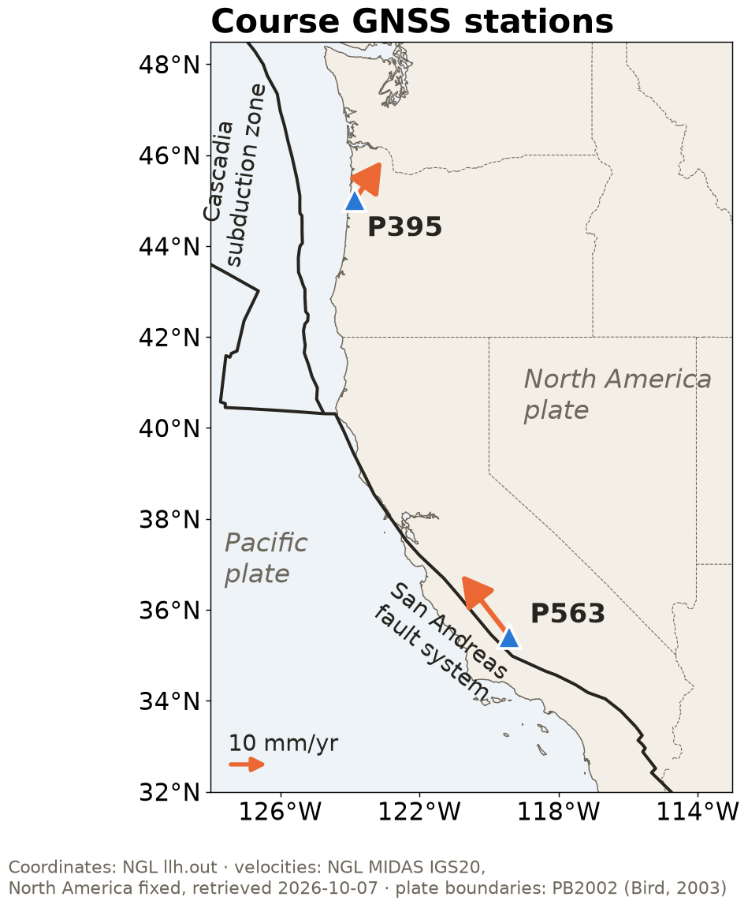
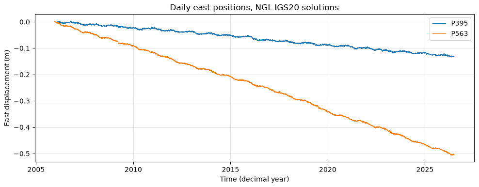
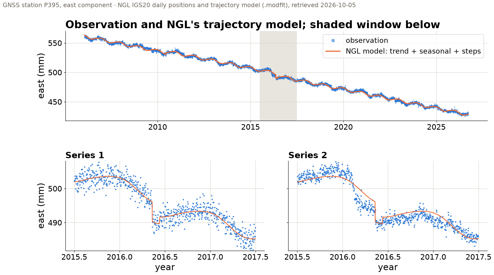
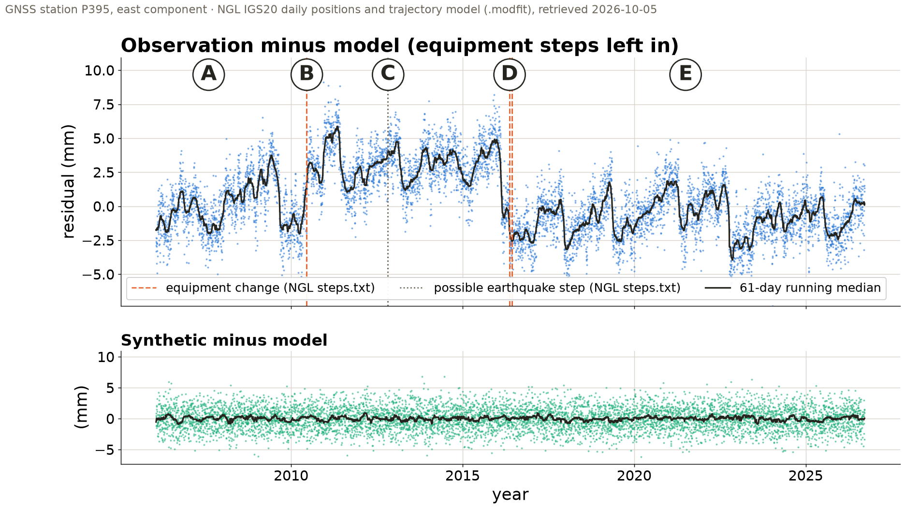

## {background-color="#faf7f2"}

[🌋]{.lecture-icon}

### Today's question

An AI assistant can draft a working analysis in minutes.

**What is left that only the scientist can do?**

::: {.dim}
Reading: [1.1 Open reproducible science](https://geo-smart.github.io/mlgeo-book/open-reproducible-science)
:::

::: {.notes}
Welcome to ESS 469/569. Before this slide: names, who is in the room (geophysics, oceanography, geology, hydrology, engineering — this course is built for you, not for CS majors), and the one-page syllabus tour. Then pose the question and let it sit: in 2026 the code is cheap. The course's answer, which every week develops: framing the problem, judging the evaluation, and interpreting the science stay human. Ask for a show of hands — who has already used an AI assistant for research code? Most hands will go up; that is the starting condition of the course, not a confession.
:::

## This lecture in the literature



::: {.takeaway}
Two maps of the opportunity, one measurement of the failure mode. The refs file updates as the field moves — bring me candidates.
:::

::: {.notes}
Two minutes per paper. Bergen et al. is the Science survey of what ML has already done in solid-Earth geoscience — earthquake detection, pattern discovery in lab friction data, emulation of expensive simulations; it is the optimistic map, and one of the two anchor readings for the reading arc. Karpatne et al. is the other side: why our data resist off-the-shelf methods — physical constraints, correlated samples, rare events, few labels; it reads like a syllabus for Chapter 2. Kapoor & Narayanan is the caution: a systematic review finding leakage-driven overoptimism in ML-based science across 17 fields — the exact failure the fair-evaluation thread of this course exists to prevent. Point students at these as the first entries of their reading arc.
:::

## Twenty years of ground motion, measured daily {.smaller}

:::: {.columns}
::: {.column width="38%"}
{height="600px"}
:::
::: {.column width="62%"}
{width="100%"}

Each point is the station's daily east position, measured to a few millimeters. In this global frame both stations drift west, and 12 to 13 mm/yr of that drift is the North America plate itself. What remains is deformation at the plate boundary (map arrows, relative to stable North America): the Oregon coast at P395 is pushed landward while the Cascadia megathrust is locked, and P563 is carried northwest in the shear zone between the Pacific and North America plates.
:::
::::

::: {.takeaway}
A daily position record measures plate motion, plate-boundary deformation, and seasonal loading in one signal; separating them is a modeling task.
:::

::: {.notes}
This is the course's first data set; notebook 1.7 downloads it live and it returns in Chapters 2 and 3. All rates are NGL MIDAS (IGS20 solution), retrieved 2026-10-05. Read the time series first: it is the east position in the global IGS20 frame. P395 moves east at −6.4 mm/yr and P563 at −23.5 mm/yr in that frame. Relative to stable North America the same stations move +6.9 and −11.9 mm/yr east, so the plate's own motion accounts for 13.3 and 11.6 mm/yr of westward drift; that is the meaning of "reference frame", which session 3 returns to. At P395 the remaining northeast motion is commonly attributed to elastic loading of the upper plate while the subduction interface is locked, with a contribution from rotation of the Oregon forearc (McCaffrey et al., 2013). At P563, about half of the 2.3 cm/yr westward drift is the plate and half is shear across the Pacific–North America boundary zone; the station also subsides at 7.2 mm/yr, a rate consistent with groundwater extraction in the San Joaquin Valley. The annual oscillations at both stations are seasonal signals such as hydrological loading. P395 has 7,496 daily solutions in the course file as of Oct 7, 2026 (the file grows daily). Ask the room: what could you extract from this? (Velocities, seasonal loading, earthquake offsets, slow slip.) Open-science point: this exists because NGL publishes it freely; cite Blewitt et al. (2018, Eos). Data citation is part of section 1.1.
:::

## Spot the synthetic

{.r-stretch}

**One of Series 1 and 2 is the station; the other is NGL's model plus independent random noise of the same size. Which is synthetic, and what gives it away?**

::: {.fragment}
Series 1 is synthetic. The real record wanders for weeks at a time, and its 2016 drop starts in January, months before the step the model places at the antenna change.
:::

::: {.notes}
Three minutes: one minute alone, one with a neighbor, one to collect answers. The top panel is NGL's trajectory model for P395 (east component): a constant rate of −6.4 mm/yr, annual and semi-annual sinusoids, and four steps, all read from NGL's .modfit file; it leaves a 1.8 mm RMS misfit, the value NGL reports. Series 1 adds independent Gaussian noise with that RMS to the model. Most students identify the synthetic from texture: its scatter is the same every day, while real errors are correlated in time. The second clue is the 2016 drop: the model explains it with steps at the equipment changes on 2016-05-12 and 2016-06-10, but the observed decline begins around January. Do not resolve that yet; it is feature D on the next slide.
:::

## Measurement error or model error?

{.r-stretch}

**For each letter, vote: measurement or processing error, physics the model leaves out, or cannot tell yet.**

::: {.notes}
Four minutes: votes by show of hands, letter by letter, before revealing the next slide. The top panel is the observation minus NGL's model with the equipment steps deliberately left in, so they show; the bottom panel is the same operation on the synthetic series, which leaves only noise. Everything the top panel has and the bottom one lacks is information the model does not contain. Dates and event types come from NGL's step catalogue (steps.txt).
:::

## What the residual contains {.smaller .compact}

| | Feature | Most likely cause | Evidence |
|---|---|---|---|
| **A** | day-to-day scatter, 1.8 mm RMS | measurement | receiver noise, multipath, and atmospheric delay; same size as the synthetic noise |
| **B** | +3.0 mm step, June 2010 | measurement system | antenna change in the station log; an antenna shifts the measured phase center, not the ground |
| **C** | nothing, October 2012 | physics hypothesis rejected | catalogue flags a possible step from an M7.8 earthquake 1,051 km away (USGS usp000juhz); NGL's estimate is 0.1 ± 0.08 mm |
| **D** | −5.9 and +2.0 mm, May–June 2016 | both, or cannot tell | antenna and receiver changes, but the decline begins months earlier |
| **E** | wander of several mm over months | model error and correlated noise | absent from the synthetic: seasonal loading that changes from year to year, possible transient deformation, noise correlated in time |

::: {.takeaway}
The model's residual mixes instrument effects, missing physics, and noise; telling them apart is the scientific question, and the place where data-driven methods can help.
:::

::: {.notes}
Reveal after the votes. A: NGL's residual RMS for this fit is 1.83 mm east. B, C, D: the catalogue records equipment changes (code 1) and earthquakes whose epicenter falls within a magnitude-dependent distance of the station (code 2); NGL notes that a flagged earthquake may cause no displacement, and C is such a case: the model includes the step and estimates it as zero within uncertainty. D is the open case: equipment changes explain a jump, but the observed decline starts in early 2016, so part of it may be ground motion or seasonal signal that the constant-amplitude sinusoids miss. E: the synthetic residual shows what independent errors look like; the real residual's months-long excursions mean the errors are correlated or the model is missing physics, and one station cannot separate the two. Neighboring stations can: motion shared across a network is either common-mode error or regional physics.
:::

## Where could machine learning reduce the error? {.smaller .compact}

| Residual feature | A data-driven approach | Where in the course |
|---|---|---|
| A · daily scatter | estimate the error shared by nearby stations and remove it | 2.9 repairing records, Fri Oct 16 |
| B, D · instrument steps | detect offsets and classify them as equipment or ground motion | 2.9; 3.4 rare-event detection, Fri Oct 30 |
| C · catalogue flags | learn which flagged earthquakes produce measurable steps | 3.4 imbalanced classification |
| E · correlated wander | predict the residual from hydrology covariates (rain, snow, soil moisture); group similar transients across stations | 2.11 features, Mon Oct 19; 3.3 clustering, Wed Oct 28; 3.7 forests, Fri Nov 6 |

**Before trusting any of these: how would you know it worked?**

::: {.fragment}
Add signals of known size to synthetic series and check that the method recovers them: section 2.10, Mon Oct 19.
:::

::: {.takeaway}
Machine learning is most useful on what the physical model leaves in the residual, and it has to be tested where the truth is known.
:::

::: {.notes}
Three minutes. Ask each pair to choose one row and say what data they would need and what could go wrong. Common answers to push on: a network filter can remove real regional deformation along with error; a step classifier trained on equipment logs learns what the logs record, not what the ground did; a hydrology regression explains the residual only if the covariates are measured independently of the GNSS record. The fragment is the course's answer to every row: synthetic data with known truth (2.10), which is why Series 1 existed on the earlier slide.
:::

## What ML does for the geosciences

- **Automation** — catalog events at rates no human analyst can match
- **Discovery** — structure nobody labeled, in data nobody can read whole
- **Emulation** — fast stand-ins for expensive physical simulations
- **Forecasting** — the next value, with honest uncertainty

::: {.dim}
The fifth canonical use, signal processing — denoising, gap filling — rides with automation. Matching method to question is learning outcome #1.
:::

::: {.takeaway}
Every one of these already runs in production somewhere in the geosciences.
:::

::: {.notes}
Give one concrete example per line. Automation: deep-learning phase pickers now build earthquake catalogs with many times more events than analyst catalogs. Discovery: clustering found new families of repeating signals in continuous seismic data and unexpected regimes in ocean color. Emulation: ML surrogates for ground-motion simulation and ocean models run in milliseconds instead of node-hours. Forecasting: streamflow and shaking forecasts, where the uncertainty statement matters as much as the number. The pattern across all four: the geoscience question comes first, the method second — the ordering this course enforces on every slide. The next four slides make this concrete: four cases where ML genuinely transformed a science.
:::

## Geoscience: the systems we study {.smaller .compact}

The geosciences study Earth and other planetary bodies as coupled physical, chemical, and biological systems: their materials, the processes that move mass and energy between them, and the history those materials record, over timescales from seconds to billions of years.

| System | What it includes | Processes studied |
|---|---|---|
| [🪨 Solid Earth]{.gb .sys .solid} | crust, mantle, core | plate motion, earthquakes, volcanism, landscape evolution |
| [🌊 Ocean]{.gb .sys .ocean} | water column, seafloor | circulation, heat and carbon uptake, waves, sea level |
| [💧 Land water]{.gb .sys .water} | rivers, lakes, soil, groundwater, snowpack | runoff, infiltration, evapotranspiration, floods, droughts |
| [🌤️ Atmosphere]{.gb .sys .air} | the air column, surface to upper atmosphere | weather, climate, transport of heat, water, and aerosols |
| [🧊 Cryosphere]{.gb .sys .ice} | glaciers, ice sheets, sea ice, permafrost | ice flow, melt, contribution to sea level |
| [🌱 Biosphere]{.gb .sys .bio} | ecosystems on land and in the ocean | exchange of carbon, water, and energy with the other systems |
| [🪐 Planets & exoplanets]{.gb .sys .planet} | bodies in and beyond the Solar System | interiors, surfaces, atmospheres, habitability |

::: {.takeaway}
The systems exchange mass and energy, so most research questions, and most course datasets, involve more than one of them.
:::

::: {.notes}
Two minutes. The definition is deliberately broad enough to include planetary science, which several students work on. Give one coupling per row as you read: groundwater extraction lowers the land surface (land water and solid Earth); melting ice sheets raise sea level (cryosphere and ocean); volcanic aerosols cool the atmosphere (solid Earth and atmosphere). The badge in the first column is the label students will see on every dataset from now on.
:::

## Disciplines and the systems they study {.smaller .compact}

| Discipline | Main systems | Typical data |
|---|---|---|
| [📈 Seismology]{.gb .disc .solid} | [🪨 Solid Earth]{.gb .sys .solid} | seismic waveforms, earthquake catalogs |
| [📐 Geodesy]{.gb .disc .solid} | [🪨 Solid Earth]{.gb .sys .solid} [🧊 Cryosphere]{.gb .sys .ice} [💧 Land water]{.gb .sys .water} | GNSS positions, InSAR, gravity |
| [🌋 Volcanology]{.gb .disc .solid} | [🪨 Solid Earth]{.gb .sys .solid} [🌤️ Atmosphere]{.gb .sys .air} | seismicity, deformation, gas and thermal emission |
| [⛰️ Geology & geomorphology]{.gb .disc .solid} | [🪨 Solid Earth]{.gb .sys .solid} | maps, samples, topography |
| [💧 Hydrology & land-surface modeling]{.gb .disc .water} | [💧 Land water]{.gb .sys .water} [🌱 Biosphere]{.gb .sys .bio} | stream gauges, soil moisture, land-surface model output |
| [🌊 Oceanography]{.gb .disc .ocean} | [🌊 Ocean]{.gb .sys .ocean} | floats, moorings, satellite altimetry |
| [🌡️ Atmospheric & climate science]{.gb .disc .air} | [🌤️ Atmosphere]{.gb .sys .air} | weather stations, reanalyses, climate models |
| [🧊 Glaciology]{.gb .disc .ice} | [🧊 Cryosphere]{.gb .sys .ice} | ice velocity, altimetry, ice cores |
| [🦠 Biogeosciences]{.gb .disc .bio} | [🌱 Biosphere]{.gb .sys .bio} | flux towers, ocean color |
| [🪐 Planetary science & astrobiology]{.gb .disc .planet} | [🪐 Planets & exoplanets]{.gb .sys .planet} | spacecraft and telescope observations, exoplanet spectra |

::: {.dim}
A discipline is a community of questions and methods; a single project usually draws on more than one.
:::

::: {.notes}
One minute. Do not read the table. Point out that the discipline badge takes the color of its main system, so the color groups disciplines without replacing the label. Geodesy appears under three systems because the same GNSS and gravity measurements record tectonics, ice loss, and groundwater change.
:::

## Data sources, and how course datasets are labeled {.smaller}

| Source | What it is | Examples |
|---|---|---|
| [📍 In-situ sensor]{.gb .src} | an instrument that measures where it sits | seismometer, GNSS receiver, stream gauge, float, weather station |
| [🛰️ Satellite & airborne]{.gb .src} | remote sensing from orbit or aircraft | InSAR, optical imagery, altimetry, gravity |
| [🔭 Telescope]{.gb .src} | observation of other planetary bodies and stars | light curves, spectra |
| [🖥️ Model & simulation]{.gb .src} | numerical solution of physical equations | climate and land-surface models, reanalyses, synthetic data |
| [🗂️ Catalog & compiled product]{.gb .src} | records derived from other data | earthquake catalogs, velocity fields, gridded compilations |
| [🧪 Sample & laboratory]{.gb .src} | measurements on physical material | rock, water, and ice-core analyses |

Each dataset carries three labels. The GNSS stations on the earlier slide: [📍 In-situ sensor]{.gb .src} [🪨 Solid Earth]{.gb .sys .solid} [📐 Geodesy]{.gb .disc .solid}

::: {.notes}
One minute. Sources are drawn as dark filled badges, systems as outlined badges, disciplines as badges with a colored bar. Every dataset shown in this course from now on carries one of each. Derived products matter for reproducibility: a velocity field or an earthquake catalog is itself the output of a processing pipeline, and its provider documents that pipeline.
:::

## Find your project lane {.smaller .compact}

| Earth system | Data modalities | Plausible first ML tasks |
|---|---|---|
| [🪨 Solid Earth]{.gb .sys .solid} | waveforms, catalogs, GNSS and InSAR time series | detect events, estimate trends, invert parameters |
| [🌊 Ocean]{.gb .sys .ocean} | profiles, trajectories, moorings, altimetry grids | discover regimes, forecast states |
| [💧 Land water]{.gb .sys .water} | station records, terrain, soil moisture, model output | forecast flow, map susceptibility, emulate models |
| [🌤️ Atmosphere]{.gb .sys .air} | gridded fields, station series, ensembles | forecast, emulate simulations, quantify extremes |
| [🧊 Cryosphere]{.gb .sys .ice} | imagery, altimetry, point clouds | segment features, detect change |
| [🌱 Biosphere]{.gb .sys .bio} | flux-tower series, ocean color, imagery | classify surfaces, model fluxes |
| [🪐 Planets & exoplanets]{.gb .sys .planet} | light curves, spectra, spacecraft imagery | detect transits, classify spectra and surfaces |

::: {.dim}
Choose a system, a discipline, and the data source you expect to use, then a first task. The next slide records it.
:::

::: {.takeaway}
Start with the scientific question and the data you can obtain; then choose the task.
:::

::: {.notes}
Use this as the first class survey and keep it short; the three preceding slides supplied the vocabulary. Ask each student to name their three labels (source, system, discipline) and a tentative task, then enter the idea on the next slide. Students who do not fit one system should list two; interdisciplinary work is common, and the labels describe projects rather than sort people. A paper found in the pair sprint can move an idea between rows: it may begin in one system but use a modality and task shared by several others. The system chosen here also sets the subfield for reading-arc stage 1, assigned in session 3.
:::

## Add your project idea {.project-activity}

```{=html}
<div class="project-intake" id="project-intake">
  <label class="idea-field">Scientific question or project idea
    <input id="project-idea" type="text" maxlength="90" placeholder="Example: Can GNSS reveal seasonal groundwater change?">
  </label>
  <label>Earth system
    <select id="project-discipline">
      <option>Solid Earth</option>
      <option>Ocean</option>
      <option>Land water</option>
      <option>Atmosphere</option>
      <option>Cryosphere</option>
      <option>Biosphere</option>
      <option>Planets & exoplanets</option>
    </select>
  </label>
  <label>Data modality
    <select id="project-modality">
      <option>Time series</option>
      <option>Waveforms</option>
      <option>Images & rasters</option>
      <option>Gridded fields</option>
      <option>Tables & points</option>
      <option>Profiles & trajectories</option>
    </select>
  </label>
  <label>First ML task
    <select id="project-task">
      <option>Detect & classify</option>
      <option>Discover structure</option>
      <option>Forecast</option>
      <option>Emulate & invert</option>
    </select>
  </label>
  <div class="project-actions">
    <button id="project-add" type="button">Add idea</button>
    <button id="project-demo" class="secondary" type="button">Load examples</button>
    <button id="project-clear" class="secondary" type="button">Clear</button>
    <span id="project-count" aria-live="polite">0 ideas</span>
  </div>
</div>
```

::: {.takeaway}
One question, one obtainable data source, one first task. The method can change later.
:::

::: {.notes}
Use this slide as the instructor-led fallback when a shared response form is not connected. Ask pairs to call out their idea and enter it here. Responses persist in this browser during the class. “Load examples” populates six clearly illustrative entries for a demo. The next slide organizes every entry by task and lets the class recolor the same landscape by discipline, modality, or task. For student self-entry, connect a short Google Form or Gaia form with four required fields and publish the response sheet as CSV; set that CSV URL in the project-landscape div on the next slide.
:::

## Class project landscape {.project-activity}

```{=html}
<div id="project-landscape" class="project-landscape" data-csv="">
  <div class="landscape-toolbar" aria-label="Landscape color theme">
    <span>Color by</span>
    <button class="theme-button active" type="button" data-theme="discipline">Earth system</button>
    <button class="theme-button" type="button" data-theme="modality">data modality</button>
    <button class="theme-button" type="button" data-theme="task">ML task</button>
    <span id="landscape-status" class="landscape-status">local activity</span>
  </div>
  <div id="landscape-board" class="landscape-board" aria-live="polite"></div>
  <div id="landscape-legend" class="landscape-legend"></div>
</div>
```

::: {.takeaway}
Shared modalities and tasks create natural project teams across Earth systems.
:::

::: {.notes}
Read the distribution before reading individual cards. Which task attracts the class? Which data modality crosses the most disciplines? Where could two projects share code or validation strategy? Switch the color theme to make each relationship visible without changing the underlying ideas. This slide polls a configured public CSV every ten seconds; while no shared source is configured, it uses the ideas entered on the previous slide and stores them locally in the instructor’s browser.
:::

## Transformation 1 — a fifty-year problem, solved

::: {.big-number}
200,000,000+ [predicted protein structures, released open]{.unit}
:::

Protein structure prediction reached experimental accuracy — a problem open since the 1960s — and the 2024 Nobel Prize in Chemistry followed.

[Jumper, J., et al. (2021). Highly accurate protein structure prediction with AlphaFold. *Nature*, 596, 583–589.]{.ref-cite}

::: {.takeaway}
Scientific discovery: ML answered a question the field could not.
:::

::: {.notes}
AlphaFold 2 at CASP14 (2020): median backbone accuracy comparable to experiment. The database now covers essentially every catalogued protein. Why show a biology example in a geoscience course? Because it is the cleanest existence proof that ML can *solve* a scientific problem, not just speed one up — and because its recipe (a hard benchmark, honest held-out evaluation, physics-informed architecture) is exactly this course's recipe. Nobel: Hassabis, Jumper, Baker 2024.
:::

## Transformation 2 — the forecast that left the supercomputer

::: {.big-number}
< 1 minute [for a 10-day global forecast, on one processor]{.unit}
:::

Machine-learned weather models now beat the leading physics-based system on most verification targets — at a thousandth of the compute. Operational centers run them today.

[Lam, R., et al. (2023). Learning skillful medium-range global weather forecasting. *Science*, 382, 1416–1421.]{.ref-cite}

::: {.takeaway}
Acceleration: hours on a supercomputer became seconds — and the workflow changed shape.
:::

::: {.notes}
GraphCast (2023): outperformed ECMWF's high-resolution physics forecast on ~90% of 1,380 verification targets, running in under a minute on a single TPU versus hours on a supercomputer. ECMWF now runs its own operational AI forecast system alongside the physics one. The deeper change: when a forecast costs seconds, you can run enormous ensembles — uncertainty becomes cheap. Chapter 4.10 puts a small transformer forecaster in students' hands; same idea, classroom scale. Verification vocabulary (skill, baselines, lead time) is lecture 26.
:::

## Transformation 3 — ten times more earthquakes, same sensors

::: {.big-number}
1,810,000 [earthquakes in ten years of Southern California data]{.unit}
:::

Template matching and deep learning re-read an existing archive and found ~10x the cataloged earthquakes — no new instrument installed. Fault structures and foreshock sequences appeared where the catalog had been blank.

[Ross, Z. E., et al. (2019). Searching for hidden earthquakes in Southern California. *Science*, 364, 767–771.]{.ref-cite}

::: {.takeaway}
Transformed inquiry in our own field: the data were already there — the method made them legible.
:::

::: {.notes}
The QTM catalog: 1.81 million events versus ~180,000 in the standard catalog, from the same decade of waveforms. Deep phase pickers (PhaseNet, EQTransformer) made this routine; dense catalogs changed what seismologists can ask — foreshock prevalence, fault-zone geometry, swarm dynamics. This is the course's home discipline, and the running example: lecture 22's detector is the classroom-scale version, including the honest part — our synthetic-trained CNN collapses on real waveforms, which is why evaluation discipline is the course's spine.
:::

## Transformation 4 — a map of materials that don't exist yet

::: {.big-number}
~381,000 [new stable crystals predicted — an order of magnitude beyond the known set]{.unit}
:::

Deep learning proposed millions of candidate crystal structures and filtered them to hundreds of thousands of stable ones — a century of conventional discovery rate, compressed.

[Merchant, A., et al. (2023). Scaling deep learning for materials discovery. *Nature*, 624, 80–85.]{.ref-cite}

::: {.takeaway}
Discovery at scale: the search space itself became the instrument.
:::

::: {.notes}
GNoME: 2.2 million predicted structures, ~381k passing stability filters — roughly 10x the stable materials humanity had catalogued. The geoscience rhyme: mineral prospectivity, ice-nucleating particles, aerosol chemistry — anywhere the candidate space dwarfs the lab's throughput. The caution belongs in the same breath: predictions are hypotheses; lab synthesis is the test set. Ask the class: what is the equivalent search space in *your* field?
:::

## The course: three pillars and a running thread

| Pillar | Where | You leave able to |
|---|---|---|
| **AI-ready data** | Chapter 2 | turn a raw sensor stream into a data set a model can learn from |
| **Classic machine learning** | Chapter 3 | train feature-based models and evaluate them honestly |
| **Deep learning** | Chapter 4 | build and diagnose networks in PyTorch |
| **Working with agentic AI** | Chapters 1 & 6, woven throughout | verify, disclose, and evaluate AI help |

::: {.takeaway}
The fourth row is the 2026 difference: a skill to be taught, not a shortcut to be policed.
:::

::: {.notes}
Walk the arc of the quarter: Chapter 2 is roughly weeks 2–4 (the data work is half the course, on purpose — it is where projects live or die), Chapter 3 weeks 5–7, Chapter 4 weeks 8–10, and the agent thread is deliberately early: policy Monday (week 2), a critical-evaluation lab in week 4, agent evals in week 7. Chapters 5 and 7 arrive as flipped reading and project scaffolding. Mention the final project now: teams, a real data set, proposal due Oct 30 — start thinking about data today, since the data gallery browse at the end of class feeds it.
:::

## Why 2026 is different {.smaller}

::: {.big-number}
minutes [for an assistant to draft a working analysis of that GNSS series]{.unit}
:::

::: {.big-number}
3 [jobs that stay yours: frame the problem, judge the evaluation, interpret the science]{.unit}
:::

::: {.takeaway}
"If you can do these three, an assistant makes you faster. If you cannot, an assistant makes you wrong at scale." — course policy, 1.8
:::

::: {.notes}
Be concrete about the first number: "load the GNSS series from 1.7 and fit a linear trend to the east component" — a current agentic assistant often produces a working notebook in one pass. So the graded skills have moved to what the tools cannot do: deciding what question the data can answer, whether the evaluation is honest, and what the result means physically. Judgment is the scarce skill; syntax is not. Preview Monday's session, which turns this into explicit policy and mechanism. This is also why grading leans on evaluations, disclosure, and defending your choices rather than on whether code runs.
:::

## Open, reproducible science — the working standard

- **Reproducible**: your code + your data give your numbers, on someone else's machine
- **Replicable**: same code, new data, same conclusion
- This course grades the first and aims for the second
- Everything behind a figure: committed, licensed, citable, rerunnable

::: {.takeaway}
Open data built this field — waveforms, GNSS, imagery arrive free. Publishing your work the same way closes the loop.
:::

::: {.notes}
This is section 1.1, today's reading. Define the FAIR principles aloud, one line each from 1.1: findable (a DOI and rich metadata, indexed somewhere searchable), accessible (retrievable by a standard protocol such as HTTPS; "available from the author on request" fails), interoperable (open, documented formats), reusable (a clear license and enough provenance). Then the two practical habits: a license file in every repository ("public" does not mean "licensed" — without a license nobody may legally reuse your work; a repository that holds both code and data gets two licenses, MIT for the code and CC-BY for the data, with the split stated in the README) and a DOI for anything citable (Zenodo mints them free from GitHub releases). Then the AI-era twist from 1.1: you might think regenerable code makes archiving obsolete — the opposite. AI-generated code is not deterministic; the committed code in the locked environment is the only record of what actually ran. Verification is the new bottleneck, and the reproducible artifact is what makes verification possible.
:::

## The course promise: fair evaluation

- Design the evaluation **before** the model: baseline, data design, metric
- Week 7, twice — honest validation for models (3.8), then for AI agents (6.3)
- Leaderboards score you on hidden test data, the way deployment does
- Capstone: your own review agent, tested against ground truth

::: {.takeaway}
One idea, applied to everything you build this quarter — including the AI.
:::

::: {.notes}
This is the spine of the course, worth naming on day one. The story students will live: in week 7 they watch a model's score collapse when validation days move from shuffled-into-training to the future — same model, same data, different question. The following Friday they apply the identical discipline to an AI agent: task spec, eval set with ground truth, failure analysis. The Kapoor & Narayanan paper on the literature slide is what happens at field scale when this discipline is missing. Promise them: by December, "what was your baseline and what did your test set hold out?" will be the first question they ask of any paper, any leaderboard, any AI demo.
:::

## Active sprint — paper → evidence → project

1. **Discover:** ask ChatGPT Search for one recent ML paper that matters to your geoscience interests
2. **Verify:** open the publisher page; confirm title, authors, year, and DOI
3. **Trace:** find the data, code, environment, license, and evaluation design
4. **Question:** name one result you could reproduce — and one extension you would make
5. **Place:** add the idea to our class project landscape

::: {.takeaway}
Search finds a candidate. Evidence earns it a place in your project plan.
:::

::: {.notes}
Run this as a 25-minute pair activity. Students may use ChatGPT Search to discover a candidate, but a chat citation is not verification: every pair must open the paper's publisher or archival landing page and match the title, author list, year, and DOI. Then they inspect the paper and supplements for five concrete artifacts: data location and access conditions; code repository and license; software environment or dependency record; split/baseline/metric; and the exact figure or table they would try to reproduce. They finish with a project-gallery entry: scientific question, domain, data modality, first ML task, data-access status, DOI, and the single biggest reproducibility gap. A missing artifact is a finding, not a failure. Collect two fast reports: one paper that is unusually reproducible, and one attractive result whose evidence trail stops. Use the contrast to motivate the course's repository, environment, and evaluation requirements.
:::

## Today, in one table

| Idea | Geoscience example | Where it lands |
|---|---|---|
| ML's canonical uses | picking earthquakes in continuous waveforms | Chapters 3–4 |
| Open, reproducible science | NGL data cited; your repository licensed and rerunnable | every submission |
| Fair evaluation | validate the GNSS model on future days, not shuffled days | 3.8 → 6.3, leaderboards |
| Working with agents | disclose the tool, verify the output | 1.8, Chapter 6 |

::: {.takeaway}
Judgment about data, evaluations, and meaning is the product of this course. The code is a byproduct.
:::

::: {.notes}
Leave this up while taking questions. Each row is a thread, not a topic: canonical uses return as the framing of every method chapter; open science returns as the graded repository standard; fair evaluation returns in week 7 twice and in every leaderboard; the agent thread starts Monday. If a student asks "do we get to use ChatGPT/Claude/Copilot" — yes, expected, with disclosure, and Monday's whole session is the rules and the reasons.
:::

## This week — HW1 is assigned today

1. **HW1** ([1.9](https://geo-smart.github.io/mlgeo-book/workbench-setup-hw1)): pixi, git, GitHub, your `MLGEO2026_UWNETID` repository — due **Mon Oct 12**
2. Read [1.1](https://geo-smart.github.io/mlgeo-book/open-reproducible-science) — Ch 1 quiz opens Tue Oct 6, closes Thu Oct 8
3. Finish your paper-to-project entry: verified DOI, data/code trail, reproducibility gap, and one project question
4. Browse the [data gallery (1.6)](https://geo-smart.github.io/mlgeo-book/data-gallery): find one data set that matters to your science
5. Setup trouble? Week-1 **install clinic** in office hours — not in lecture

::: {.dim}
Friday: the workbench lab — version control, environments, your first pull request. Bring a charged laptop.
:::

::: {.notes}
Timing for the 80-minute block (10:00–11:20), session 1 — no pulse talks until week 3: welcome, introductions, syllabus tour ~10 min; opening deck through the fair-evaluation promise ~30 min; paper-to-project reproducibility sprint ~25 min; two rapid reports and class-landscape synthesis ~8 min; HW1 launch and logistics ~7 min. The sprint replaces a generic data-gallery browse: each pair discovers a paper with ChatGPT Search, verifies the DOI and bibliographic record outside the chat, traces data/code/environment/evaluation artifacts, and contributes one scientifically framed project idea plus its largest reproducibility risk. HW1 is self-serve by design (1.9 has a "success looks like" check at every step); the message to send: start it tonight, the first `pixi install` downloads gigabytes, and help lives in the install clinic, not in Friday's lecture. Friday's session assumes laptops and runs as a lab.
:::

```{=html}
<script src="project-landscape.js"></script>
```
