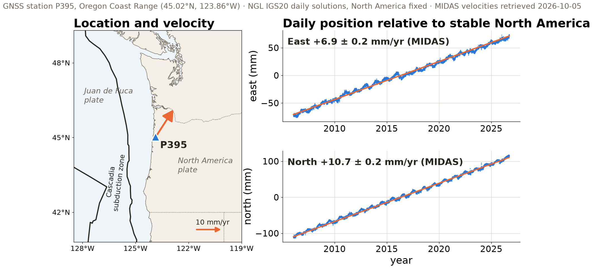

## {background-color="#faf7f2"}

[🤖]{.lecture-icon}

### Learning objectives

Evaluate an AI-assisted workflow as a scientific process: identify which decisions belong to the model, which operations belong to tools, which access constraints come from the sandbox, and which evidence supports the reported result.

Write an agent instruction file whose rules can be checked against the agent's output.

::: {.dim}
Reading: [1.8 AI in your workflow](https://geo-smart.github.io/mlgeo-book/ai-in-your-workflow) + [6.1 From language models to agents](https://geo-smart.github.io/mlgeo-book/llms-to-agents)
:::

::: {.notes}
Continue the rubric thread from Friday. The session has one intellectual task: extend the class rubric so it covers AI-assisted work. Students first score the paper they found, then learn where an agent's environment and sandbox fit, run a calibration experiment, and finish by writing an agent instruction file and checking whether an agent follows it. The class should leave with rubric version 0.2, an evidence-based AI policy, and a first AGENTS.md. The peer rerun moves to the start of Wednesday's session, when more repositories will have a smoke test. Suggested 80-minute allocation: rubric checkpoint 8 minutes; executable claims and agent architecture 17; failure modes 10; calibration experiment, including the P395 context slide, 20; policy, governance, and rubric extension 10; instruction file and compliance check 10; synthesis 5.
:::

## Rubric checkpoint

Score the paper from your sprint using Friday's six dimensions:

**scientific claim · data · code/workflow · environment/compute · evaluation · publication/credit**

For each dimension, assign:

- **0** missing
- **1** present but incomplete
- **2** another team can verify it

::: {.takeaway}
A score whose interpretation is uncertain indicates where the rubric needs a clearer criterion or additional evidence.
:::

::: {.notes}
Give pairs eight minutes. Each score needs a URL, file, passage, or explicit absence. Ask for two challenged scores and let the room decide what evidence would move each score. This creates the need for the agent-specific criteria later. A paper can provide code and still score poorly if the environment, data version, or evaluation split cannot be reconstructed.
:::

## From available artifacts to an executable claim

Code availability answers only one question: **Can the files be inspected?**

A computational claim also depends on:

- the data object and preprocessing state
- the software environment and external services
- the order of operations and configuration
- the evaluation target and tolerance for agreement
- the hardware or numerical behavior that may affect the result

::: {.notes}
Distinguish an open repository from a reproducible result. A repository may omit large data, credentials, preprocessing steps, package versions, configuration files, or the command that produced the reported output. Conversely, a well-documented workflow may depend on restricted data and still support a transparent evaluation of what can and cannot be reproduced. Ask students to state the smallest executable claim for their paper, such as “recreate Figure 3 within the plotted uncertainty” rather than “reproduce the paper.”
:::

## Agent, tools, environment, sandbox

**Agent = language model + tools + a loop over observations**

| Layer | Role in an agent run |
|---|---|
| Tools | actions such as reading files, running Python, or querying a catalog |
| Environment | exact Python, packages, libraries, and command-line programs |
| Sandbox | allowed files, network destinations, tools, and write locations |
| Hardware | CPU, GPU, memory, storage, and network underneath the run |

::: {.takeaway}
The environment determines which software can execute. The sandbox constrains which resources that software may reach.
:::

::: {.notes}
Connect directly to Friday's vocabulary. An agent can write correct Python and still fail because the sandbox blocks the data path or network. It can have access but compute a different result because the package version changed. It can have the right environment and still exhaust memory. Ask students to classify three errors aloud: “permission denied,” “module not found,” and “CUDA out of memory.” This makes the layers usable rather than definitional. The assigned literature supplies measured examples for the failure-mode slide: Liu et al. on attention, Sharma et al. on agreement, and Zheng et al. on evaluation bias.
:::

## The agent loop {.smaller}

Each iteration contains three distinct sources of scientific responsibility:

| Stage | Example | Question for the reviewer |
|---|---|---|
| Specification | “Estimate the velocity of station P395” | Were the target, units, interval, and success criterion defined? |
| Execution | the agent reads data and runs regression code | Which tools, data, environment, and permissions shaped the operation? |
| Interpretation | the agent explains the estimated trend | Does the conclusion follow from the computed output and domain assumptions? |

A complete execution log does not compensate for a scientific question that was underspecified at the start.

::: {.notes}
This distinction supports a more complete evaluation. Execution errors include wrong paths, package changes, or arithmetic bugs. Specification errors include an ambiguous component, date interval, or treatment of offsets. Interpretation errors include treating a seasonal signal as tectonic acceleration. Agent traces often document execution better than specification or interpretation. The rubric should therefore evaluate all three stages.
:::

## Where errors enter {.smaller}

| Failure mode | What can happen | Evidence or countermeasure |
|---|---|---|
| Attention | important context receives little weight | name required files; test cited details |
| Agreement | the model follows a user's wrong framing | request alternatives; test opposing hypotheses |
| Judgment | it chooses the wrong data, method, or interpretation | specify success criteria; compare with ground truth |
| Hallucination | fluent claims or citations have no source | resolve citations; recompute quantitative claims |

::: {.takeaway}
The rubric evaluates evidence and decision quality rather than confidence, fluency, or length of explanation.
:::

::: {.notes}
Keep this short. The goal is to generate testable rubric evidence. Long reasoning may make a failure more persuasive without making it less wrong. Tools improve arithmetic only when the agent uses them correctly. A successful command does not validate the scientific judgment that selected the command. Link each row to a later graded habit: file references, hypothesis checks, evaluation against known cases, and citation resolution.
:::

## Long context and incomplete evidence

An agent may receive an entire repository while using only a small fraction of it effectively.

- Retrieval and attention determine which passages influence the next action
- Files listed in a trace may not have influenced the conclusion equally
- Summaries can omit exceptions, warnings, and negative results
- A long reasoning trace records a proposed path, not a guarantee of causal faithfulness

An evaluation should test specific claims against source files and outputs rather than infer completeness from trace length.

::: {.notes}
Connect this slide to Liu et al.'s “lost in the middle” result. The practical point is not that long contexts always fail. It is that nominal access to a file does not establish that relevant content influenced the answer. Ask students how they would test an agent's claim that it “reviewed the whole repository.” Useful checks include requesting exact file and line references, sampling omitted files, and designing questions whose answers occur in different context positions.
:::

## The calibration dataset: GNSS station P395

::: {.badge-row}
[📍 In-situ sensor]{.gb .src} [🪨 Solid Earth]{.gb .sys .solid} [📐 Geodesy]{.gb .disc .solid}
:::

{.r-stretch}

::: {.takeaway}
Relative to stable North America, the Oregon coast at P395 moves northeast at about 13 mm/yr while the Cascadia megathrust offshore is locked.
:::

::: {.notes}
Two minutes; this slide gives the experiment its physical meaning. The badges are the labels introduced in session 1. P395 sits in the Oregon Coast Range at 45.02°N, 123.86°W (NGL llh.out). NGL's MIDAS solution, retrieved 2026-10-05, gives east +6.9 ± 0.2 and north +10.7 ± 0.2 mm/yr relative to stable North America, and up +0.2 ± 0.4 mm/yr, so no vertical rate is resolved. The northeast motion is commonly attributed to two contributions: elastic shortening of the upper plate while the subduction interface is locked between earthquakes, and clockwise rotation of the Oregon forearc (McCaffrey et al., 2013, JGR, doi:10.1029/2012JB009473). The annual oscillations in both components are seasonal signals, such as hydrological loading, that a velocity estimate must either model or average over. The class CSV is in the IGS20 frame, not the North-America-fixed frame drawn here; the next slide makes the frame part of the specification.
:::

## Numerical calibration protocol

Before asking the assistant, define the reference calculation:

- station component, date interval, and reference frame
- treatment of missing data, offsets, and seasonality
- regression model, units, and reported precision
- tolerance for agreement and an independently executed implementation

Then record whether the assistant accessed the intended data, executed code, exposed warnings, and produced a value consistent with the reference.

::: {.notes}
The point is not to catch a model making arithmetic mistakes. It is to show that a numerical answer depends on the specification and execution pathway. Two correct programs can disagree if one removes seasonal terms or uses a different interval. The reference frame matters most here: in the IGS20 frame of the class CSV, NGL's MIDAS east rate for P395 is −6.4 ± 0.2 mm/yr, while relative to stable North America it is +6.9 ± 0.2 mm/yr (both from the MIDAS files retrieved 2026-10-05). The station has not changed; the specification has. Students should compare assumptions before comparing numbers. If the assistant uses a tool, preserve the code and output. If it produces a number without executing code, classify the result separately rather than combining it with tool-based estimates.
:::

## Citation calibration protocol

For each suggested paper, verify four properties independently:

| Property | Verification source |
|---|---|
| Existence | DOI resolver, publisher, or trusted bibliographic index |
| Bibliographic identity | title, authors, year, and venue match |
| Relevance | abstract or full text addresses the stated scientific question |
| Accessibility of evidence | data, code, supplement, and licensing can be located |

A real citation can still fail the relevance or evidence test.

::: {.notes}
This protocol separates fabrication from retrieval quality. A paper may exist but use a different data modality or make a different claim. A DOI may resolve while the assistant has altered the title or authors. Record each failure type rather than reporting a single “hallucination” count. This produces a more informative small eval set and reinforces the paper sprint's evidence trail.
:::

## Calibration experiment

**20 minutes in pairs**

1. Give an assistant `book/Chapter1-GettingStarted/data/gps_P395_relative_position.csv` and ask for the east velocity of P395 in mm/yr
2. Record whether it runs code or answers from text
3. Recompute the value independently, then compare both with NGL's published MIDAS rate
4. Ask for three ML papers in your subfield
5. Resolve every DOI and count unsupported citations

::: {.dim}
The class will report denominators, not anecdotes: number of attempts, valid tool executions, numerically consistent answers, and verified citations.
:::

::: {.notes}
The P395 file is committed in the book repository, so every student who cloned it on Friday already has it; 1.7, which produces it, is not taught until Wednesday. The external reference is NGL's MIDAS IGS20 solution, not an instructor calculation: east −6.417 ± 0.185 mm/yr, north −3.410 ± 0.158 mm/yr (https://geodesy.unr.edu/gps_timeseries/IGS20/midas/midas.IGS.txt, retrieved 2026-10-05; Blewitt et al., 2016, JGR, doi:10.1002/2015JB012552). Show students where that file is, and note that the CSV ends at 2026.505 while the MIDAS file runs to 2026.716, so small differences are expected. Do not announce a “correct” hallucination rate. Measure what happens in this room with the models students use. Record denominators. For the numeric task, note whether the assistant executed code, whether the environment contained the needed packages, and whether the final number matches the independent computation within a stated tolerance. For citations, distinguish a valid DOI with an irrelevant paper from a DOI that does not resolve.
:::

## Course AI modes

🔒 **By hand**

The learning objective requires unaided execution or interpretation. These exercises establish the skills needed to inspect an assistant's work.

🤝 **Assistant allowed**

The assistant may contribute to the workflow. The submission must disclose its contribution, preserve accepted artifacts, and document independent verification.

::: {.takeaway}
Students remain responsible for explaining the scientific and computational decisions represented in submitted work.
:::

::: {.notes}
Explain that AI use is expected in this course. The badges control the learning objective. A student who delegates every indexing drill cannot review an agent's data-selection code. Disclosure can be brief but specific. “Used ChatGPT” lacks the task and contribution. A useful statement names what the tool drafted, what the student changed, and how the student verified the result.
:::

## Sandbox boundaries and research data

Before giving an agent access to research material, classify both the data and the action.

| Question | Examples of relevant evidence |
|---|---|
| May the service receive these data? | consent, data-use agreement, export controls, institutional policy |
| May the process contact the network? | approved domains, API terms, firewall or sandbox configuration |
| May the process modify or delete files? | write scope, version control, backups, confirmation policy |
| May outputs leave the environment? | disclosure risk, licensing, embargo, human review |

Credentials should enter through approved secret-management mechanisms rather than prompts, notebooks, or committed files.

::: {.notes}
Treat this as research governance, not merely cybersecurity. Public data can still carry license or attribution requirements. Restricted data can include unpublished collaborator data, location-sensitive ecological observations, or human-subject information. A local sandbox may provide stronger control than a hosted assistant, but local execution does not remove policy obligations. Students should identify the relevant authority before transmitting data to an external service.
:::

## AI-assisted rubric extension {.smaller}

Add these criteria to the class rubric:

| Dimension | Observable evidence |
|---|---|
| Tool disclosure | tool and its contribution are named in the submission or commit |
| Human review | the student can explain the accepted code and scientific choices |
| Independent verification | numbers, citations, and API claims are checked outside the model output |
| Access boundaries | sensitive data and credentials stay outside unapproved tools and sandboxes |
| Run record | accepted code, environment, inputs, and outputs are preserved in the repository |

**0** missing · **1** present but incomplete · **2** another team can verify it

::: {.dim}
Same scale as v0.1. A claim without inspectable evidence, such as "verified the citations", scores 1.
:::

::: {.notes}
Ask the class whether any row belongs inside an existing rubric dimension rather than becoming a seventh dimension. The likely answer is yes: tool disclosure belongs with publication and credit; access boundaries belong with data and environment; independent verification belongs with evaluation. This discussion prevents “AI reproducibility” from becoming a detached checklist. The same evidence standards govern all scientific work.
:::

## From rubric to AGENTS.md

An **instruction file** is a plain-text file at the root of a repository that a coding agent reads at the start of every session. AGENTS.md is an open format read by Codex, the GitHub Copilot coding agent, Cursor, Gemini CLI, and others; Claude Code reads it when the project has no CLAUDE.md, and otherwise imports it with `@AGENTS.md`.

```markdown
# AGENTS.md for MLGEO2026_UWNETID
## Environment
- Run all code through `pixi run`; add packages only through pixi.toml.
- Run `pixi run smoke` before reporting any result.
## Data
- Fetch values that a provider publishes (station coordinates, velocities,
  catalogs) and cite the URL and retrieval date; do not recompute or retype them.
- Cite every dataset by DOI in the README.
## Reporting
- State the reference frame, units, and time window of every number.
- Mark AI-drafted commits: "AI-assisted: <tool>, <what it drafted>".
```

::: {.takeaway}
Each rule restates a rubric criterion as an instruction whose outcome can be checked in the agent's output.
:::

::: {.notes}
Four minutes. Walk from rubric v0.1 to the file: environment and compute becomes the pixi rules, data and provenance becomes the provider rule, evaluation becomes the reporting rule, publication and credit becomes the commit rule. Contrast with rules that cannot be checked, such as "write clean code" or "be careful with data": no transcript can show whether the agent complied. The provider rule comes from this session's calibration slide: NGL publishes P395's velocity, so an agent that recomputes it from a CSV has not followed the specification even if its number is close. For Claude Code, AGENTS.md support requires v2.1.277 or later (Claude Code memory documentation). An instruction file is a task specification without an evaluation set; 6.3 on Nov 13 supplies the evaluation set.
:::

## Does the agent follow its instructions?

**6 minutes in pairs**

1. Put the AGENTS.md above, or three of its rules, in your course repository or a scratch folder
2. Ask your agent: *"Report the east velocity of GNSS station P395 and where the value comes from."*
3. Score three rules as yes or no from the transcript and the changed files
4. Exchange transcripts with the next pair and score theirs without discussion
5. Compare the two sets of scores, rule by rule

::: {.dim}
A disagreement between pairs means the rule is ambiguous or the evidence is missing; record which.
:::

::: {.takeaway}
Whether an agent follows a rule is an empirical question, answered from its output rather than from the instruction file.
:::

::: {.notes}
This is a preview of outcome 10, not its assessment. One run per pair cannot estimate a compliance rate, and two raters on one transcript cannot estimate agreement; say so explicitly. The full method arrives in stages: the critical-evaluation lab (6.2, Oct 23) adds bias controls for model graders; 6.3 (Nov 13) builds an eval set with planted cases and rule-by-rule binary scoring; reading-arc stage 4 (Dec 10) runs five trials per case and reports pass rates with binomial standard errors and Cohen's kappa between raters. Expect the provider rule to fail often: many agents fit the CSV instead of citing NGL's MIDAS file. Collect one disagreement for the rubric v0.2 discussion.
:::

## Rubric v0.2

As a class, choose:

- one criterion the paper review exposed
- one criterion the calibration experiment exposed
- one rule the instruction-file check exposed
- the evidence required for a score of **2**

::: {.dim}
Ch 1 quiz opens Tue Oct 6 and closes Thu Oct 8 · HW1 now includes an AGENTS.md · Wednesday: peer rerun of your repositories, then from reproducible code to curated data
:::

::: {.notes}
Reserve the final five minutes for synthesis. Record the agreed wording in the Gaia workspace so the rubric remains editable and visible. Announce that every project checkpoint will use the current rubric, and the class may revise it when new failure modes appear. The first three rows should come from actual obstacles today, not generic principles. Announce pulse-talk sign-ups and reading-arc stage 1 on Canvas rather than spending synthesis time on them.
:::
