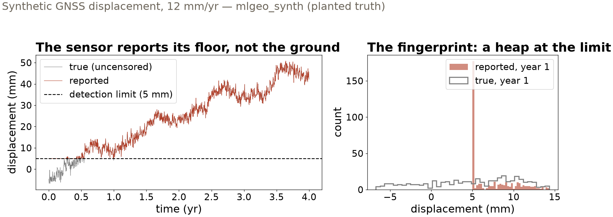

## {background-color="#faf7f2"}

[🧮]{.lecture-icon}

### Today's question

Cleaning changes your data before any model ever sees it.

**Which of your table's oddities are damage — and which are the science?**

::: {.dim}
Reading: [2.3 Pandas](https://geo-smart.github.io/mlgeo-book/pandas-rendered) · [2.4 DataFrame preparation](https://geo-smart.github.io/mlgeo-book/dataframes-prep)
:::

::: {.notes}
Frame the session: Wednesday named the streams and formats; today is the tabular stream, and specifically what happens between "file opens" and "data trusted." The danger is not dirty data — everyone expects that — it is *cleaning that quietly rewrites the science*: deleting the evolved granites along with the bad zeros, or trusting values an instrument fabricated. Every decision today gets graded against planted truth. Ask the room: who has ever deleted rows from a dataset? What was the rule, and who reviewed it?
:::

## This lecture in the literature



::: {.takeaway}
Rows dropped from a table have moved national policy. Cleaning decisions are scientific claims.
:::

::: {.notes}
Two minutes. Rubin 1976 is the playbook: the legitimacy of ignoring missing data depends on the *mechanism* — missing completely at random, missing at random, missing not at random; those terms come back on slide 7. Herndon: the Reinhart–Rogoff "debt slows growth" result, cited in austerity debates worldwide, partly rested on a spreadsheet that excluded five countries' rows; reanalysis of the same table reversed the headline — the cleaning was the result. Helsel: environmental chemistry's standard reference on detection limits — substituting the limit (or half of it) for nondetects "fabricates data"; his fix, survival-analysis methods, is the honest path our censoring slide points to. Refs update monthly — bring candidates.
:::

## One library, every table

- A global earthquake catalog: **1,785 events, M ≥ 6.0**, depths 0–685 km, with timestamps and place names
- The same verbs every time: read, **describe**, filter, transform, **group**, join, map
- Datetime-aware: select by time window, resample by day, roll a moving average

::: {.takeaway}
Learn the verbs, not the spellings — your coding agent knows the syntax; you must know what to ask for.
:::

::: {.notes}
This is 2.3 compressed to one slide; the notebook is a guided tour and much of it is marked for self-study. The catalog is real — EarthScope/IRIS global M≥6 events; describe() instantly shows depth in *meters* (max 685,500), which is why the first transform is unit conversion — a one-line lambda. Show of hands: who has used a spreadsheet for this? Pandas is the spreadsheet you can version-control, test, and rerun. Implementation names for the notebook: read_csv, describe, apply/map with lambdas, groupby, agg, sort_values, plotly for the interactive quake map. The skill the slides train is the next four slides: knowing which values to distrust.
:::

## Today's table: a rock survey with planted truth

::: {.big-number}
10,000 [rock samples — 7 major-element oxides, density, magnetic susceptibility, lithology]{.unit}
:::

::: {.big-number}
985 [andesites — against 5,525 granites: a 5.6 : 1 class imbalance]{.unit}
:::

::: {.dim}
Synthetic whole-rock geochemistry (mlgeo_synth): the generator plants the correlations and the pathologies, so every cleaning decision is graded against known truth.
:::

::: {.takeaway}
Imbalance is the norm in geoscience labels — remember 985 when a classifier reports 90% accuracy in Chapter 3.
:::

::: {.notes}
Introduce the table: each data sample is one rock — oxides in weight percent, bulk density, magnetic susceptibility, and a lithology label (granite/basalt/andesite) a classifier will later predict. Why synthetic: 2.4's whole point is that repairs get *graded* — we planted 2% missing densities, 3% missing susceptibilities, and 15 sentinel zeros, then check whether cleaning recovers the truth. The imbalance number seeds exercise question 3: a model that always says "granite" scores 55% accuracy — hold that thought until the classification weeks. Physical sanity checks come first in the notebook: oxides 0–100 wt%, crustal densities roughly 2.5–3.3 g/cm³ — read describe() against physics, always.
:::

## A zero is not one thing

| Column | Zeros in the table | Verdict |
|---|---|---|
| MgO | **1,434** | real — evolved granites have fractionated their magnesium away |
| K2O | 824 | real — same logic, other rock types |
| density | **15** | impossible — no rock has zero density: an instrument's failure code |

::: {.dim}
The check: is zero inside the physically possible range of *this* variable?
:::

::: {.takeaway}
"Replace all zeros with missing" would delete 1,432 silica-rich granites — rewriting the geology, not cleaning it.
:::

::: {.notes}
The tempting shortcut is a global zeros-to-missing sweep; walk why it fails per column. The MgO zeros sit almost entirely in granites (1,432 of 1,434), and those granites are silica-rich — median SiO2 of 74.2 wt% versus 69.2 for the full table. That is textbook petrology: evolved melts run out of Mg — the zeros carry the geology. The 15 density zeros are the opposite: physically impossible, so they are sentinel codes — a database's way of writing "no measurement" inside the data values. Real archives use 0, −999, −9999; the fingerprint is a heap at an impossible or suspiciously round value. Fix: replace *only* the impossible ones with an explicit missing marker.
:::

## Censored: present, plausible, and wrong

{.r-stretch}

::: {.takeaway}
12% of samples sit exactly at the 5 mm floor — yet a missing-data check reports *zero* problems. Censored data passes every missingness test.
:::

::: {.notes}
Define censoring aloud: the instrument reports a number, but the number is the *reporting floor*, not the measurement — geochemical analyses write "<0.01" as 0.01, stream gauges floor out at low flow, positioning systems near their resolution. Left panel: the reported series (red) rides the dashed floor whenever the true series (gray) dips below it. Right panel: the fingerprint — a heap of identical values exactly at the limit, the same signature as the sentinel zeros one slide ago, at a value that is plausible instead of impossible. That plausibility is what makes censoring dangerous: nothing looks broken. Data are synthetic (mlgeo_synth) with the uncensored truth returned, so the next slide can measure the damage exactly.
:::

## What the floor does to the science

::: {.big-number}
12.44 mm/yr [trend fit on the true, uncensored values]{.unit}
:::

::: {.big-number}
11.59 mm/yr [trend fit on what the sensor reported]{.unit}
:::

::: {.dim}
Every low excursion pulled up to the floor: the early mean is too high, the fitted trend too low — biased in a *predictable direction*. Dropping the censored samples deletes exactly the low values: worse.
:::

::: {.takeaway}
Model the censoring, or report the limit in the data card — never substitute and move on.
:::

::: {.notes}
The bias is not noise — it has a sign you can reason out: censoring only ever pulls values *up*, so first-year statistics inflate and the trend deflates. 0.85 mm/yr may sound small; over a GNSS velocity field it is the difference between locked and creeping fault interpretations. Neither of the two lazy fixes works: substitution (the limit, or half of it) is Helsel's "fabricating data"; dropping removes exactly the informative low tail. Honest options: survival/tobit-style methods that treat "below L" as the datum it is, or at minimum reporting the limit alongside the data so downstream users can. Related trap for the notes: a mid-record instrument swap changes the floor mid-series — a step in a record's variance is a metadata question before it is a discovery.
:::

## Why is it missing? The gap can be the data

- The stream gauge drowns in the flood it was built to measure
- The GNSS antenna goes silent under the storm's snow load
- The field crew skips the location when the road washes out

::: {.dim}
Missing completely at random (MCAR) — safe to drop. Missing *because of* the value (MNAR) — dropping deletes your extremes.
:::

::: {.takeaway}
Ask what process made the gap. If the answer involves the measurement, the missingness belongs in your data card as data.
:::

::: {.notes}
Rubin's vocabulary, on geoscience instruments. Our planted gaps were MCAR by construction — that is what licensed dropna in the notebook, and the text says so explicitly. Real instruments rarely oblige: each bullet is a case where the gap is *caused by* the value that would have been measured, so dropping rows systematically deletes floods, storms, washouts — the events the analysis probably exists to study. Connect backward: the MgO zeros were the same idea inverted — "suspicious" values concentrated in one geology, so removing them rewrites the field. The operational habit: for every gap pattern, write one sentence on its mechanism; if the sentence mentions the measured quantity, the missingness policy is a scientific decision to defend, not a default.
:::

## The dtype trap

- Cleaning density: replace the impossible zeros with a missing marker — correct
- pandas silently upcast the column: **float64 → object** (numbers stored as generic objects)
- Every later "numeric columns only" step — correlations, summaries — now *drops density without a warning*

::: {.takeaway}
A column can be numeric in content and non-numeric in dtype. Check dtypes after every cleaning step, not just the first.
:::

::: {.notes}
The notebook's most instructive bug, planted deliberately. The very cleaning that protected density (zeros → missing) changed its storage type; from then on, any select-numeric-columns operation — the correlation matrices, describe — silently excludes the column the cleaning was defending. No error, no warning; the analysis just quietly loses a variable. The fix is one cast back to numeric, but the lesson is the habit: dtype checks are part of every step. This is also the modern-pandas moment: assign results (df = df.replace(...)) rather than inplace mutations — chained inplace on slices errors in pandas 3. Downstream payoff of a clean table: the correlation matrices reveal the planted geochemistry (SiO2 anticorrelates with FeO/MgO/CaO), plus the closure effect — oxides sum to ~100 wt%, building anticorrelation into the table regardless of petrology. That subtlety is exercise question 1.
:::

## Four pathologies, four fingerprints

| Pathology | Fingerprint | Geoscience example | Response |
|---|---|---|---|
| **Sentinel value** | heap at an impossible value | density = 0 g/cm³ | replace only the impossible ones |
| **Censored value** | heap at a plausible round value | 5 mm detection floor | model it, or report the limit |
| **Informative gap** | gaps track events | gauge drowned in the flood | treat the gap as data |
| **Dtype drift** | numeric content, non-numeric dtype | density after cleaning | check dtypes every step |

::: {.takeaway}
Same discipline throughout: diagnose the mechanism first; clean second; write the decision down.
:::

::: {.notes}
The lecture in one screen — leave it up for questions. Each row was a slide; the connecting idea is that every pathology has a *mechanism* (a failing instrument, a reporting floor, a physical cause, a library behavior) and a *fingerprint* you can test for — and that the response is a documented decision, not a reflex. This table becomes part of the 2.13 data-card checklist and gets applied to the students' own project data at check-in #1. The censoring and gap rows return Monday on time series, where the same mistakes cost RMS error we can measure.
:::

## Now run it yourself — open 2.4

1. `pixi run jupyter lab` → `2.4_dataframes_prep.ipynb`
2. Run the cleaning: count the zeros, replace only the impossible ones, catch the dtype flip and fix it
3. Reproduce the censoring bias: 11.59 vs 12.44 mm/yr — then try *dropping* the censored samples and watch it get worse
4. Exercise Q3: what accuracy does "always predict granite" achieve — and what does that imply for evaluating any classifier on this table?

::: {.dim}
Monday: sampling, resampling & irregular data (2.5–2.6) · HW1 due Mon Oct 12
:::

::: {.notes}
Timing for the 80-minute block (10:00–11:20): pulse-talk sign-ups just opened, no talks yet — admin ~10 min, deck ~20 min, guided notebook ~40 min (task 3 is where the learning is — circulate and ask students to predict the direction of the bias before running), synthesis ~10 min on task 4, whose answer (about 55%) seeds the class-imbalance thread that runs to Chapter 3. Implementation names live here: isna/dropna, replace with pd.NA, pd.to_numeric, select_dtypes, corr(method='spearman'), value_counts. 2.3's remaining levels (plotly maps, station-metadata parsing) are marked self-guided. Remind: HW1 due Monday.
:::
