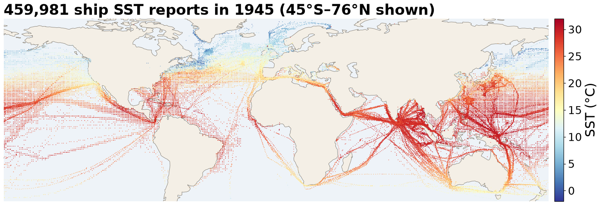
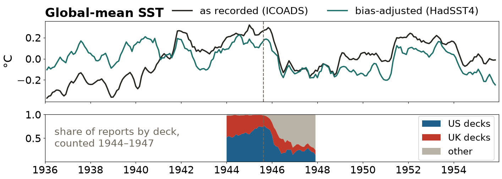
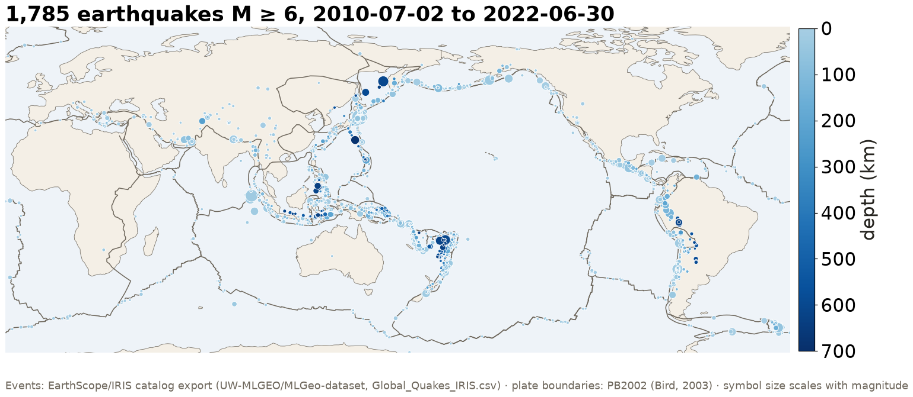
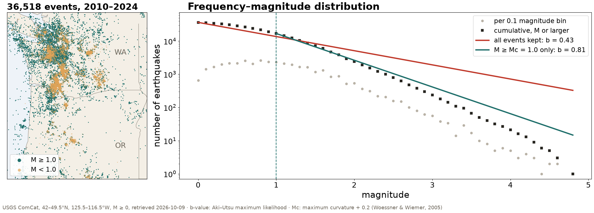
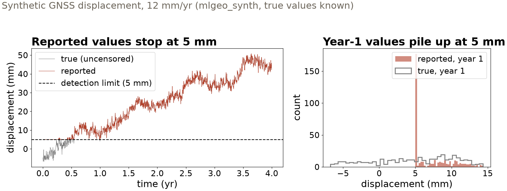

## {background-color="#faf7f2"}

[🧮]{.lecture-icon}

### Today's question

Cleaning changes the data before a model sees it.

**Which unusual values in a table are recording errors, and which are real measurements?**

::: {.dim}
Reading: [2.3 Pandas](https://geo-smart.github.io/mlgeo-book/pandas-rendered) · [2.4 DataFrame preparation](https://geo-smart.github.io/mlgeo-book/dataframes-prep)
:::

::: {.notes}
Frame the session with Wednesday's curation map: today answers its third row, "does the table record what happened: missing values, types, joins?" Wednesday named the streams and formats; today is the tabular stream, and specifically what happens between "the file opens" and "the data are trusted." Everyone expects dirty data. The harder problem is cleaning that changes the science without anyone noticing: deleting the evolved granites along with the bad zeros, or trusting values an instrument made up. Every decision today is graded against planted truth. Ask the room: who has ever deleted rows from a dataset? What was the rule, and who reviewed it? Keep the answers; the AGENTS.md slide near the end returns to them.
:::

## Literature example: ocean temperatures in the 1940s {.smaller}

::: {.badge-row}
[📍 In-situ sensor]{.gb .src} [🌊 Ocean]{.gb .sys .ocean} [🌡️ Atmospheric & climate science]{.gb .disc .air}
:::

:::: {.columns}
::: {.column width="40%"}
::: {.lit-card}
[Global-mean sea surface temperature drops by about 0.3 °C in late 1945, when the reports switch from US ships measuring engine-intake water to UK ships measuring water hauled up in buckets.]{.lit-msg}

[Thompson, Kennedy, Wallace & Jones (2008). *Nature*, 453, 646–649.]{.lit-cite}
:::

**One data sample is one ship report** (ICOADS release 3.1)

::: {.records}
| date | lat | lon | SST °C | method | country | deck |
|---|---:|---:|---:|---|---|---|
| 1945-07-01 | 52.5 | −178.5 | 15.6 | | | 195 US Navy logs |
| 1945-07-01 | 38.5 | −64.5 | 24.4 | | | 195 US Navy logs |
| 1945-12 | 14.5 | 120.8 | 27.8 | | UK | 245 Royal Navy logs |
| 1945-12 | −33.8 | 151.2 | 21.1 | | UK | 245 Royal Navy logs |
:::

[The method column is blank for 96% of the 459,981 reports from 1945, so the method has to be inferred from the deck and the country.]{.dim}
:::

::: {.column width="60%"}
{width="100%"}

{width="100%"}
:::
::::

::: {.takeaway}
Raw ICOADS today: −0.4 °C from late 1945 to mid-1946, as the US share of reports falls from 76% to 33%.
:::

::: {.notes}
Four minutes; this is the one paper the lecture tells in full. Geoscience first: sea surface temperature since the 1850s comes mostly from ships, and the map shows the 1945 reports, which follow wartime shipping lanes and convoy routes and leave most of the Southern Ocean empty. Then the table: each data sample is one report with a date, a position, a temperature, and columns that record how it was measured (SI, the method code: 0 bucket, 1 engine intake), which country reported it (C1), and which archive it came from (the deck: 195 is US Navy ship logs, 245 Royal Navy ship logs 1938–47, from the ICOADS code tables). In 1945 the method column is blank for 96% of reports, so the method is a cleaning decision inferred from the deck. Thompson et al. (2008) found a drop of about 0.3 °C in late 1945 in the record of the time and traced it to the change in national origin: US engine-intake readings run warm, uninsulated UK bucket readings run cool. The figure is our reconstruction from open data with today's ICOADS release 3.1, which contains many more digitized logbooks than the 2008 version: the raw global mean (black, three-month running mean of the ICOADS 2° monthly means from NOAA PSL, no bias adjustment) falls by about 0.4 °C from late 1945 to mid-1946, and the deck counts from the IMMA files (bottom) show the US share dropping from about 76% in September 1945 to about 33% in March 1946. The bias-adjusted HadSST4 record (teal) warms the bucket-dominated years before 1941 by about 0.3 °C but still shows part of the 1945–46 drop; Chan and Huybers (2021, next slide) revisited the corrections deck by deck. Everything here is regenerated by figscripts/sst_1945_discontinuity.py. Reading code for the students who ask: the IMMA files are fixed-width text, so pandas.read_fwf with column positions (year 1–4, latitude 13–17, longitude 18–23, method 84–85, SST 86–89, deck 119–121) reads them.
:::

## The same problem in other geoscience tables {.smaller}



::: {.takeaway}
Ocean temperatures, earthquake catalogs, and water chemistry share the problem: the result depends on how measurement metadata and missing or censored values are handled.
:::

::: {.notes}
Two minutes, one sentence per card. Karl et al. (2015): over two decades the share of SST observations from drifting buoys grew, and buoys read about 0.12 °C cooler than ships in the same place; without the offset, the switch of instruments looks like a slowdown of warming after 1998, and with it the 2000–2014 trend was at least as large as the 1950–1999 trend. Hausfather et al. (2017, Science Advances) confirmed it with records from a single instrument type. Chan and Huybers (2021): the 1941–1945 warmth in the SST record shrinks once offsets are estimated separately for each deck and country, the same columns as on the previous slide. Woessner and Wiemer (2005): every earthquake catalog misses small events below a magnitude of completeness; slide 6 shows what that does to the b-value in the Pacific Northwest. Helsel (2006): water-quality laboratories report concentrations below the detection limit as "<DL"; substituting the limit, or half of it, invents values, and survival-analysis methods use the information honestly. Rubin (1976, Biometrika) is the source of the MCAR / MAR / MNAR terms used on the gaps slide.
:::

## Tabular data in the geosciences {.smaller .compact}

| Dataset | Provider | One data sample | A cleaning choice that changes results |
|---|---|---|---|
| [🗂️ Catalog]{.gb .src} [🪨 Solid Earth]{.gb .sys .solid} earthquake catalog | USGS ComCat, ISC | one earthquake | magnitude cut at the completeness limit; mixed magnitude types |
| [🗂️ Catalog]{.gb .src} [🪨 Solid Earth]{.gb .sys .solid} GNSS velocity table | NGL MIDAS | one station | reference frame; stations with short records |
| [🧪 Sample & laboratory]{.gb .src} [🪨 Solid Earth]{.gb .sys .solid} whole-rock geochemistry | GEOROC, EarthChem | one rock sample | values below detection; iron reported as FeO, Fe2O3, or total |
| [📍 In-situ sensor]{.gb .src} [💧 Land water]{.gb .sys .water} stream-gauge daily values | USGS NWIS | one day at one gauge | values flagged as estimated or ice-affected |
| [🧪 Sample & laboratory]{.gb .src} [💧 Land water]{.gb .sys .water} water-quality analyses | Water Quality Portal | one laboratory analysis | concentrations reported as below the detection limit |
| [📍 In-situ sensor]{.gb .src} [🌊 Ocean]{.gb .sys .ocean} ship and buoy temperatures | ICOADS | one observation | measurement method: bucket, engine intake, or buoy |

::: {.takeaway}
In each table, one data sample is one physical object or observation, and the columns that describe how it was measured decide how it should be cleaned.
:::

::: {.notes}
Two minutes. Ask each student which row is closest to their project data. The left column carries the source and system labels; disciplines are seismology, geodesy, geochemistry and petrology, hydrology (two rows), and oceanography and climate science. Point at the right column: none of these choices is a coding question. ComCat merges contributions from regional networks that use different magnitude scales (local, duration, moment), and its completeness changes with station density. MIDAS reports the same station velocity in a global frame and in plate-fixed frames (session 1, P395). GEOROC and EarthChem compile analyses from many laboratories, which report iron differently and flag detection limits differently; oxides that sum to 100 wt% also build negative correlations into the table (Chayes, 1960, JGR, the closure problem). NWIS daily values carry qualification codes such as "e" for estimated and "Ice" for ice-affected. The Water Quality Portal reports nondetects with a detection-condition field and a limit, not a number. ICOADS records the measurement method for each ship observation, which is what the Thompson et al. correction needed.
:::

## Twelve years of large earthquakes

::: {.badge-row}
[🗂️ Catalog & compiled product]{.gb .src} [🪨 Solid Earth]{.gb .sys .solid} [📈 Seismology]{.gb .disc .solid}
:::

{.r-stretch}

::: {.takeaway}
Deep events outline the subducting slabs. A maximum depth of 685,500 means depth is stored in meters, so the first step converts it to km.
:::

::: {.notes}
Section 2.3 compressed to one slide. The catalog is the EarthScope/IRIS event-service export kept in the UW-MLGEO dataset repository (Global_Quakes_IRIS.csv): 1,785 events of M 6 and above, 2 July 2010 to 30 June 2022, with time, latitude, longitude, depth, magnitude, and a place name. Geoscience first: shallow events outline every plate boundary; the 154 events deeper than 300 km all sit in subducting slabs (Tonga–Fiji, the Kuril–Japan–Izu–Bonin arcs, the Banda Sea, beneath South America), the Wadati–Benioff zones. The largest is the M 9.1 Tohoku-oki earthquake of 11 March 2011. Then the table: describe() reports a maximum depth of 685,500, which only makes sense in meters, hence a one-line conversion to km before anything else. The verbs to know, not the spellings: read, describe, filter, transform, group, join, map, and select by time window. Implementation names for the notebook: read_csv, describe, apply/map, groupby, agg, sort_values, plotly for the interactive map. Figure: figscripts/global_quakes_map.py fetches the catalog, PB2002 plate boundaries (Bird, 2003), and Natural Earth land at run time.
:::

## Catalog completeness and the b-value

::: {.badge-row}
[🗂️ Catalog & compiled product]{.gb .src} [🪨 Solid Earth]{.gb .sys .solid} [📈 Seismology]{.gb .disc .solid}
:::

{.r-stretch}

::: {.takeaway}
Keeping all 36,518 events gives b = 0.43; keeping the 16,892 events at or above M 1.0 gives b = 0.81. Hazard models use b to extrapolate from small to large earthquakes.
:::

::: {.notes}
Three minutes. Data: USGS ComCat, Washington and Oregon box (42–49.5°N, 125.5–116.5°W), M ≥ 0, 2010–2024, retrieved 2026-10-09 by figscripts/pnw_catalog_completeness.py; 99% of the events come from the Pacific Northwest Seismic Network (uw). Geoscience first: the map shows Puget Sound crustal seismicity, the Cascade volcanoes (the dense clusters at Mount St. Helens and Mount Hood), and scattered events in eastern Washington and Oregon. The Gutenberg–Richter law says the number of earthquakes of magnitude M or larger falls as 10^(−bM); in most tectonic regions b is close to 1. The network does not detect every small event, so below some magnitude the counts fall short of the line: that is the magnitude of completeness, Mc. Here Mc is the maximum-curvature estimate (0.8) plus 0.2, the correction Woessner and Wiemer (2005) recommend, so Mc = 1.0; 54% of the table lies below it. Fitting b with the Aki–Utsu maximum-likelihood formula on every event gives 0.43, a value that would imply far more large earthquakes per small one than the region produces; fitting above Mc gives 0.81. The map shows why a single Mc is itself a simplification: small events are detected near the dense Puget Sound and volcano-monitoring networks and missed elsewhere, so Mc varies across the region. A second cleaning issue sits in the magType column: 33,016 local magnitudes (ml) and 3,323 duration magnitudes (md) in the same table. Ask: which cleaning step would you document first?
:::

## A synthetic rock survey with known errors {.smaller .compact}

::: {.badge-row}
[🧪 Sample & laboratory]{.gb .src} [🪨 Solid Earth]{.gb .sys .solid} [⛰️ Geology & geomorphology]{.gb .disc .solid}
:::

```python
import mlgeo_synth
df = mlgeo_synth.geochem_table(n=10000, seed=42)   # synthetic: the true values are known
df.head()
```

| | SiO2 | Al2O3 | FeO | MgO | CaO | Na2O | K2O | density g/cm³ | susc. 10⁻³ SI | label |
|---:|---:|---:|---:|---:|---:|---:|---:|---:|---:|---|
| 0 | 45.91 | 16.27 | 11.98 | 9.70 | 12.75 | 2.08 | 0.00 | 3.01 | 0.44 | basalt |
| 1 | 68.27 | 14.42 | 4.86 | 2.24 | 4.76 | 3.05 | 3.42 | 2.69 | 0.17 | granite |
| 2 | 50.42 | 15.27 | 8.21 | 5.85 | 10.38 | 2.55 | 1.24 | 2.94 | 1.34 | basalt |
| 3 | 46.50 | 14.57 | 11.73 | 7.62 | 12.45 | 1.24 | 0.00 | 3.00 | 1.12 | basalt |
| 4 | 68.31 | 13.59 | 3.46 | 2.52 | 3.78 | 3.27 | 3.74 | 2.68 | 0.09 | granite |

[Oxides in wt%. 10,000 data samples: 5,525 granite, 3,490 basalt, 985 andesite (5.6 : 1 granite to andesite).]{.dim}

::: {.takeaway}
Each row is one rock; two of the first five already have K2O = 0, and a classifier that always predicts granite scores 55%.
:::

::: {.notes}
Introduce the table: each data sample is one rock, with oxides in weight percent, bulk density, magnetic susceptibility, and a lithology label (granite, basalt, andesite) that a classifier will later predict. The badges describe what the table imitates, laboratory analyses of hand samples; the science tag says it is synthetic, and no map applies because the samples have no locations. Why synthetic: 2.4's point is that repairs get graded. The notebook knocks out 2% of densities and 3% of susceptibilities at random and plants 15 density zeros, then checks whether cleaning recovers the truth. The imbalance seeds exercise question 3: a model that always says "granite" scores 55% accuracy (5,525 of 10,000). Physical sanity checks come first in the notebook: oxides between 0 and 100 wt%, crustal densities roughly 2.5 to 3.3 g/cm³. Read describe() against physics, always.
:::

## Zeros in three columns

| Column | Zeros in the table | Verdict |
|---|---|---|
| MgO | **1,434** | real: evolved granites have fractionated their magnesium away |
| K2O | 824 | real: same logic, other rock types |
| density | **15** | impossible: no rock has zero density, so this is an instrument's failure code |

```python
numeric_cols = df.select_dtypes(include="number").columns
(df[numeric_cols] == 0).sum()                       # zeros per column
df.loc[df["MGO"] == 0, "label"].value_counts()       # which rocks have MgO = 0?
```

::: {.takeaway}
Replacing every zero with a missing value, then dropping incomplete samples, would remove 1,432 silica-rich granites from the table.
:::

::: {.notes}
The tempting shortcut is a global zeros-to-missing sweep; walk through why it fails, column by column. The MgO zeros sit almost entirely in granites (1,432 of 1,434), and those granites are silica-rich: median SiO2 of 74.2 wt% against 69.2 for the full table. That is textbook petrology: evolved melts run out of Mg, so these zeros are measurements. The 15 density zeros are the opposite. They are physically impossible, so they are sentinel codes, a database's way of writing "no measurement" inside the data values. Real archives use 0, −999, −9999; the fingerprint is a heap at an impossible or suspiciously round value. Fix: replace only the impossible ones with an explicit missing marker. Numbers rerun on Oct 7 from mlgeo_synth.geochem_table(n=10000, seed=42) and the notebook's planting step.
:::

## Values below a detection limit

{.r-stretch}

::: {.dim}
A 5 mm detection limit imposed on a synthetic GNSS-shaped series to measure the bias. GNSS has no such limit; groundwater arsenic ("<0.5 µg/L") and low-flow stream gauges do.
:::

::: {.takeaway}
12% of samples are recorded at the 5 mm limit instead of their true value, and a missing-value check finds none: censored values are numbers.
:::

::: {.notes}
Define censoring aloud: the instrument or laboratory reports a number, but the number is its detection limit, not the measurement. Geochemical analyses write "<0.01" as 0.01; stream gauges floor out at low flow. Be straight about the example: a GNSS position has no such floor, so this is a GNSS-shaped series with a floor imposed to make the bias measurable; the real cases are laboratory detection limits (trace elements, nutrients, contaminants) and gauges at low flow. Left panel: the reported series (red) rides the dashed floor whenever the true series (gray) dips below it. Right panel: the fingerprint, a heap of identical values exactly at the limit, the same signature as the sentinel zeros one slide ago, but at a value that is plausible instead of impossible. Because the value is plausible, nothing in a summary table flags it. The generator returns the uncensored truth, so the next slide can measure the damage exactly.
:::

## Effect of the detection limit on the fitted trend

| Series used for the fit | Trend (mm/yr) | Year-1 mean (mm) |
|---|---:|---:|
| True, uncensored | **12.44** | **4.80** |
| Reported, values at the limit kept | 11.59 | 7.24 |
| Reported, values at the limit dropped | 11.82 | 9.29 |

::: {.dim}
Both shortcuts raise the early values and lower the trend. Dropping the values at the limit worsens the year-1 mean and slightly improves the trend; neither recovers the true values.
:::

::: {.takeaway}
Use a method that treats "below 5 mm" as information, or report the limit in the data card so later users can.
:::

::: {.notes}
The bias has a sign you can work out in advance. Censoring only ever pulls low values up, so first-year statistics inflate and the trend deflates. Ask the room to predict the third row before revealing it. Dropping removes the low tail entirely, so the year-1 mean rises further (9.29 against 7.24, truth 4.80); the trend improves a little (11.82 against 11.59) because the dropped samples were the ones dragging the early fit up, but it is still 0.6 mm/yr low, and which statistic suffers depends on what you compute. Neither shortcut is safe in general. Honest options: survival or tobit-type methods that treat "below L" as the datum it is, or at minimum reporting the limit alongside the data so downstream users can. Related trap: a mid-record instrument swap changes the floor mid-series, so a step in a record's variance is a metadata question before it is a discovery. All six numbers rerun on Oct 7: mlgeo_synth.gnss_series(n_years=4, velocity_mm_yr=12.0, seed=7) through degrade_series(detection_limit_mm=5.0, seed=7), least-squares line on 1,461 daily samples (1,286 after dropping).
:::

## Gaps caused by the measured quantity

- A stream gauge fails during the flood it was installed to measure
- A GNSS antenna stops recording under a storm's snow load
- A field crew skips a location when the road washes out

::: {.dim}
Missing completely at random (MCAR): safe to drop. Missing *because of* the value (MNAR): dropping deletes your extremes.
:::

::: {.takeaway}
For each gap pattern, state what caused it. If the cause depends on the measured quantity, dropping those samples removes the extremes, and the data card should say so.
:::

::: {.notes}
Rubin's vocabulary, on geoscience instruments. The planted gaps in 2.4 are MCAR by construction; that is what licenses dropna in the notebook, and the text says so. Real instruments rarely oblige: each bullet is a case where the gap is caused by the value that would have been measured, so dropping rows systematically deletes floods, storms, and washouts, the events the analysis probably exists to study. Connect backward: the MgO zeros were the same idea inverted, "suspicious" values concentrated in one geology, so removing them rewrites the field. The operational habit: for every gap pattern, write one sentence on its mechanism; if the sentence mentions the measured quantity, the missingness policy is a scientific decision to defend, not a default.
:::

## Cleaning can change a column's type

- Replacing the impossible density zeros with a missing marker is the right fix
- pandas then changes the column's storage type from **float64 to object** (numbers stored as generic objects), without a message
- Later steps that use only numeric columns, such as correlations and summaries, *drop density without a warning*

```python
df = df.replace({"density_g_cm3": {0.0: pd.NA}})
df["density_g_cm3"].dtype                            # object, no longer float64
```

::: {.takeaway}
Check column types after each cleaning step: a column of numbers can be stored as a non-numeric type.
:::

::: {.notes}
The notebook plants this bug on purpose. The cleaning that protected density (zeros to missing) changed its storage type; from then on, any select-numeric-columns operation, the correlation matrices and describe(), excludes the column the cleaning was meant to protect, with no error or warning, so the analysis loses a variable. The fix is one cast back to numeric, and the habit to teach is checking dtypes after every step. This is also the modern-pandas moment: assign results (df = df.replace(...)) rather than mutating in place, because chained in-place edits on slices raise errors in pandas 3. Downstream payoff of a clean table: the correlation matrices show the planted geochemistry (SiO2 anticorrelates with FeO, MgO, CaO), plus the closure effect: oxides sum to about 100 wt%, which builds anticorrelation into the table regardless of petrology. That subtlety is exercise question 1.
:::

## Four kinds of bad values and how to detect them {.smaller}

| Pathology | Fingerprint | Geoscience example | Response |
|---|---|---|---|
| **Sentinel value** | heap at an impossible value | density = 0 g/cm³ | replace only the impossible ones |
| **Censored value** | heap at a plausible round value | laboratory detection limit | model it, or report the limit |
| **Informative gap** | gaps track events | gauge drowned in the flood | treat the gap as data |
| **Dtype drift** | numeric content, non-numeric dtype | density after cleaning | check dtypes every step |

::: {.takeaway}
In each case, find out what produced the values before changing them, and record the change.
:::

::: {.notes}
The lecture in one screen; leave it up for questions. Each row was a slide. The connecting idea is that every pathology has a mechanism (a failing instrument, a reporting floor, a physical cause, a library behavior) and a fingerprint you can test for, and that the response is a documented decision, not a reflex. This table becomes part of the 2.13 data-card checklist and is applied to each team's own project data at check-in 1. The censoring and gap rows return Monday on time series, where the same mistakes cost an error we can measure.
:::

## What each cleaning choice changed {.smaller .compact}

| Choice | Data | Result |
|---|---|---|
| keep events below the completeness limit | Pacific Northwest earthquakes, ComCat | b-value 0.43 instead of 0.81 |
| combine ship measurement methods without correction | sea surface temperature, ICOADS | drop of about 0.3 °C in late 1945 (Thompson et al., 2008) |
| ignore the ship–buoy offset | sea surface temperature, ERSST | apparent slowdown of warming after 1998 |
| replace all zeros, then drop incomplete samples | rock survey (synthetic) | 1,432 granites removed |
| keep values recorded at the detection limit | GNSS-shaped series (synthetic) | trend 11.59 instead of 12.44 mm/yr |
| substitute the detection limit for nondetects | water-quality analyses | biased means and trends |

::: {.takeaway}
Each choice changed a number that a scientific conclusion depends on. Record the rule, how many values it changed, and why, so that another analyst can repeat the analysis with a different choice.
:::

::: {.notes}
Two minutes; leave it up while moving to the notebook. The first three rows are real geoscience data and published or reproducible results (this lecture's figure; Thompson et al., 2008; Karl et al., 2015); the next two are the synthetic examples, where the true values are known; the last is Helsel (2006). The point for projects: a cleaning step is part of the method, and its effect can be measured by running the analysis both ways, as the b-value slide did. That record belongs in the data card (2.13) and in the cleaning log named on the next slide.
:::

## Cleaning rules your agent must follow

Ask an assistant to "clean this table" and the likely result is the global sweep: zeros to missing, then drop incomplete samples.

| A rule that cannot be checked | A rule that can |
|---|---|
| Clean the data carefully | Replace a value only if it lies outside the physical range stated in `data/README.md` |
| Handle missing values | Log every replacement or drop (column, rule, count) to `cleaning_log.csv` |
| Fix the types | Report `df.dtypes` before and after each cleaning step |

::: {.takeaway}
If AGENTS.md states no cleaning rule, an assistant applies its default: the global sweep from the zeros slide.
:::

::: {.notes}
Three minutes, 🤝 assistant allowed. This links today to Monday's AGENTS.md (HW1 Step 7, due Monday Oct 12). The left column is what most people would type; none of it can be settled by reading the agent's output, so it does not count toward the five rules. The right column can be checked against the commits and the log. Ask each student to write one data-cleaning rule for their own project data and add it to their AGENTS.md before Monday; the peer who reran their repository on Wednesday is the right person to check it. Return to the opening question: the rules people described for deleting rows are exactly what belongs here.
:::

## Run notebook 2.4

1. `pixi run jupyter lab` → `2.4_dataframes_prep.ipynb`
2. Run the cleaning: count the zeros, replace only the impossible ones, catch the dtype change and fix it
3. Reproduce the censoring bias (11.59 vs 12.44 mm/yr), then drop the values at the limit: predict first which statistic gets worse, the trend or the year-1 mean
4. Exercise Q3: what accuracy does "always predict granite" achieve, and what does that imply for evaluating any classifier on this table?
5. Write one checkable cleaning rule into your AGENTS.md

::: {.dim}
Monday: sampling, resampling, and irregular data (2.5–2.6) · HW1 due Mon Oct 12
:::

::: {.notes}
Timing for the 80-minute block (10:00–11:20): pulse-talk sign-ups are open, no talks yet. Admin about 7 minutes, deck about 20, guided notebook about 40 (task 3 is where the learning is: circulate and ask students to commit to a prediction before running), synthesis about 13 on tasks 4 and 5. Task 4's answer (55%) seeds the class-imbalance thread that runs to Chapter 3; collect two or three AGENTS.md rules from task 5 and test them against the left/right columns of the previous slide. Implementation names live here: isna/dropna, replace with pd.NA, pd.to_numeric, select_dtypes, corr(method='spearman'), value_counts. 2.3's remaining levels (plotly maps, station-metadata parsing) are self-guided. Remind: HW1 due Monday, including the AGENTS.md.
:::
