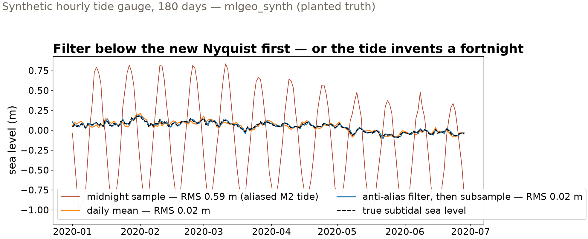
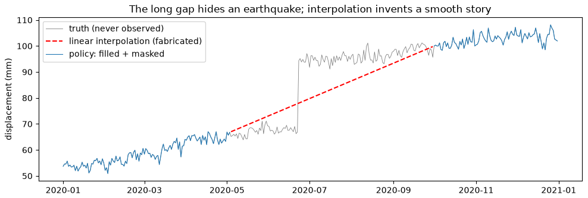
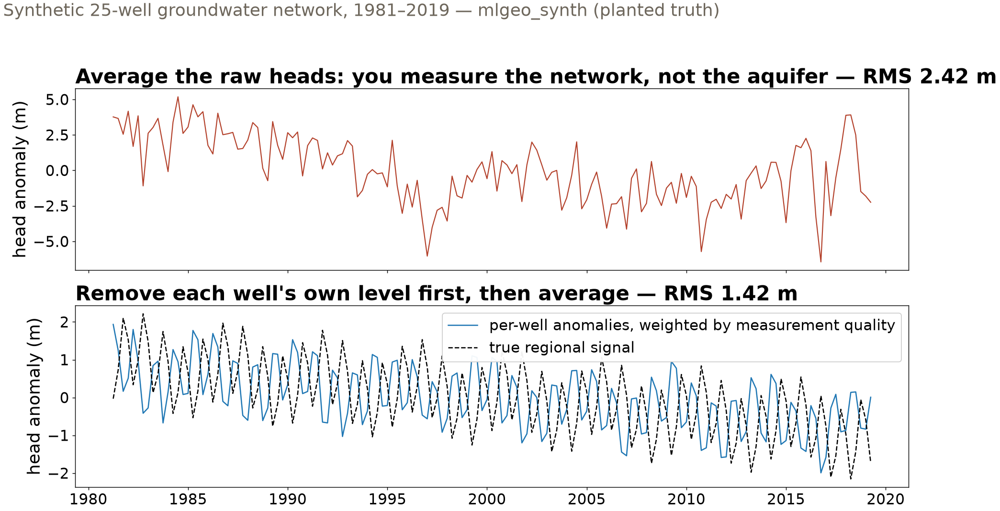

## {background-color="#faf7f2"}

[🌊]{.lecture-icon}

### Today's question

Downsample a series, fill a gap, average a network — each changes the data.

**Can you change the sampling without inventing signal that was never measured?**

::: {.dim}
Reading: [2.5 Arrays](https://geo-smart.github.io/mlgeo-book/arrays) · [2.6 Resampling](https://geo-smart.github.io/mlgeo-book/resampling)
:::

::: {.notes}
Frame the session: Friday was tables; today the other two streams — gridded arrays and sensor series — and the operations that change their sampling. "Resampling" means two things and we do both: statistical resampling (bootstrap — redraw from a sample to measure uncertainty) and signal resampling (change a series' sampling rate or grid). They share one trap: done naively, each manufactures data that was never measured. Every repair today is graded against planted truth. Ask the room: who has ever called a resample-to-daily function, or interpolated across a gap, without checking what it did? Everyone — that is today.
:::

## This lecture in the literature



::: {.takeaway}
Sampling theory is old; geoscience still pays for ignoring it — in aliased tides, jumpy station averages, and error bars several times too small.
:::

::: {.notes}
Two minutes. Shannon: the sampling theorem — a series sampled at interval Δt represents only frequencies below the Nyquist frequency 1/(2Δt); everything above folds back in, disguised as a lower frequency. Today's tide-gauge demo is that theorem with sea water in it. Mao: GPS velocity papers assumed white (memoryless) noise; the noise is time-correlated, and the published error bars were several times too small — our block-bootstrap slide reproduces exactly that failure and its fix on synthetic data where truth is known. Hansen & Lebedeff: the classic anomaly method — average station *departures*, not raw temperatures, so a station joining or leaving the network cancels instead of jumping the global mean; our multi-well slide is the same move on groundwater. Künsch: the block bootstrap, formalized — resample contiguous chunks so the noise correlation survives. Refs update monthly — bring candidates.
:::

## Arrays that know their coordinates

- Geoscience arrays come with meaning attached: time, latitude, depth — not index 0, 1, 2
- **Labeled dimensions**: ask for the grid cell nearest 47.6° N, 122.3° W — not for row 12
- Reanalysis air temperature: **2,920 time steps × 25 × 53 grid** — Seattle's series is one labeled selection

::: {.takeaway}
Units, coordinates, and provenance travel *with* the array — the first requirement of AI-ready gridded data.
:::

::: {.notes}
2.5 in one slide. NumPy arrays index by position; the moment data are geophysical, position should mean something — a labeled array carries coordinate vectors and units, so selection is by physical value ("nearest 47.6 N") and errors like transposed axes become impossible to write. The example is the notebook's real reanalysis air-temperature dataset (4×-daily NMC reanalysis); the exercise selects Seattle by coordinates — one line — and plots two years of temperature. Note the longitude convention trap: the dataset stores 0–360°E, so Seattle is at 237.7, not −122.3 — coordinate conventions are metadata too. Implementation names for the notebook: NumPy for the mechanics, Xarray DataArray/Dataset for labels (reads netCDF and Zarr from Wednesday's formats lecture), and a first look at PyTorch tensors — same objects, built for gradients, for Chapter 4.
:::

## Keep one sample a day — and the tide invents a fortnight

::: {.big-number}
0.59 m [RMS error — keep each midnight reading]{.unit}
:::

::: {.big-number}
0.02 m [RMS error — average the day first, then keep one value]{.unit}
:::

::: {.dim}
The M2 tide (12.42-h period) lives above a daily series' Nyquist frequency. Subsampled, it does not vanish — it *folds* into a 14.8-day oscillation at nearly full tidal amplitude.
:::

::: {.takeaway}
Thirty times worse — and the artifact masquerades as a plausible fortnightly ocean signal.
:::

::: {.notes}
Set up the task: an hourly tide gauge, and a scientist who wants a daily series to study slow sea-level variability. The lazy move — keep the midnight sample — does not just lose the tide, it *transforms* it: sampling at 1 cycle/day can only represent frequencies below 0.5 cycles/day (define Nyquist here, from the literature slide), and M2 at 1.93 cycles/day folds to |1.93 − 2| = 0.068 cycles/day — a 14.8-day period. Fortnightly tidal modulation is a real oceanographic phenomenon, which is exactly why the artifact is dangerous: it is physically dressed. Numbers are the executed notebook's, graded against the generator's tide-free truth. The rule, stated once and repeated: before reducing a sampling rate, ask what lives above the new Nyquist and remove it first.
:::

## Three ways to make a daily series

{.r-stretch}

::: {.takeaway}
The daily mean — a humble 24-h average — already suppresses the tide; a proper anti-alias filter does slightly better. The midnight samples invent a half-meter oscillation that was never in the ocean.
:::

::: {.notes}
Walk the curves: red = midnight subsampling, swinging ±0.8 m at the folded 14.8-day period; orange = daily mean (a 24-hour boxcar is a crude low-pass filter — that is why the everyday resample-to-daily-mean idiom is largely safe); blue = decimation with a designed anti-alias filter; black dashed = the true subtidal sea level, known because the data are synthetic (mlgeo_synth) with the tide returned separately. Real-world anchor for the notes: satellite altimetry lives with this permanently — the TOPEX/Jason orbit revisits each point every ~10 days, aliasing M2 into a ~62-day signal that must be modeled away; mission orbits are *designed* around tidal aliasing. Ask the room: what is the highest frequency in *your* project's data, and what will your averaging do to it?
:::

## Gaps: interpolation is a decision, not a default

{.r-stretch}

::: {.takeaway}
Synthetic GNSS with planted truth (mlgeo_synth): a 150-day outage hides a 25 mm earthquake step — interpolation draws a confident straight ramp through it. Policy: fill gaps ≤ 10 days (error below the 2.4 mm noise), mask the rest.
:::

::: {.notes}
The scenario: a daily GNSS record degraded with eight random short gaps plus one 150-day outage placed across an earthquake — a station knocked out by the shaking it was supposed to record is not hypothetical. Gray = truth (never observed), red dashed = what linear interpolation fabricates, blue = the stated policy. The graded numbers: short gaps interpolate at 0.7–2.4 mm RMS — at or below the 2.4 mm daily noise, because trend plus seasonal cycle barely move in a few days; the 150-day gap costs 8.1 mm RMS and, worse, the filled values are *confidently wrong* — smooth, plausible, and treated as measurements by any downstream trend fit or ML feature window. The policy is the lesson: a threshold derived from this station's signal rates (faster station → shorter threshold), written in the data card; NaN is an honest statement. Mantra from the notebook: fix what the data constrain, mask what they do not, write the threshold down.
:::

## The irregular stream: 25 wells, 40 years, no grid

{.r-stretch}

::: {.takeaway}
Averaging raw heads jumps by meters whenever a well enters or leaves the record. Remove each well's own level first, weight by measurement quality — and the true regional decline emerges: RMS 2.42 → 1.42 m.
:::

::: {.notes}
The third stream from lecture 4, finally in action: 2,902 visits across 25 wells, 1981–2019, every well with its own datum offset (meters!), noise level, active period, and visit schedule — operational hydrology as it actually looks. Top panel: the naive quarterly mean of raw heads; its meter-scale jumps are wells with high offsets entering and leaving — the curve is a history of *which wells were visited*, not of the aquifer. Bottom: two moves fix most of it — per-well anomalies (subtract each well's own mean, so offsets cancel; Hansen & Lebedeff's temperature method) and inverse-variance weights (1/σ², so a steel-tape reading cannot dilute a transducer record). Nothing sophisticated: the improvement comes from refusing to average incompatible things. Residual error is mostly each well sampling a different segment of the 40-year decline. Exercise 3 asks which move carries the load — have teams predict before running.
:::

## Error bars for noise with memory

::: {.big-number}
±0.019 mm/yr [velocity uncertainty — resample individual days]{.unit}
:::

::: {.big-number}
±0.148 mm/yr [velocity uncertainty — resample 100-day blocks]{.unit}
:::

::: {.dim}
GNSS noise is time-correlated. Resampling single days destroys that memory: the true velocity sat **8.6σ** outside the narrow bar — and **1.1σ** inside the honest one.
:::

::: {.takeaway}
The wider error bar is the correct one. The narrow bar was not conservative — it was wrong, and only the planted truth exposed it.
:::

::: {.notes}
Close the loop on the bootstrap thread. Section 2 of the notebook fit a 12 mm/yr synthetic GNSS trend and bootstrapped the slope by resampling (day, displacement) pairs: a beautifully tight histogram — with the true velocity 8.6 standard deviations outside it. Diagnosis: pair resampling treats residuals as independent, but flicker and random-walk noise have memory, and correlated noise is precisely what makes a trend uncertain. Fix (Künsch, literature slide): resample contiguous 100-day blocks of residuals so correlation survives up to the block length — the bar widens by roughly a factor of seven and the truth lands ~1σ from the estimate, which is what honesty looks like. Block length is itself a stated decision (longer than the noise correlation time — exercise 4 probes sensitivity). Sting for the room: on real data there is no planted truth to flag the narrow bar — Mao et al. is a whole field learning this in print. The same caveat applies to the real P395 velocity fit in the notebook.
:::

## One discipline, four streams

| Data situation | The trap | The principle | Graded result |
|---|---|---|---|
| Hourly tide gauge → daily | aliasing: high frequencies fold, disguised | low-pass below the new Nyquist, *then* subsample | 0.59 → 0.02 m RMS |
| Daily GNSS with outages | confident fabrication across gaps | fill what noise bounds, mask the rest, state the threshold | 150-day gap hid a 25 mm step |
| Irregular multi-well network | the average tracks the network, not the field | anomalies first, weight by quality | 2.42 → 1.42 m RMS |
| Trend in correlated noise | error bars that ignore memory | resample blocks, not samples | 8.6σ → 1.1σ |

::: {.takeaway}
Every resample is a claim about what happens between your samples. Make the claim explicitly — and grade it when you can.
:::

::: {.notes}
The lecture in one screen — leave it up for questions. Each row was a slide; the shared discipline is that a resampling choice (a filter, a threshold, a weighting, a block length) is a scientific decision with a stated rationale, recorded in the data card — never a library default accepted silently. All four graded results exist because the data were synthetic with planted truth; that is the course's recurring move (2.4's censoring, 2.10's detection floor, 3.8's split ladder): plant the truth, grade the method, *then* trust it on real data. Wednesday continues the signal thread with distributions and spectral transforms — where aliasing becomes visible in the frequency domain.
:::

## Now run it yourself — open 2.6

1. `pixi run jupyter lab` → `2.6_resampling.ipynb`, section 3 (Level 3)
2. Alias hunting: keep the *noon* sample instead of midnight — does the 14.8-day artifact move? Why not?
3. Gap policy: rerun with 3-day and 30-day thresholds; where would you set it for a station moving at 50 mm/yr?
4. Wells: drop the 1/σ² weights — how much improvement survives? Which move carried the load?

::: {.dim}
Wednesday: statistical considerations & spectral transforms (2.7–2.8) · HW1 due today
:::

::: {.notes}
Timing for the 80-minute block (10:00–11:20): pulse talks begin this week — two talks ~10 min, deck ~20 min, guided notebook ~40 min on the four tasks (task 2 is the conceptual test: the folding formula does not care which hour you keep, so the artifact stays at 14.8 days — students who expect it to move are still thinking in the time domain), synthesis ~10 min. Implementation names live here: scipy.signal.decimate (anti-alias, zero-phase), pandas resample('D').mean() and interpolate(method='time'), groupby-transform for per-well anomalies, sklearn.utils.resample for the bootstrap; the block bootstrap is a ten-line loop in the notebook. If time is short, sections 1–2 (randomization, bootstrap, Monte Carlo, the real P395 velocity fit) are self-study; Level 3 is the in-class core. Remind: HW1 due tonight; Wednesday needs 2.7–2.8 unread but downloaded.
:::
