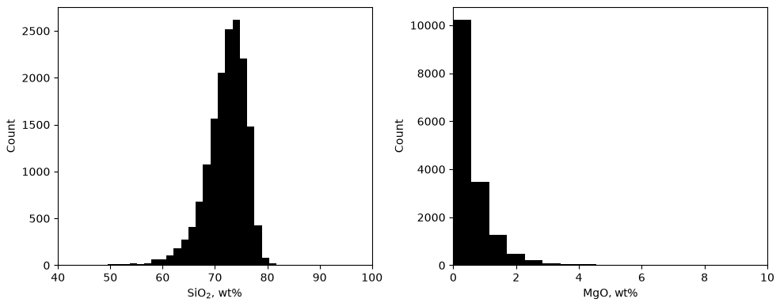
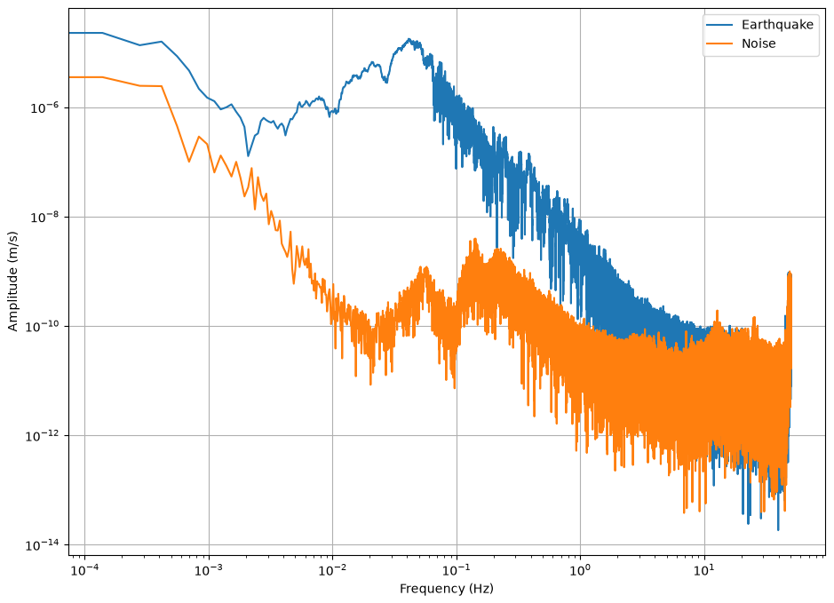
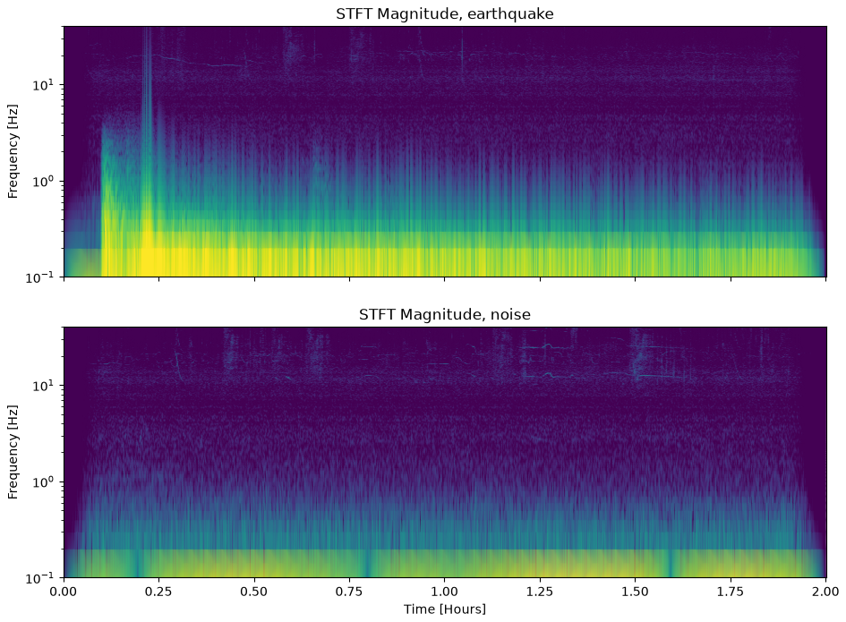

## {background-color="#faf7f2"}

[📈]{.lecture-icon}

### Today's question

Before any model touches your data:

**What shape is your data — and where does its energy live?**

::: {.dim}
Reading: [2.7 Statistical considerations](https://geo-smart.github.io/mlgeo-book/statistical-considerations) · [2.8 Spectral transforms](https://geo-smart.github.io/mlgeo-book/data-spectral-transforms)
:::

::: {.notes}
Frame the session: two lenses on the same raw data, before any ML. The histogram answers "what values does this process produce, and how often?" The spectrum answers "at which frequencies does this process carry energy?" Both are features a geoscientist reads off the data — and both become model inputs in Chapter 3. Ask the room: what distribution do you assume when you report a mean and a standard deviation? What breaks when the data are skewed?
:::

## This lecture in the literature



::: {.takeaway}
Two tools from the 1960s–70s and two statistics lessons — all four still load-bearing today.
:::

::: {.notes}
Two minutes. Cooley & Tukey: the FFT turned the Fourier transform from a research project into a routine call — every spectrum today runs through it. Harris: the encyclopedia of tapers; the vocabulary for what a window does to a spectrum, including the spectral leakage we meet later today. Aki: a one-line maximum-likelihood estimator for the Gutenberg-Richter b-value — the notebook uses exactly this formula, and it exists because magnitudes follow an exponential distribution, not a normal one; the estimator matches the distribution. Kagan & Jackson: the seismic-gap hypothesis drove hazard thinking for a decade; when its forecasts were finally tested statistically against the catalogs, they failed — a field misled by not testing its statistics. Refs file updates monthly; bring candidates.
:::

## Four distributions cover most of geoscience

- **Normal** — temperature, sea level, wind speed
- **Log-normal** — rainfall intensity, river discharge, permeability
- **Exponential** — earthquake magnitudes (Gutenberg-Richter)
- **Power-law** — landslide areas, wildfire sizes

::: {.takeaway}
Name the distribution before you compute a mean — the mean of a power law can be meaningless.
:::

::: {.notes}
Walk each: normal arises from many small additive effects; log-normal from multiplicative ones (that is why rainfall and permeability are log-normal — cascades of multiplicative processes); exponential inter-event times and magnitudes; power laws for size distributions of landslides and fires, where variance may not even exist. Common student error the notebook corrects head-on: earthquake magnitudes are NOT log-normal — log10 N = a − bM means an exponential distribution in magnitude. The 2024 edition of the course generator had this wrong; mlgeo_synth now samples the true truncated exponential. That is why the estimator on the next slides is Aki's, not a Gaussian fit.
:::

## Real rocks have shapes

{.r-stretch}

::: {.dim}
Kurtosis of SiO₂: 13.67 by the moment integral, 10.67 from pandas — same data, two conventions (plain vs *excess*), difference exactly 3. Record which one your pipeline uses.
:::

::: {.takeaway}
15,924 granite analyses, EarthChem database. SiO₂ piles up near 73 wt% with a long left tail; MgO decays like an exponential. Two variables, one dataset, two different shapes.
:::

::: {.notes}
Real geochemical data: granites from the EarthChem database, silica and magnesium oxide in weight percent. Left: SiO₂, skewness −1.75 — the tail points at altered or misclassified samples, not at the granites. Right: MgO hugs zero and decays fast; the maximum is 57 wt% — physically impossible for a granite, so it is a data-entry or classification error sitting in the archive. Lesson for their projects: describe() and a histogram before anything else; the shape tells you what cleaning and what statistics are legitimate. Spend a beat on the dim line — define kurtosis aloud (tail weight relative to a Gaussian) and name the convention trap: the moment definition gives 13.67, pandas and scipy report excess kurtosis, 10.67; the difference is exactly 3, and a feature table built under one convention and read under the other is a silent bug (2.11 computes kurtosis on 200 waveforms). Also the provenance rule from the notebook: never edit the original file — record every processing step.
:::

## The estimator that matches the distribution

::: {.big-number}
b = 0.998 [maximum likelihood, 20,000 synthetic magnitudes — true value 1.0]{.unit}
:::

::: {.dim}
Gutenberg-Richter: log₁₀ N(≥M) = a − bM. Synthetic catalog (mlgeo_synth), magnitudes 1.0–5.64, so the truth is known and the estimator can be graded.
:::

::: {.takeaway}
Because we planted b = 1.0, we can certify the estimator before trusting it on a real catalog.
:::

::: {.notes}
The workflow to spotlight: magnitudes follow an exponential distribution, so the correct estimator is Aki's one-liner — not a least-squares fit to a log histogram, which is biased. And how do we know the estimator works? We ran it on data where we planted the answer: 20,000 magnitudes drawn with b = 1.0, recovered 0.998. This is the course's honesty pattern — synthetic data with known truth grades the method — and it returns full-scale on Monday (2.10). Caveat for real catalogs: magnitude of completeness; below it the catalog misses small events and the line bends over, so estimate b only above completeness.
:::

## What a spectrum tells a geoscientist

{.r-stretch}

::: {.takeaway}
Station UW.RATT (Washington), M8.2 Chignik, Alaska earthquake, 2021-07-29 vs the two hours of noise before it. The earthquake wins by 2–3 decades from 0.01–1 Hz; the curves merge near 5–10 Hz — that band choice is Friday's lecture.
:::

::: {.notes}
The course's flagship record, met here first: broadband vertical channel at 100 samples per second, ground velocity after instrument-response removal. Read the figure like a geoscientist: the bump near 0.2 Hz in both curves is the ocean microseism — storms pumping the seafloor, present whether or not there is an earthquake. Between 0.01 and 1 Hz the great earthquake's surface waves tower above the noise; above ~5–10 Hz the two curves merge — signal-to-noise ratio near 1, no filter can help you there. This one figure picks the 1–10 Hz bandpass we use Friday in 2.9. Also point out: the phase spectrum of both records is uniform — the information geoscientists use lives mostly in the amplitude spectrum.
:::

## Before you transform: taper

- The Fourier transform assumes your window repeats forever
- A hard cut at the window edges smears energy across frequencies — **spectral leakage**
- The fix: taper the edges to zero (this record: 5% cosine taper)

::: {.dim}
Spectral leakage (signal processing) ≠ data leakage (model evaluation, 2.13). Unrelated concepts that share a word — the glossary keeps them apart.
:::

::: {.takeaway}
Detrend, taper, then transform — the standard chain before every spectrum in this course.
:::

::: {.notes}
Give the intuition: chop a sine mid-cycle and the transform sees a discontinuity — a step — which is broadband, so energy from one frequency bleeds into neighboring bins. Tapering (a Hann-type window; Harris 1978 is the catalog) trades a little resolution for much cleaner bins. Say the disambiguation out loud, because Wednesday of week 4 introduces the other leakage: spectral leakage is about frequency bins in one signal; data leakage is about information crossing the train/test line. Same word, different worlds. The processing chain used on RATT: merge, detrend, 5% taper, remove instrument response — in that order, every time.
:::

## Moments meet spectra

::: {.big-number}
11.2 vs 2.8 [kurtosis of the log-amplitude spectrum: earthquake vs noise]{.unit}
:::

::: {.dim}
Their means barely differ: −4.77 vs −4.87. The tails discriminate; the average does not.
:::

::: {.takeaway}
2.7's moments applied to 2.8's spectra = a discriminating feature. This is feature engineering, one week early.
:::

::: {.notes}
The bridge slide: take the log10 amplitude spectra of the earthquake window and the noise window, and compute 2.7's four moments on each. Means: nearly identical — useless as a feature. Kurtosis: 11.2 against 2.8 — the earthquake spectrum has heavy tails because a few frequency bands carry enormous energy while noise spreads energy evenly. Skewness separates too (2.45 vs 0.78). This is exactly how detection features get built in 2.11 and how a classifier will tell event types apart: not by the average, by the shape. Preview question for the room: what other geoscience pairs differ in tails but not means? (Flood vs baseflow discharge, storm vs calm wind.)
:::

## The same record in time *and* frequency

{.r-stretch}

::: {.takeaway}
Short-time Fourier transform, earthquake (top) vs noise (bottom), UW.RATT (real). The P arrival is a brief high-frequency streak; the surface waves ring below 0.3 Hz for the rest of the two hours.
:::

::: {.notes}
The spectrogram: Fourier transforms of short overlapping windows (10 s windows here), stacked in time. Read it: at ~0.2 hours a vertical streak to several Hz — the P wave, brief and broadband; then a sustained bright band below 0.3 Hz — the surface-wave train and coda of a magnitude-8 event, ringing for hours. The horizontal lines near 10–20 Hz in both panels are cultural and instrumental noise — always there. ML hook: this 2D array is a standard neural-network input; Chapter 4's CNNs eat spectrograms. Mention the wavelet transform for students who need better low-frequency time resolution (book section 4 of 2.8, Level 3): adaptive windows, 460× the cost — the notebook times both.
:::

## Two lenses, one habit

| Lens | The question it answers | Geoscience example |
|---|---|---|
| Histogram + moments | What values, how often, how heavy the tails? | granite SiO₂; flood discharge |
| Named distribution | Which statistics are even legitimate? | Gutenberg-Richter b-value |
| Spectrum (+ taper) | Where does the energy live? Where does signal beat noise? | picking the 1–10 Hz band at RATT |
| Spectrogram | When does each frequency band turn on? | P wave vs hours of surface waves |

::: {.takeaway}
Look at the data both ways before modeling — every later chapter assumes you did.
:::

::: {.notes}
Leave this up during questions. Each row was a slide today. The habit being installed: characterization before modeling. In week 4, the AI-ready checklist (2.13) makes this mandatory — the data card records exactly these properties. In week 7, the same discipline turns on evaluation designs. If time allows, ask each project team which row they have NOT yet done on their own data.
:::

## Now run it yourself — open 2.7 and 2.8

1. `pixi run jupyter lab` → `2.7_statistical_considerations.ipynb`
2. Exercise: draw from your distribution, compute the four moments, shrink to 100 samples — which moments degrade first?
3. Open `2.8_data_spectral_transforms.ipynb`: recompute the RATT spectra with and without the taper; describe the difference
4. Compute skewness and kurtosis of both log-amplitude spectra — reproduce today's 11.2 vs 2.8

::: {.dim}
Friday: repairing real records (2.9) — filters meet gaps and clock errors · HW1 was due Mon · Ch 1 quiz closed last week
:::

::: {.notes}
Timing for the 80-minute block (10:00–11:20): pulse talks ~10 min, this deck ~20 min, guided notebook work ~40 min on the four tasks, synthesis ~10 min comparing answers to task 2 (higher moments need far more samples — kurtosis is the fragile one; connect to why small geoscience datasets rarely support tail statistics). Implementation names live here, not on the content slides: scipy.stats.moment, scipy.stats.kurtosis (note the fisher=True default — that is the excess convention), pandas .kurtosis(), scipy.fft.fft/rfft, scipy.signal.stft or spectrogram, obspy taper(max_percentage=0.05). Students' coding agents know the syntax; choosing the distribution and the band is the scientist's job.
:::
