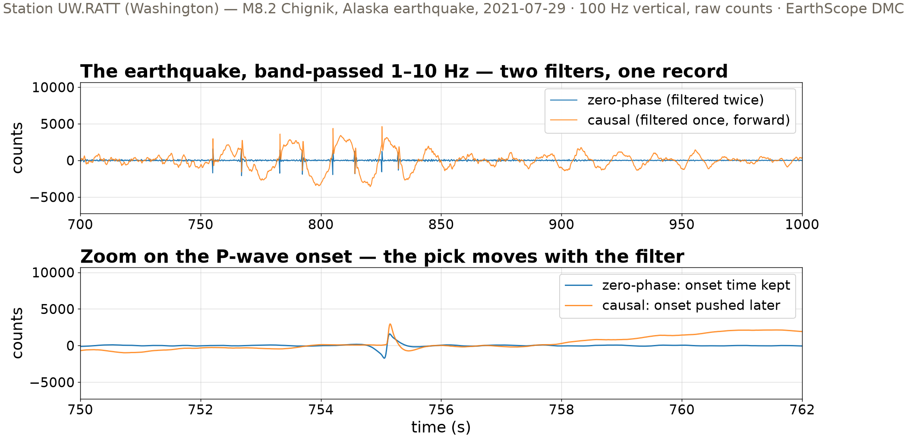
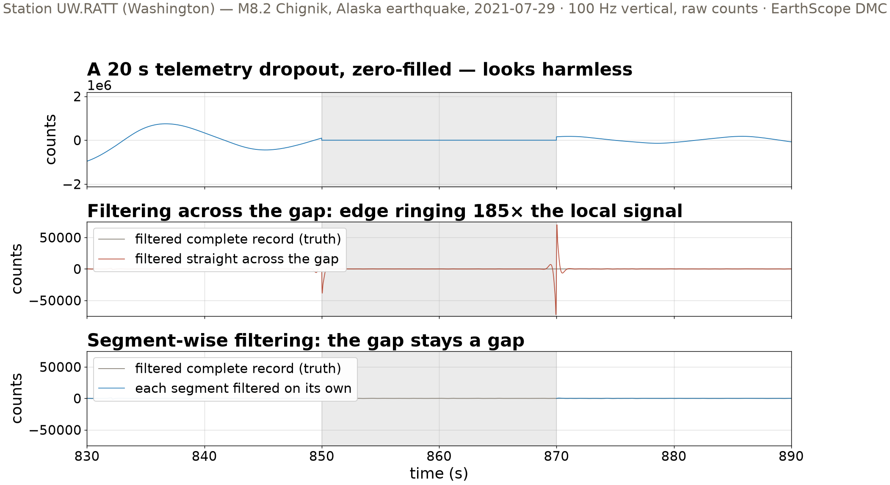
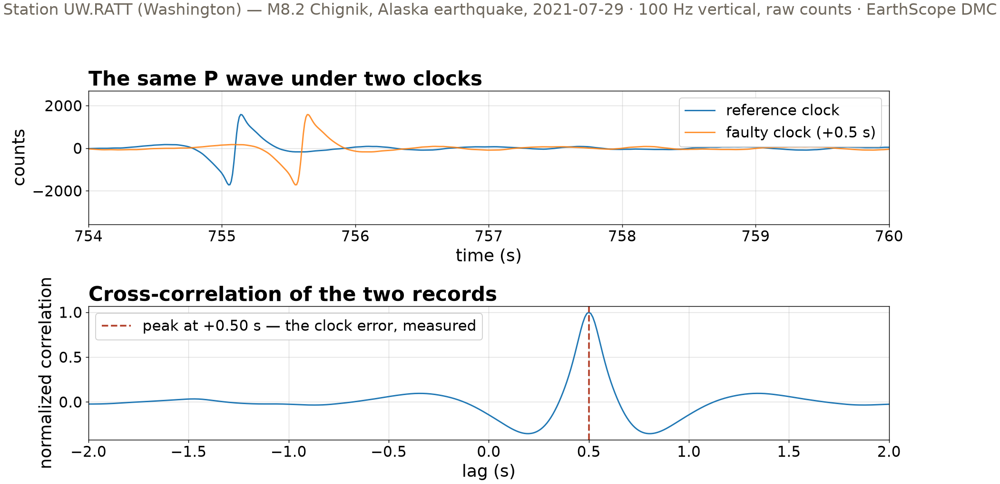

## {background-color="#faf7f2"}

[🩹]{.lecture-icon}

### Today's question

The archive hands you a broken record.

**What may you repair — and what must stay broken?**

::: {.dim}
Reading: [2.9 Filtering data](https://geo-smart.github.io/mlgeo-book/filtering-data)
:::

::: {.notes}
Frame the session: real records arrive with injuries — dropouts, timing errors — and every filter we apply adds artifacts of its own. Today's discipline: break a healthy record on purpose, so the unbroken record is the ground truth and every repair gets graded with a number. Three pathologies on one real waveform: the filter that moves an onset, the gap that rings, the clock that lies. Ask the room: who has downloaded data with gaps? What did you do about them?
:::

## This lecture in the literature



::: {.takeaway}
Processing choices are science choices — the literature has celebrated artifacts and retracted precursors to prove it.
:::

::: {.notes}
Two minutes. Scherbaum is the deep reference: what a filter's poles and zeros do to phase and amplitude — the book behind today's causal/zero-phase story. Boore & Bommer: for strong-motion records, the choice of filter corners and baseline correction changes peak ground motions and response spectra — the numbers building codes use; processing done right, documented, consequential. The Loma Prieta pair is today's cautionary tale: a low-frequency magnetic precursor reported before the 1989 earthquake became one of the most cited precursor claims ever; two decades later a re-analysis showed the anomaly came from the instrument and its processing, not the Earth. Keep it in mind at the P-wave zoom: artifacts near onsets get interpreted as physics. Refs update monthly; bring candidates.
:::

## One healthy record, injured on purpose

- Station UW.RATT (Washington), 100 Hz vertical — the M8.2 Chignik, Alaska earthquake, 2021-07-29
- We add the injuries ourselves: a zero-filled gap, a 0.5 s clock error
- The unbroken record stays as ground truth — **every repair gets graded**

::: {.takeaway}
Same honesty pattern as Wednesday's b-value: plant the truth, then grade the method.
:::

::: {.notes}
Recall Wednesday: this is the same record whose spectrum picked the 1–10 Hz band. Two hours of data, 720,000 samples, kept in raw digitizer counts (no response removal today — the repairs do not need it). The experimental design is the lecture's real lesson: never test a repair on data whose truth you do not know. We take the intact record, injure a copy, repair it, and measure repair error against the intact original. The notebook's phrase: "every repair gets graded." Note the notebook also opens with a synthetic climate series showing that filtering recovers a frequency band, not a physical component — worth a sentence here as a reminder that filters are band tools, not physics tools.
:::

## Two filters, one P wave

{.r-stretch}

::: {.takeaway}
Causal filtering pushes the onset later (phase delay). Zero-phase keeps the time but leaks energy *before* the onset. Neither is wrong — each answers a different need.
:::

::: {.notes}
Walk the zoom panel. Blue, zero-phase: the filter runs forward then backward, phase delays cancel — onset time preserved, but energy smears backward in time, so a sharp onset grows a small precursor that is pure artifact. Orange, causal: output at time t depends only on data up to t — nothing appears before it happens, but every frequency is delayed by a different amount, so the onset arrives late and distorted. When each: causal is the only option in real time — earthquake early warning — and whenever precursory energy matters; zero-phase for offline work where timing alignment matters, like phase picks feeding tomography. The rule the notebook states verbatim: do not interpret small precursory wiggles near sharp onsets — they can be filter artifacts. That is the Loma Prieta lesson at waveform scale.
:::

## The gap that rings

{.r-stretch}

::: {.takeaway}
Zero-filling creates two step discontinuities. A step is broadband — the filter answers with its own ringing, and inside the gap it draws plausible-looking wiggles that are pure artifact.
:::

::: {.notes}
Top: a 20 s telemetry dropout delivered zero-filled — which is how many archives (and a careless merge) deliver gaps. It looks harmless. Middle: band-pass straight across it, and the filter rings at both edges — compare against the gray truth from the intact record. Emphasize the danger inside the gap: the naive output contains oscillations at the filter's corner frequencies that look like signal. An ML pipeline windowing this record would happily learn from them. Bottom: the repair — filter each contiguous segment separately, leave the gap as NaN. The gap stays declared missing rather than silently invented. Connect back to 2.6: fabricating samples by interpolation has the same ethics; here even "just filtering" fabricates.
:::

## The repair, graded

::: {.big-number}
185× [edge ringing vs local in-band signal — filtered across the gap]{.unit}
:::

::: {.big-number}
1.7× [same measure after segment-wise filtering]{.unit}
:::

::: {.dim}
Measured 0–2 s from the gap edges against the intact-record truth: ringing of 12,998 counts over a local signal of 70 counts RMS. Beyond 2 s, the segment-wise error falls to ~0.
:::

::: {.takeaway}
Two orders of magnitude, and the residual damage is confined to ~2 s of filter memory — flag that guard interval in your metadata.
:::

::: {.notes}
The grading only exists because we kept the intact record. Naive filtering: error 185× the local signal in the first two seconds from each gap edge — the "signal" there is coda at ~70 counts RMS, the ringing is ~13,000 counts. Segment-wise: 1.75× at the edge, 0.0005× at 2–5 s, zero beyond. Why ~2 s: a few periods of the lowest passband frequency (1 Hz) — the memory of the filter. Practice: repair means confining the damage, then declaring it — a guard interval of a couple of seconds at each segment edge, recorded in metadata so downstream feature extraction (2.11) can skip it. Ask: what is the guard interval if your band goes down to 0.1 Hz? (Tens of seconds — it scales with the longest period.)
:::

## The clock that lies

{.r-stretch}

::: {.takeaway}
A 0.5 s timing error leaves the waveform perfect and corrupts only the timestamps — invisible to the eye, fatal for phase picks. Cross-correlation reads it back exactly: +0.50 s.
:::

::: {.notes}
The third pathology is the sneakiest: GPS clock failures drift station time by fractions of a second. Nothing in the waveform shape changes — plot either record alone and it looks perfect. But every arrival time, every pick-derived ML label, every cross-correlation measurement is now wrong by half a second — at 100 Hz, 50 samples. The repair: cross-correlate a 60 s window spanning the P arrival against a reference; the correlation peak sits at the lag that best aligns them — +0.50 s, exactly the injected offset. Sub-sample precision: fit a parabola through the three points around the peak. Real-world references: a co-located sensor, a neighboring station corrected for predicted travel-time difference, or for ambient-noise methods the long-term average of the noise correlation itself. mlgeo_synth.degrade_series injects the same pathology at daily cadence for their projects.
:::

## Repair means confining the damage

- Filter artifacts near onsets: **know your filter** — never interpret precursory wiggles
- Gaps: filter segment-wise, leave the gap `NaN` — declared missing, not repaired
- Guard intervals at segment edges, written into the metadata
- Clock errors: measure with cross-correlation, correct the timestamps, log the correction

::: {.takeaway}
An honest record carries its scars and its repair log — that log becomes the data card in 2.13.
:::

::: {.notes}
The synthesis before the table. The common thread: never silently invent data. A gap interpolated over is invented data; ringing inside a gap is invented data; a precursor from a zero-phase filter is invented data. Every repair we accepted either confines damage (segment-wise filtering, guard intervals) or is exactly measurable (the clock lag). And every one leaves a paper trail. Forward pointer: in 2.13, the data card has fields for missing-data policy and processing provenance — today generated the content that belongs in them. For ML: gaps and guard intervals must be masked out of training windows, or the network learns filter artifacts.
:::

## Three pathologies, three repairs

| Pathology | What it does | The repair | Where you'll meet it |
|---|---|---|---|
| Filter phase | moves or decorates the onset | pick causal vs zero-phase for the task | early warning vs tomography picks |
| Zero-filled gap | edge ringing 185× local signal | segment-wise filtering + guard interval | telemetry dropouts, careless merges |
| Clock error | timestamps lie, waveform looks fine | cross-correlation lag, then correct + log | GPS clock failures, ocean-bottom sensors |

::: {.takeaway}
The unbroken record graded every number in this table — plant truth before you trust a repair.
:::

::: {.notes}
Stands alone for review. Row 1: the choice is per-use, not per-taste — real-time and precursor studies need causal; offline alignment wants zero-phase. Row 2: the 185× is today's flagship number; students reproduce it in the notebook and then move the gap into the surface-wave train to see the damage scale with local amplitude. Row 3: ocean-bottom seismometers are the classic clock-drift setting — no GPS underwater; whole re-timing literatures exist. If a student asks about repairing the gap contents themselves: that is imputation, and for ML the honest move is masking, not inventing — Chapter 4's training lab returns to this.
:::

## Now run it yourself — open 2.9

1. `pixi run jupyter lab` → `2.9_filtering_data.ipynb`
2. Reproduce the gap experiment; then move the gap under the surface waves and re-grade the ringing
3. Change the band to 0.1–1 Hz: how long does the guard interval get?
4. Add sub-sample precision to the clock recovery (parabola through the correlation peak)
5. Your team's data: which of the three pathologies applies? Write the one-line repair policy.

::: {.dim}
Monday: synthetic data with known truth, the detection floor (2.10–2.11) · Reading-arc stage 1 due Wed Oct 21
:::

::: {.notes}
Timing for the 80-minute block (10:00–11:20): pulse talks ~10 min, deck ~20 min, notebook ~40 min, synthesis ~10 min collecting task-5 answers — every team should name a pathology and a policy; hydrology teams have gauge gaps during floods, GNSS teams have offsets and outages, climate teams have station moves. Implementation names for the notebook, not the slides: scipy.signal.butter with output='sos' (numerically stable second-order sections), sosfilt (causal) vs sosfiltfilt (zero-phase), np.flatnonzero/np.split for segment bookkeeping, scipy.signal.correlate + correlation_lags. The task-3 answer: guard interval scales with the longest period — 0.1 Hz means tens of seconds, which for short records may consume the segment; that pain is the point.
:::
