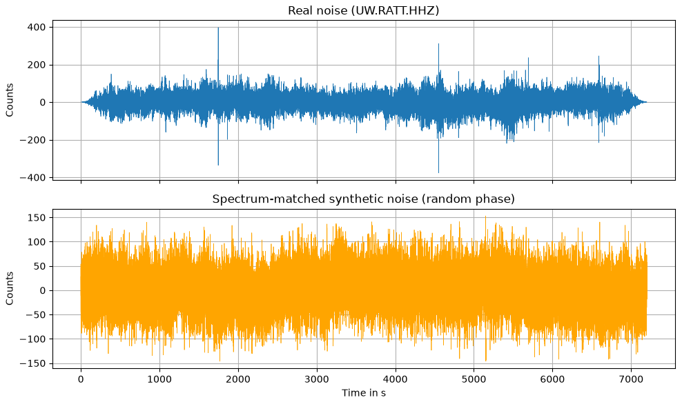
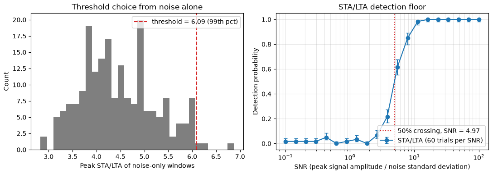
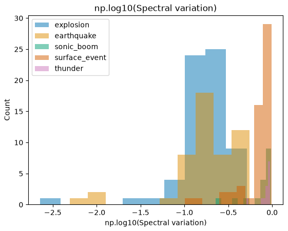

## {background-color="#faf7f2"}

[🎛️]{.lecture-icon}

### Today's question

The Earth rarely tells you the answer.

**How weak a signal can your detector actually see?**

::: {.dim}
Reading: [2.10 Synthetic noise](https://geo-smart.github.io/mlgeo-book/synthetic-noise) · [2.11 Feature engineering](https://geo-smart.github.io/mlgeo-book/feature-engineering)
:::

::: {.notes}
Frame the session: real data never comes with an answer key — we do not know which wiggles are events and which are noise. Physics-generated synthetics do come with the key: we planted the event, so we know exactly what a detector should find. Today we build realistic synthetic data, measure a classical detector's limits with it, then turn to fully real waveforms and ask what features describe them. Ask the room: how would you measure your detector's false-alarm rate on real data, where you don't know the truth? (You can't — that is the lecture.)
:::

## This lecture in the literature



::: {.takeaway}
A 1978 detector, a 1993 noise model, one catalog cautionary tale, and the benchmark dataset this class touches today.
:::

::: {.notes}
Two minutes. Allen 1978: the STA/LTA trigger — short-term average over long-term average — still running in observatories today; it is the baseline our synthetic experiment grades. Peterson 1993: the low- and high-noise models of global seismic background; whenever you synthesize noise, these are the reference spectra reality answers to. Habermann is the ✗ story: reported changes in seismicity rates that turned out to be changes in network detection thresholds — the detection floor moved, and people published it as physics. Exactly what today's experiment quantifies before it can mislead. Ni et al. 2023 is the curated Pacific Northwest AI-ready dataset — Denolle group and PNSN — whose subset, miniPNW, is today's real data. Refs update monthly; bring candidates.
:::

## The honesty machine

- Physics-generated synthetics carry their own answer key — **known truth grades everything**
- Seeded generation: same seed, same dataset — reproducible by anyone
- Admissible: method development, benchmarking, augmentation — always disclosed
- Not admissible: *"a model validated only on synthetic data has not been validated"*

::: {.takeaway}
Synthetics are for grading methods; real data is for grading claims.
:::

::: {.notes}
This is course principle 2 made explicit. Wednesday we planted b = 1.0 and graded the estimator; Friday the intact record graded every repair; today we plant events at chosen amplitudes and grade a detector. The two rules that make this honest: disclose (which samples are synthetic, which generator, which seed — the data card in 2.13 has a field for it), and never let synthetic validation substitute for real validation — the quoted line is verbatim from the book. mlgeo_synth is the course generator: provenance one import away. The admissible list matters for their projects: augmentation is fine and common (we do it in a moment), but the final claim must stand on real held-out data.
:::

## Noise with the Earth's own spectrum

{.r-stretch}

::: {.takeaway}
Top: two hours of real noise, station UW.RATT (Washington). Bottom: synthetic (mlgeo_synth) — same amplitude spectrum, new random phases. The statistics match; the waveforms line up nowhere.
:::

::: {.notes}
The recipe: take the real record's amplitude spectrum, replace every phase with a uniform random draw, inverse-transform. The result has the microseism peak, the cultural-noise bands, the right amplitude distribution — because those live in the amplitude spectrum — but it is a genuinely new realization, sharing no waveform with the original. Recall lecture 7: the phase spectrum of noise is uniform — that is exactly the property we exploit. Why this beats white noise for testing: a detector tuned on white noise meets the microseism and falls over; spectrum-matched noise gives laboratory control with field-realistic statistics. The figure carries both tags deliberately — top real, bottom synthetic — practice reading them; every figure in this course declares which it is.
:::

## The threshold comes from noise alone

::: {.big-number}
6.09 [detection threshold — 99th percentile of 200 noise-only trials]{.unit}
:::

::: {.dim}
STA/LTA: short-term average over long-term average — spikes when a transient arrives. Pure noise reaches a median peak of 4.3; the 99th percentile sets a 1% false-alarm rate by construction, before any signal enters.
:::

::: {.takeaway}
Set the threshold from noise alone, then measure detection — never tune the threshold on the signals you want to find.
:::

::: {.notes}
Define STA/LTA aloud (it is in the glossary): a running ratio of short-window to long-window average amplitude — 1 s over 10 s here. The design discipline is the slide's point: 200 windows of noise-only synthetic data, record each window's peak STA/LTA, threshold at the 99th percentile. The false-alarm rate is then 1% by construction — chosen, not discovered. Contrast with the common sin: tuning the threshold until the events you already believe in are detected — circular, and exactly how Habermann-style artifacts are born. This procedure is only possible because we can generate unlimited noise-only data — the synthetic's gift. Note the noise here is microseism-rich, hence a high median of 4.3; quieter sites would allow lower thresholds.
:::

## The detection floor, measured

{.r-stretch}

::: {.takeaway}
Detection probability crosses 50% near SNR ≈ 5 and saturates above ~16. Below the floor, events exist but the catalog will not contain them.
:::

::: {.notes}
Left panel: the noise-only histogram and the 6.09 threshold from the previous slide. Right: plant a synthetic event (a Ricker wavelet in spectrum-matched noise) at 20 SNR levels, 60 trials each, and count detections. SNR here = peak signal amplitude over noise standard deviation. The curve: flat at the designed 1–2% false-alarm level up to SNR ~2.6, climbs through 50% at SNR 4.97, saturates at 1 above ~16. Plain words: this classical detector needs a peak of roughly five noise standard deviations to trigger reliably. Consequences: every catalog has such a floor; seismicity below it is invisible, and if the floor moves — new instruments, new noise — apparent rates change with no physics (Habermann). In 4.3 we overlay a trained CNN's floor on this same curve, measured the same way — the fair comparison this course keeps building.
:::

## Now the real thing: miniPNW

::: {.big-number}
1,720 [real waveforms — Pacific Northwest, five source types]{.unit}
:::

::: {.dim}
earthquake 500 · explosion 500 · surface event 500 · sonic boom 126 · thunder 94 — three components, 100 Hz, from the curated PNW dataset (Ni et al. 2023).
:::

::: {.takeaway}
Not everything that shakes a seismometer is an earthquake — the label is the science question.
:::

::: {.notes}
Switch to fully real data: miniPNW, a course-sized subset of the curated Pacific Northwest AI-ready dataset — quarry blasts, avalanches and landslides (surface events), sonic booms, thunder, and earthquakes, recorded by regional networks (UW, CC, CN and others) at 100 Hz, 150 s windows around the pick. Two things to read from the class counts: the balance is engineered (500/500/500) for the big three, and the rare classes are genuinely rare — 94 thunder records is what the archive holds. Discriminating these classes is a real operational task at the PNSN — every regional network must tell blasts from earthquakes before publishing a catalog. This is the dataset their classification chapters will keep using; today we ask what features describe a waveform.
:::

## Features that separate sources

{.r-stretch}

::: {.takeaway}
One engineered feature — spectral variation — histogrammed per class over 200 real miniPNW waveforms: 156 features computed in 25 seconds; the spectral ones separate best.
:::

::: {.notes}
Feature engineering: compress each 15,001-sample waveform into named numbers — statistical (variance, kurtosis), temporal (autocorrelation), spectral (centroid, MFCCs, spectral variation), fractal (Higuchi dimension). An extraction library computed 156 of them on 200 randomly chosen waveforms in 24.9 s. Then the scientist's move: rank features by between-class spread over within-class spread. Result: spectral features top the ranking with separations around 1–2 — physically sensible, since explosions and earthquakes differ in frequency content more than in amplitude statistics. Warn about the traps the notebook hits: some features come back infinite or constant within a class and must be dropped; many are near-duplicates of each other — the correlation heatmap is dense with redundant blocks, which is Wednesday's problem (dimensionality reduction). Kurtosis appears again as an impulsiveness feature — the thread from 2.7 and 2.8.
:::

## What known truth buys you

| Move | Known truth means... | Geoscience example |
|---|---|---|
| Grade an estimator | planted b = 1.0, recovered 0.998 | Gutenberg-Richter fitting |
| Grade a repair | intact record vs 185× ringing | gap filtering (Friday) |
| Grade a detector | planted events → floor at SNR ≈ 5 | STA/LTA, then CNNs in 4.3 |
| Augment training data | real noise statistics, unlimited copies | spectrum-matched noise |

::: {.takeaway}
Three lectures, one pattern: plant the truth, grade the method, disclose the synthetic.
:::

::: {.notes}
The table names the pattern across the week so it stops looking like three separate tricks. Row 4 is the forward-looking one: deep networks in Chapter 4 are data-hungry, and the SNR ladder built today (a real-noise-statistics event at ten SNR levels) is exactly how training sets get augmented — with disclosure. The detection floor also gives teams a vocabulary for their proposals: what is your detection floor, and does your scientific claim live above or below it? The answer decides whether more data or better methods are needed.
:::

## Now run it yourself — open 2.10, then 2.11

1. `pixi run jupyter lab` → `2.10_synthetic_noise.ipynb`
2. Exercise 1: spectrum-matched noise from a different two-hour window — do the statistics still match?
3. Exercise 2: move the detection floor — try STA/LTA windows 0.5/5 s, 1/10 s, 2/20 s
4. Open `2.11_feature_engineering.ipynb`: extract features on miniPNW, rank by class separation
5. Which three features would you keep for a five-class classifier? Defend them physically.

::: {.dim}
Wednesday: dimensionality reduction + the AI-ready checklist (2.12–2.13) · Reading-arc stage 1 due Wed · Friday: the critical-evaluation lab (6.2)
:::

::: {.notes}
Timing for the 80-minute block (10:00–11:20): pulse talks ~10 min, deck ~20 min, notebook ~40 min, synthesis ~10 min on task 5 — push for physical defenses (spectral centroid separates blasts from quakes because sources differ in corner frequency), not score-chasing. Implementation names for the notebook, not slides: mlgeo_synth.spectrum_matched_noise and synthetic_seismogram, obspy.signal.trigger.classic_sta_lta, tsfel.get_features_by_domain / time_series_features_extractor, h5py access pattern bucketX$i for miniPNW. The exercise-3 expected finding: shorter STA windows catch impulsive onsets earlier but raise the noise-only percentile, so the threshold rises with them — the floor is a property of the detector-plus-noise pair, not of the Earth.
:::
