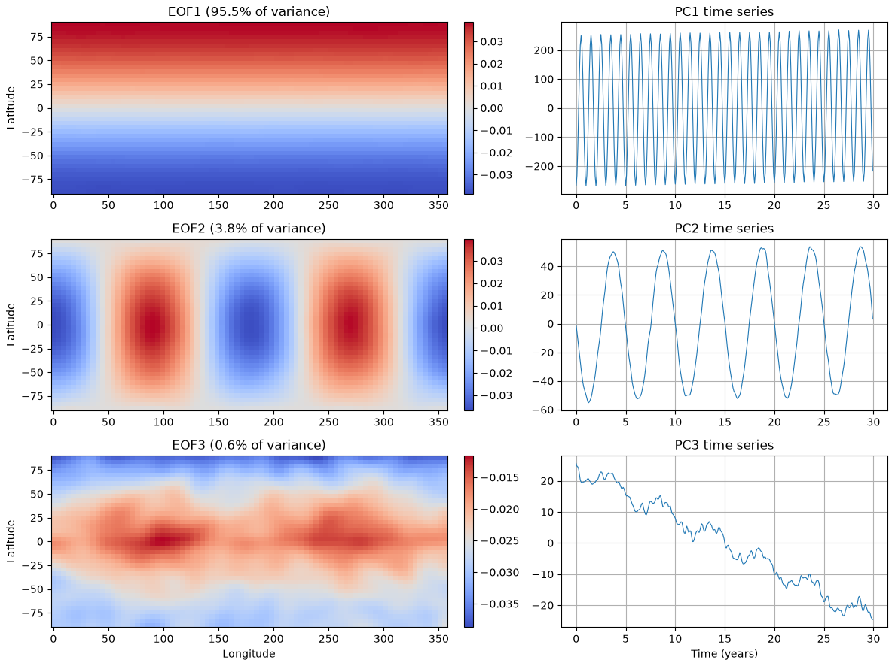
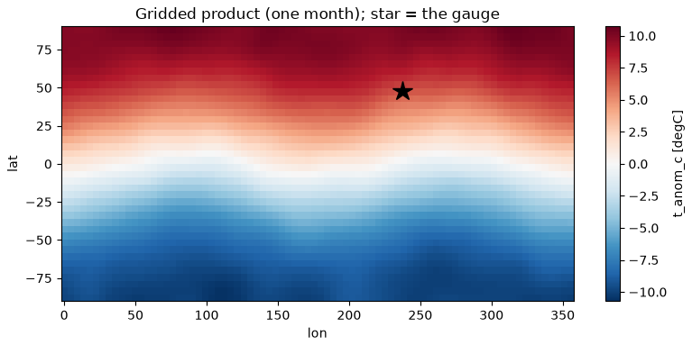

## {background-color="#faf7f2"}

[✅]{.lecture-icon}

### Today's question

"AI-ready" is not a feeling.

**Can your dataset prove it?**

::: {.dim}
Reading: [2.12 Dimensionality reduction](https://geo-smart.github.io/mlgeo-book/dimensionality-reduction) · [2.13 AI-ready data](https://geo-smart.github.io/mlgeo-book/mlready-data)
:::

::: {.notes}
Frame the session: the capstone of the data pillar. Two weeks of skills — formats, statistics, spectra, repairs, synthetics, features — converge on one operational question: when is a dataset ready to hand to a model, or to another scientist? The answer is a checklist, and the checklist is graded (it is the project's first milestone deliverable). First a short stop in dimensionality reduction — Monday's 156 features are too many and too redundant — then the checklist, and the two ways we break it on purpose to see the damage in the metrics. Ask the room: what would you need to know before training on a stranger's dataset?
:::

## This lecture in the literature



::: {.takeaway}
Data documentation and leakage are now a literature of their own — including a documented reproducibility crisis.
:::

::: {.notes}
Two minutes. Gebru: "datasheets for datasets" imported the electronics datasheet into ML — provenance, composition, collection process, intended use; our data card is its geoscience-sized descendant. Wilkinson: the FAIR principles are the data-stewardship frame funders now expect — the checklist operationalizes them for ML. Kaufman: the paper that formalized leakage, a decade before it was fashionable. Kapoor & Narayanan is the ✗: a systematic survey finding leakage in hundreds of published ML-for-science papers across 17 fields — civil war prediction, medicine, bioinformatics — each with inflated claims later walked back. Chapter 3.8 (week 7) is this course's full treatment; today installs the audit habit. Refs update monthly; bring candidates.
:::

## First, shrink the feature space

{.r-stretch}

::: {.takeaway}
A 30-year gridded temperature field, synthetic (mlgeo_synth) with planted patterns: the first mode carries 95.5% of the variance and matches the planted seasonal pattern with correlation 1.00.
:::

::: {.notes}
Monday ended with 156 features, many near-duplicates. Dimensionality reduction finds the few directions that carry the variance. Two demonstrations in 2.12, both synthetic with planted truth. One: PCA on a geochemical table — the first component carries 78.2% of nine variables' variance and is the igneous differentiation index, a physical axis the generator planted. Two, this figure: a gridded monthly temperature field decomposed into spatial patterns (EOFs — the geoscience name for principal components of a space-time field) and their time series. EOF1: 95.5% of variance, pattern correlation 1.00 with the planted seasonal mode; EOF2 recovers the zonal mode at −1.00 (sign is arbitrary — always check both signs). Caveats the notebook states: modes are forced orthogonal, real physics is not; trends dominate if you do not remove them; this is description, not causation. Wednesday's point for today: a PCA basis is a preprocessing statistic — remember that phrase when we hit leakage.
:::

## A dataset is AI-ready when it passes this checklist

1. Documented provenance, license, citation
2. Machine-readable metadata — **a data card**
3. Tidy shapes
4. Explicit units
5. A missing-data policy
6. Benchmark splits shipped with the data
7. **Leakage controls**
8. A class and event inventory

::: {.takeaway}
The plan for today: build a dataset that passes, then break rules 6 and 7 on purpose and watch the metrics lie.
:::

::: {.notes}
Read the list slowly — it is the graded artifact. Item 2: a README written for humans is not enough; the card must be parseable (YAML), because scripts consume it. Item 6: splits ship WITH the data as a column, so every user evaluates on the same held-out samples — that is what makes a benchmark a benchmark. Item 7 has two halves: the split design respects the correlation structure (time, location, event membership), and every preprocessing statistic comes from the training split only. Item 8: rare-event problems look nothing like balanced ones, and users must know before they train. The demo dataset: ten years of synthetic daily river discharge with injected floods — 3,652 days, 312 flood days (8.5%), 33 distinct flood events, disclosed synthetic (item 1) with generator and seed in the card. Chronological splits: train 2015–2021, validation 2022, test 2023–2024. The card is written to disk next to the CSV and read back with a YAML parser to prove machine-readability.
:::

## Break rule 7, watch the metric lie {.smaller}

::: {.big-number}
1.000 [average precision — rare-class oversampling *before* the split]{.unit}
:::

::: {.big-number}
0.848 [average precision — oversampling the training split only]{.unit}
:::

::: {.dim}
Average precision summarizes rare-event skill (1 = perfect). Same model, same flood data — duplicated flood days landed on both sides of the split.
:::

::: {.takeaway}
The perfect score is pure fiction. Leakage does not make models better — it makes evaluations wrong.
:::

::: {.notes}
Walk the mechanism: floods are 8.5% of days, so we oversample the rare class — standard practice. Done before the split, duplicated copies of the same flood day land in both train and test; the model recognizes its own training samples and scores a perfect 1.000. Done after — training split only — the honest 0.848. Also run in the notebook, quieter: scaler fit on all data vs train only, 0.722 vs 0.722 — no visible gap here, and the notebook says do not take comfort: the gap grows when data are short, the test period drifts, or preprocessing is richer than a scaler — PCA bases (this morning!), imputation models, feature selection all leak far more than a mean. And the split-design ladder: random KFold 0.839 vs time-respecting 0.704 vs grouped-by-event 0.734 — random splitting flatters by ~0.1 because consecutive correlated days straddle the split. The audit question, verbatim from the book: could a test sample be trivially reconstructed from training samples? If yes, the split is wrong. That is the "what do my samples share?" audit — full treatment in 3.8, week 7.
:::

## The join every project needs: raster → station

{.r-stretch}

::: {.takeaway}
A gridded product and a gauge (star) that sits between cell centers, synthetic (mlgeo_synth). Extract at the location, then merge in time *without touching the future*.
:::

::: {.notes}
The most requested workflow in project office hours: my measurements live at stations, my covariate lives on a grid — reanalysis precipitation onto a gauge, SST onto a buoy, soil moisture onto a borehole. Three steps. Space: the gauge is not at a cell center — nearest-cell snapping vs bilinear interpolation differ by 0.037 °C RMS here; bilinear for smooth fields, nearest is the only correct choice for categorical rasters (averaging "granite" and "basalt" is nonsense). The classic bug: longitude conventions — this grid runs 0–360, the gauge longitude 122.4 W must become 237.6 E; check the grid coordinates first. Time: monthly values joined to daily samples — linear interpolation between month centers uses the NEXT month, which is future information; the causal join takes the most recent available value and nothing from the future. Each choice — source grid, extraction method, join rule — becomes provenance in the data card (items 1 and 2). Real-data extras the synthetic spared us: CRS reprojection, grid cells being area averages not points, and timestamp semantics (does "2015-01" stamp the start or the end of the averaging interval?).
:::

## An honest pipeline may return "no" {.smaller}

::: {.big-number}
0.722 [average precision — discharge features only]{.unit}
:::

::: {.big-number}
0.710 [average precision — plus the joined temperature covariate]{.unit}
:::

::: {.takeaway}
The covariate carried no information about the floods, and the honest pipeline said so. The deliverable was never the score — it is the leakage-safe, unit-labeled, reproducible join.
:::

::: {.notes}
The result students least expect to see celebrated. The joined temperature field is synthetic with no causal connection to the injected floods — so a correctly joined, leakage-free covariate should not move the metric, and it does not (0.722 → 0.710, noise-level difference). This is the success case: the pipeline was honest enough to return a null. Contrast with the leaky world: had the join leaked future information, the score would have risen — a lie that later collapses in deployment. On real projects the same six lines of join code often DO carry skill (precipitation onto a gauge predicts floods). Message for their proposals, due Fri Oct 30: a well-audited "this covariate did not help" is a publishable, reusable finding; a leaky +0.05 is a retraction waiting to happen. This mindset returns Friday when they audit an AI's claims in the 6.2 lab.
:::

## The checklist is the capstone

| Checklist item | The question it answers | Today's evidence |
|---|---|---|
| Data card (1–5) | can a stranger — or a script — use this safely? | YAML card written, read back, parsed |
| Shipped splits (6) | is everyone graded on the same held-out data? | split column: 2015–21 / 2022 / 2023–24 |
| Leakage controls (7) | do my samples share time, location, or an event? | 1.000 vs 0.848; shuffled 0.839 vs temporal 0.704 |
| Class inventory (8) | is my problem rare-event or balanced? | 312 flood days of 3,652 (8.5%), 33 events |

::: {.takeaway}
"The split and the preprocessing are part of the dataset, not an afterthought of the model."
:::

::: {.notes}
The takeaway line is the book's closing sentence for the chapter, verbatim, and it is the single sentence to remember from the data pillar. Leave the table up for questions. Point at row 3 and forward-reference: week 7's robust-training lecture (3.8) rebuilds that row into a full validation ladder on GNSS and spatial data — today's audit habit is the seed. The checklist is graded twice: in the chapter assignment and at project check-in #1 (Nov 16), where each team presents their data against it, with their baseline and split design.
:::

## Now run it yourself — open 2.13 (and skim 2.12)

1. `pixi run jupyter lab` → `2.13_MLready_data.ipynb`
2. Write the data card, read it back with the YAML parser — item by item, what would a stranger still not know?
3. Break rule 7 yourself: oversample before the split and reproduce AP = 1.000
4. Run the three split designs; explain the 0.839 → 0.704 drop in one sentence
5. Your team's dataset against the eight items: which fail today? (Bring the list to check-in #1, Nov 16.)

::: {.dim}
Friday: the critical-evaluation lab (6.2) — Chapter 2's capstone, your data skills vs an AI's claims · Reading-arc stage 1 due today · Ch 2 quiz opens Mon
:::

::: {.notes}
Timing for the 80-minute block (10:00–11:20): pulse talks ~10 min, deck ~20 min, notebook ~40 min, synthesis ~10 min on task 5 — a quick round-robin of failing items; most teams fail 2, 6, and 7 on day one, and hearing that normalizes fixing it rather than hiding it. Implementation names for the notebook, not slides: sklearn PCA / FastICA / TSNE for 2.12; xarray .sel(method="nearest") vs .interp(), pandas merge_asof(direction="backward"), yaml.safe_load, sklearn KFold / TimeSeriesSplit / GroupKFold, make_pipeline(StandardScaler(), ...) so preprocessing stays inside the training fold. Task-4 target sentence: "random folds let the model validate on days adjacent to its training days, so the score measures interpolation, not forecasting." The 2.12 skim: scree plot, loadings, and the EOF verification cell are the three things to look at.
:::
