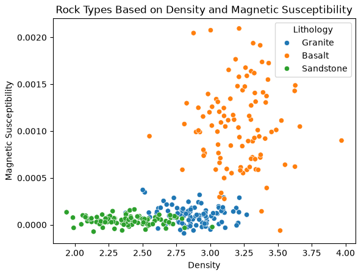

## {background-color="#faf7f2"}

[🧭]{.lecture-icon}

### Today's question

A seismic analyst has labeled ten thousand waveforms. Nobody has labeled a single Argo profile.

**What does your data offer: labels, structure, or feedback?**

::: {.dim}
Reading: [3.1 Concepts in supervision](https://geo-smart.github.io/mlgeo-book/concepts-supervision) · [3.2 Classification and regression](https://geo-smart.github.io/mlgeo-book/classification-regression)
:::

::: {.notes}
Chapter 3 opens today. Frame the session: before any algorithm, ask what the data can supervise. Two datasets, same instrument-heavy geoscience, opposite situations — one has a label for every sample (the analyst's earthquake/noise verdicts), the other has millions of samples and not one label (the Argo temperature-salinity archive). The whole taxonomy of learning frameworks falls out of that single question. Second half of the deck: once you do have labels, the first end-to-end workflow — and the train/validation/test discipline we will enforce all quarter. Ask the room: for your project dataset, who made the labels? Does it even have any?
:::

## This lecture in the literature {.smaller}



::: {.takeaway}
The supervision question is where every ML-in-geoscience paper starts — these three show the range.
:::

::: {.notes}
Two minutes. Bergen et al. is the review that organized the field: read its examples as answers to today's question — where solid-Earth problems have labels, where they only have structure. PhaseNet is supervision at scale done right: the labels were not made for ML — they are decades of routine analyst picks, millions of them, recycled as training data; the model ends up more consistent than any single analyst. Settles is the classic survey for the label-poor case — the model chooses which samples earn the analyst's hour; the book links it in 3.1. Note to the room: this refs file is a living document — the deck is missing its cautionary ✗ paper, and proposing one from your reading arc counts.
:::

## Five field problems, five kinds of supervision {.smaller}

| The field problem | What the data offers | Framework |
|---|---|---|
| 10,000 analyst-labeled waveforms | a label for every sample | **supervised** |
| Millions of Argo profiles, zero labels | only the data's geometry | **unsupervised** |
| A few mapped landslides, thousands of unvisited hillslopes | few labels + the unlabeled cloud | **semi-supervised** |
| Decades of continuous seismic archive | data that can hide part of itself | **self-supervised** |
| A glider choosing where to dive next | consequences, discovered later | **reinforcement** |
| 100,000 events/yr, analyst time for 2,000 | a model that can ask | **active** |

::: {.takeaway}
The framework is not a preference — it is read off the data you actually have.
:::

::: {.notes}
Walk each row as a story, not a definition — these are the five scenarios of book 3.1. Supervised: the analyst's verdicts are the supervision. Unsupervised: how many water masses are in the Argo archive? Structure first, labels never. Semi-supervised: calling every unvisited hillslope "stable" plants false labels; the unlabeled slopes still map where the data are dense and where the natural gaps fall — a good boundary runs through the gaps. Self-supervised: mask part of a seismogram, predict it from the rest — the label comes free; this is the training mechanism of the foundation models behind the course's AI thread, and in Chapter 4 you build a small one (autoencoder, masked pretraining). Reinforcement: no one can label the correct glider trajectory in advance; the reward arrives after the mission — rare in geoscience because few problems allow millions of trial-and-error interactions, but it is also how LLMs are post-trained from human feedback. Active: picking 2,000 seismograms at random wastes the analyst on easy cases; let the model ask for the labels that teach it most. Evaluation differs per row — that map is the table at the end of 3.1.
:::

## From today onward: supervised learning

Two kinds of question, two kinds of answer:

- **Classification** — a category: *is this window an earthquake or noise?* Binary (event / not event) or multiclass (granite / basalt / sandstone)
- **Regression** — a quantity: *how much soil moisture, given temperature and humidity?*

::: {.takeaway}
Same workflow for both; only the type of answer — and therefore the metric — changes.
:::

::: {.notes}
Lessons 3.2–3.9 live in the supervised row. The split matters because it decides the evaluation currency: classification is scored by counting correct categories (accuracy today; precision/recall on Friday), regression by measuring distance to the true value (MSE, R²). Mention in passing: some classifiers are natively binary and get wrapped one-vs-rest for multiclass — an implementation detail the notebook handles. The chapter's classifier gallery (logistic regression, LDA, naive Bayes, k-NN, SVM, random forest) is in the reading with a geoscience question attached to each — do not memorize the list; ask the three questions in order: what geoscience question, what statistical idea, does it suit my data?
:::

## The first labeled dataset

{.r-stretch}

::: {.takeaway}
Synthetic rock-property data (notebook 3.2): three lithologies in a two-feature space — density and magnetic susceptibility. The labels are the supervision.
:::

::: {.notes}
The chapter's first end-to-end workflow runs on this: 300 samples, 100 per rock type, two measurable physical properties. Point at the overlap between granite and basalt — that overlap is why no classifier will be perfect, and why we need honest evaluation rather than hope. The classifier we use is k-nearest neighbors: classify a new specimen by a vote among its k most similar training samples — assumes nothing about the boundary's shape, but "similar" depends on units (a preview of Friday's scaling lesson). Synthetic on purpose: we know the recipe, so surprises are pedagogical, not geological.
:::

## Beat the trivial guess — then report once

::: {.big-number}
1/3 [baseline: always guess the most common rock]{.unit}
:::

::: {.big-number}
0.80 [k-NN accuracy on the test set — touched once]{.unit}
:::

::: {.dim}
The validation set chose k = 9 from {1, 3, 5, 9, 15}; the test set only confirmed it.
:::

::: {.takeaway}
No baseline, no meaning: 0.80 matters because the trivial predictor gets 0.33.
:::

::: {.notes}
Numbers from the executed notebook: majority-class baseline 0.333 on the validation set; validation accuracies range 0.667–0.767 across k, best at k = 9; final test accuracy 0.80. Walk the three-way split aloud — training (60%) fits the model, validation (20%) compares the five candidate k values, test (20%) is touched once at the end. Why not tune on the test set? Because after enough peeks the test set silently becomes a validation set, and the final number becomes advertising. This discipline is the seed of session 18 on robust training. The confusion matrix in the notebook shows where the 20% of errors live: granite–basalt confusions, exactly the overlap on the previous slide — errors have geological structure.
:::

## Same discipline for a quantity {.smaller}

::: {.big-number}
R² = −0.01 [baseline: predict the training mean everywhere]{.unit}
:::

::: {.big-number}
R² = 0.947 [degree-2 polynomial, test set — touched once]{.unit}
:::

::: {.dim}
R²: 1 = perfect, 0 = no better than the mean. Validation preferred the polynomial (MSE 4.80) over the line (5.09) — the truth has a quadratic term.
:::

::: {.takeaway}
Baseline → candidate models → choose on validation → confirm once on test. Every time.
:::

::: {.notes}
The regression twin of the previous slide: synthetic soil moisture driven by temperature and humidity with a mild quadratic in temperature. Numbers from the executed notebook: mean-prediction baseline MSE 87.15, R² −0.012; linear regression MSE 5.09, R² 0.941; degree-2 polynomial MSE 4.80, R² 0.944 on validation; the selected polynomial scores MSE 4.02, R² 0.947 on the test set. Two teaching points: first, the linear model is already excellent — the polynomial wins by a nose, and only because the true function genuinely bends; model selection is only meaningful when the truth is unknown. Second, define R² before leaning on it — most of the room is domain, not data science. MSE is in squared physical units; the book returns to physical-units errors in 3.7.
:::

## The three-way split: each set has one job

| Set | Share | Its one job | Rock-type example |
|---|---|---|---|
| **Training** | 60% | fit the model's parameters | k-NN stores the labeled samples |
| **Validation** | 20% | compare models, tune choices | picked k = 9 of {1…15} |
| **Test** | 20% | one final honest number | accuracy 0.80, reported once |
| *Baseline* | — | the score any model must beat | 0.33 by always guessing |

::: {.takeaway}
Evaluation happens on data the model has not seen — the rule every notebook in this chapter enforces.
:::

::: {.notes}
The closing screen — leave it up for questions. Say the failure modes aloud: fit the scaler or the model on everything → the test set leaks into training; tune on the test set → the honest number quietly becomes a validation score. Both reappear as named villains on Friday (3.4's scaler discipline) and in session 18 (robust training). Vocabulary check: train/validation/test is the book's fixed triple — homeworks and the leaderboard use exactly these words, and the leaderboard's hidden test set is this row enforced by infrastructure.
:::

## Now run it yourself — open 3.2

1. `pixi run jupyter lab` → `3.2_classification_regression.ipynb`
2. Rock types: run the split, beat the 0.33 baseline, tune k on validation, test once
3. Soil moisture: baseline → linear → polynomial; confirm the validation choice on the test set
4. Your project data: which row of the five-problems table is it? Bring the answer Wednesday.

::: {.dim}
Wed: structure without labels — clustering (3.3) · Ch 2 quiz closes Wed · **Project proposals due Fri Oct 30**
:::

::: {.notes}
Timing for the 80-minute block (10:00–11:20): pulse talks ~10 min, this deck ~20 min, notebook exercise ~40 min, synthesis ~10 min collecting answers to task 4 — expect a spread across supervised, unsupervised, and semi-supervised, which sets up Wednesday and Friday. Implementation names live in the notebook: train_test_split (called twice for the three-way split), DummyClassifier and DummyRegressor for baselines, KNeighborsClassifier, LinearRegression, PolynomialFeatures in a Pipeline. Students' coding agents know the syntax; choosing the framework and the baseline is the scientist's job. Remind about the proposal deadline Friday and that the Ch 2 quiz window closes Wednesday.
:::
