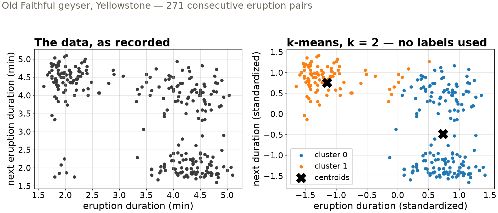
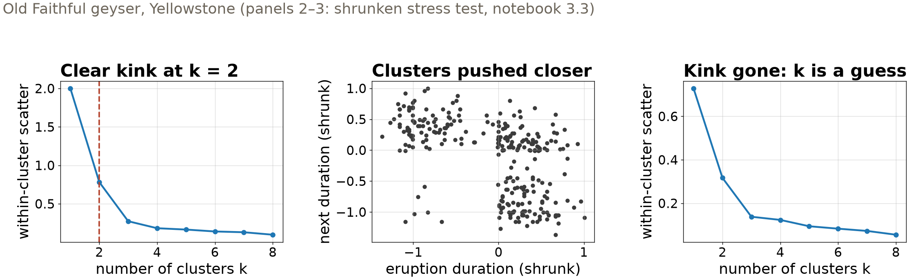
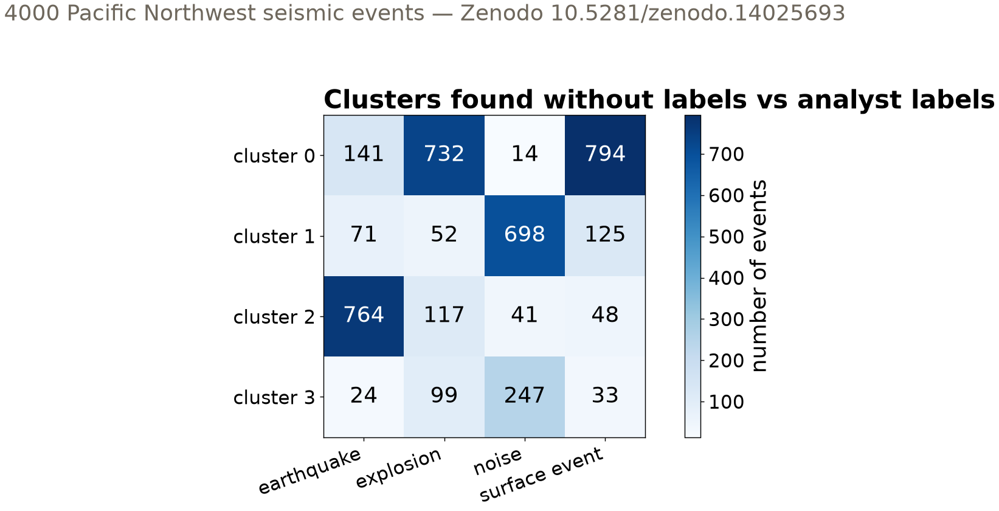

## {background-color="#faf7f2"}

[🌀]{.lecture-icon}

### Today's question

Nobody labeled the Argo profiles. Nobody labeled the geyser record either.

**Which groups are really in your data — and how would you know?**

::: {.dim}
Reading: [3.3 Clustering](https://geo-smart.github.io/mlgeo-book/clustering)
:::

::: {.notes}
Monday's table had a whole row for "only the data's geometry" — today we use it. Clustering is unsupervised classification: group data samples by similarity in feature space, no labels involved. The two honest questions of the session: what does an algorithm need from us to define "similar" (a distance metric), and how do we judge groups when no ground truth exists (diagnostics that suggest, never prove)? Ask the room: who expects their project data to contain natural groups? What would convince you they are real and not an artifact?
:::

## This lecture in the literature



::: {.takeaway}
Clustering has produced real geoscience discoveries — and its default rituals are under active critique.
:::

::: {.notes}
Two minutes. Holtzman et al. is the discovery story: cluster tens of thousands of earthquake spectra at The Geysers geothermal field with no labels, and the cluster occupancy turns out to cycle with the annual water-injection schedule — structure nobody had put a name to. Unglert et al. compared unsupervised pipelines on volcano seismic spectra and found that the tool changes what regimes you see — method choice is a scientific decision, which is today's distance-metric point at paper scale. Schubert is the cautionary one: the elbow criterion — the default ritual for choosing k — systematically misleads, and we reproduce its failure on our own data today. Refs update as the field moves; candidates from your reading arc are welcome.
:::

## Two regimes, zero labels

{.r-stretch}

::: {.takeaway}
The regimes are visible before any algorithm runs — k-means only formalizes what the geometry already says.
:::

::: {.notes}
Left: 271 consecutive Old Faithful eruptions, each point pairing one eruption's duration with the next one's. The physics: a long eruption drains the reservoir, so recharge takes longer — duration carries memory. Read the structure precisely with the room: after a short eruption the next is reliably long (tight upper-left cloud); after a long eruption the next can be short or long. Right: k-means with k = 2 on the standardized data splits short-current from long-current eruptions; X marks the centroids. Emphasize what was NOT used: no labels, no physics — only Euclidean distance between points. That is both the power (discovery without labels) and the caveat (the algorithm would happily "find" clusters in structureless data too).
:::

## Distance is the decision

- Every clustering method starts from a **distance metric** — k-means uses Euclidean, the straight line in feature space
- Features with large numeric ranges dominate the distance → **standardize first**
- Both Old Faithful axes are minutes — a coincidence; today's seismic features span orders of magnitude

::: {.takeaway}
Choosing the distance is choosing what "similar" means — a scientific decision, not a default.
:::

::: {.notes}
Define distance concretely: Euclidean is the root-sum-of-squares across features. Other choices exist for other data — Manhattan for grid-like data, geodesic on the sphere, correlation-based for waveform similarity, covariance-based in geostatistics — the book lists them; the point is that each encodes a different meaning of "similar," and the clusters change with it. Standardization habit: k-means on raw mixed-unit features silently clusters on whichever feature has the biggest numbers. Friday shows the same failure in supervised classification with a unit change (hertz to millihertz). Also connect to 2.12: PCA reduces dimensions, clustering groups samples; on high-dimensional data the standard combo is PCA first, cluster the components — we do exactly that in today's exercise.
:::

## The k-means loop

- **Guess** k centroids → **assign** each data sample to the nearest → **re-center** at the cluster means → repeat
- Minimizes within-cluster scatter — but only to a **local** minimum
- Different starts, different clusters → run many restarts, keep the best

::: {.takeaway}
Cheap, fast, everywhere — and never guaranteed to find the best partition. Restart it.
:::

::: {.notes}
You will code this loop from scratch in the notebook — four short functions, no library — because the mechanism matters: it explains why k must be chosen in advance (the loop needs centroids to start), why the result depends on initialization (local minima), and why the fix is repetition (the notebook's best-of-20 run). Then the scikit-learn version: KMeans with the k-means++ initialization and automatic restarts does all of this by default — say the names here, not on the slide. Distance returns in Chapter 4 as the building block of loss functions; the k-means objective is your first loss function, minimized by coordinate descent rather than gradients.
:::

## Choosing k: the elbow, honestly

{.r-stretch}

::: {.takeaway}
Diagnostics are suggestive, never proof: the kink at k = 2 vanishes when the regimes blur — and the data do not warn you.
:::

::: {.notes}
Left: within-cluster scatter versus k for Old Faithful — clear kink at k = 2, matching the two visible regimes; this is the elbow method working. Then the notebook's stress test: shrink the same standardized data toward the origin (middle panel) so the regimes bleed together, and the elbow curve (right) loses its kink — every k from 2 to 5 looks equally defensible. Nothing in the curve announces the failure. The notebook's second stress test (subsample to ~20% of the data) breaks it the same way. This is the Schubert critique from the literature slide, reproduced on 271 geyser eruptions. Rule for the room: use the elbow as a guide, cross-check with the silhouette score (next slide) — and with the physics.
:::

## A second opinion: the silhouette

::: {.big-number}
0.56 [silhouette score — Old Faithful, k = 2]{.unit}
:::

::: {.dim}
Per sample: (nearest-other-cluster distance − own-cluster distance) / the larger of the two. Ranges −1 (wrong cluster) through 0 (overlapping) to +1 (tight, well separated); the score is the average.
:::

::: {.takeaway}
One number for cohesion vs separation — under this distance, on these features. Another lens, not a verdict.
:::

::: {.notes}
Define it slowly from the dim line — a(i) is the average distance to your own cluster, b(i) to the nearest other cluster; well-clustered samples have b much larger than a. The executed notebook gives 0.561 for k = 2. Calibrate expectations: 0.56 is decent, not spectacular — the two regimes are real but the right-hand cloud is loose. The silhouette plot in the notebook shows the per-sample distribution, which is more informative than the average: look for clusters whose silhouettes sag toward zero. Same honesty as the elbow: the silhouette is computed from the same distance metric that made the clusters, so it can bless artifacts of a bad metric. When ground-truth labels exist — as in the exercise next — better scores exist: homogeneity, completeness, V-measure.
:::

## Exercise preview: volcanic and tectonic sources, no labels

{.r-stretch}

::: {.takeaway}
Unaided, k-means finds earthquakes and noise; explosions and surface events share a cluster — shallow sources look alike. V-measure 0.38 against the analyst labels.
:::

::: {.notes}
The hand-off dataset: 4000 Pacific Northwest seismic events — earthquakes, explosions, surface events (rockfalls, avalanches — think Mt Hood), and noise, 1000 each, described by 61 physical waveform features; analysts labeled every event, but we hide the labels and cluster. Pipeline: standardize (mandatory — the features span orders of magnitude), PCA to 15 components (80% of the variance), k-means with k = 4. The crosstab scores homogeneity 0.363, completeness 0.393, V-measure 0.377 — define V-measure as the harmonic mean of the first two, 0 random to 1 perfect. Read the physics in the matrix: cluster 2 is essentially earthquakes (764), cluster 1 noise (698); explosions and surface events pile into cluster 0 together — both are shallow near-surface sources without deep high-frequency energy, so their features overlap. The same dataset returns Monday for supervised classification, where labels lift performance substantially — which is the point of labels.
:::

## The unsupervised toolkit

| Method | Core idea | You choose | Seismic-exercise example |
|---|---|---|---|
| **k-means** | minimize within-cluster Euclidean scatter | k, feature scaling | 4 clusters in 4000 events |
| **Agglomerative** | merge nearest pairs; cut the tree at a height | distance, linkage, cut | dendrogram → cluster IDs |
| **PCA, then cluster** | compress correlated features first | number of components | 61 features → 15 PCs (80% var.) |
| **Diagnostics** | silhouette, elbow; label-based scores if truth exists | which lens to trust | V-measure 0.38 vs analysts |

::: {.takeaway}
Every row hides a scientific choice — distance, k, linkage, components. The algorithm never makes it for you.
:::

::: {.notes}
Standalone summary — leave it up during questions. Agglomerative clustering gets its treatment in the notebook: build the dendrogram, choose a linkage (Ward behaves like k-means' objective; single linkage chains), and cut — the tree lets you inspect structure before committing to a number of clusters, the reverse of k-means' commit-first order. The diagnostics row is today's refrain: every number in it is computed under choices you made. Implementation names for the notebook: KMeans, AgglomerativeClustering, silhouette_score, homogeneity_completeness_v_measure — students' coding agents know them; deciding what "similar" means in your data is the part only the scientist can do.
:::

## Now run it yourself — open 3.3

1. `pixi run jupyter lab` → `3.3_clustering.ipynb`
2. Run the from-scratch k-means on Old Faithful; break it with a bad initialization, fix it with best-of-20
3. Seismic exercise: vary k from 2 to 8, track silhouette + inertia — does k = 4 stand out?
4. Compare: clustering without PCA, and agglomerative with 4 clusters — does the V-measure move?

::: {.dim}
Ch 2 quiz closes today · Fri: rare events, honest metrics (3.4) — **project proposals due Fri**
:::

::: {.notes}
Timing for the 80-minute block (10:00–11:20): pulse talks ~10 min, deck ~20 min, notebook ~40 min, synthesis ~10 min. During the exercise, circulate on task 3 — most teams will find k = 4 does NOT clearly stand out in silhouette or inertia, which is the honest-diagnostics lesson landing on real data; collect that observation in the synthesis. Task 4 answers vary by run — the discussion is about whether the changes are meaningful. Implementation spellings live in the notebook (KMeans, n_init, AgglomerativeClustering with distance_threshold, metrics.silhouette_score). Remind: Ch 2 quiz window closes tonight; proposals due Friday on Canvas.
:::
