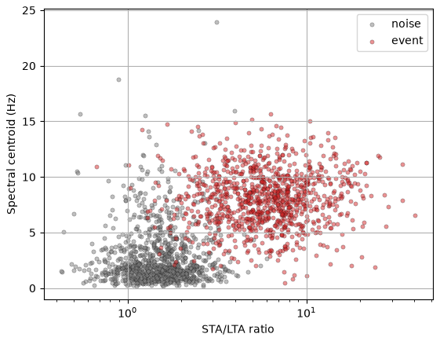
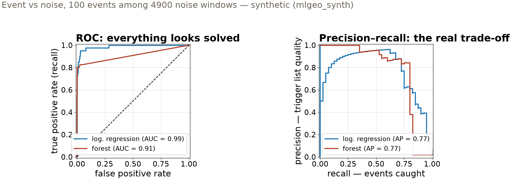

## {background-color="#faf7f2"}

[⚖️]{.lecture-icon}

### Today's question

A detector that never triggers is 98% accurate.

**What should an earthquake detector actually be graded on?**

::: {.dim}
Reading: [3.4 Binary classification](https://geo-smart.github.io/mlgeo-book/binary-classification)
:::

::: {.notes}
The task all session: binary classification of seismogram windows — event (positive) or noise (negative). On a real station events are rare, and rarity breaks the obvious metric. Arc of the deck: build the detector on a balanced set first (the classroom fiction), define the metrics, then make events rare and watch accuracy stop meaning anything — and learn the two knobs that move a detector to the operating point the science needs. Ask the room: what does a missed earthquake cost? What does a false trigger cost? Keep those two costs in mind for 80 minutes — today ends in a decision, not a score.
:::

## This lecture in the literature



::: {.takeaway}
Metric choice has made and unmade published claims — these three calibrate today's tools.
:::

::: {.notes}
Two minutes. Saito & Rehmsmeier is the methods anchor: on imbalanced data the ROC plot flatters every classifier while the precision-recall plot exposes them — we reproduce exactly that contrast on our own detector today. Mousavi et al.'s Earthquake Transformer is rare-event detection graded the right way: the paper's claims are precision/recall claims, the currency of the detection literature. The DeVries–Mignan pair is the cautionary tale: a deep aftershock model published on headline scores, then matched by a single neuron — imbalanced-data metrics helped hide how little the network had learned; this pair returns in session 18 as a baseline-discipline story. Refs update as the field moves — candidates welcome.
:::

## The detection problem in two features

{.r-stretch}

::: {.takeaway}
Events carry high STA/LTA and high-frequency energy; noise sits low on both. Heavy-tailed ratio → take the log first. Synthetic (mlgeo_synth), 2000 windows.
:::

::: {.notes}
Two physical features per seismogram window: STA/LTA — the short-term to long-term average amplitude ratio, the classic detection statistic from 2.10, which spikes on impulsive arrivals — and the spectral centroid, the amplitude-weighted mean frequency, high for local events, low for ocean microseism noise. The x-axis is log-scaled and that is the feature-engineering lesson: STA/LTA spans 0.4 to 40, so we feed the model log10 of it. The set is balanced — half events, half noise — which no real station ever gives you; we start there because metrics are easiest to learn where they still behave. The notebook has two more features (kurtosis, dominant frequency) we ignore for 2-D plots.
:::

## Units are not optional

::: {.big-number}
0.96 [k-NN accuracy — both features standardized]{.unit}
:::

::: {.big-number}
0.87 [same classifier — centroid in millihertz, no scaling]{.unit}
:::

::: {.dim}
The scaler is fit on the **training split only**, then applied to both splits — fitting it on everything leaks test statistics into training.
:::

::: {.takeaway}
Distance sees numbers, not units. A colleague's unit change silently deleted one feature.
:::

::: {.notes}
Numbers from the executed notebook: baseline (majority class) 0.49 on this balanced set; LDA 0.9525; k-NN 0.96 with standardized features. Then the stress test: express the spectral centroid in millihertz — nothing physical changed, but one axis is numerically a thousand times larger, Euclidean distance is dominated by it, and the decision boundary collapses to horizontal bands: the classifier is using the centroid alone, accuracy 0.865. Wednesday's clustering lesson, now in supervised form. The dim line is the session's second discipline: StandardScaler is fit on the training split only — the fit-on-everything version is the leakage flaw the 3.10 audit exercise teaches you to catch, and it returns in session 18. The notebook then races nine classifiers; all land between 0.95 and 0.96 F1 — on separable features the classifier hardly matters, another reason the interesting questions are elsewhere.
:::

## Three numbers per detector

- **Recall** = TP / (TP + FN) — *of the real events, how many did we catch?*
- **Precision** = TP / (TP + FP) — *of our triggers, how many were real?*
- **F1** = harmonic mean of the two — high only when **both** are high

::: {.dim}
The harmonic mean weights the lower number: precision 1.0 with recall 0.1 gives F1 0.18, not 0.55.
:::

::: {.takeaway}
Report both. A detector can be excellent on one and useless on the other.
:::

::: {.notes}
Build from the confusion matrix on the board: true/false positives and negatives; scikit-learn prints TN, FP / FN, TP with noise = 0, event = 1. Translate every term to the station: FN is a missed earthquake, FP is a false trigger an analyst must review. Recall is also called sensitivity or true-positive rate — same quantity, three names; specificity is the true-negative twin. Drive the dim line's arithmetic home — the harmonic mean punishes imbalance between the two, which is exactly why F1 is the headline number in detection papers. The notebook's simulation scatters 5000 random confusion matrices in precision-recall space to show the two are nearly unconstrained by each other — that plot is why "we report both" is a rule, not a courtesy. On the balanced set our k-NN scores precision 0.97, recall 0.95, F1 0.96 — enjoy it; it is about to fall apart.
:::

## Make events rare — accuracy dies first {.smaller}

::: {.big-number}
0.980 [accuracy of a detector that **never triggers** — 2% events]{.unit}
:::

::: {.big-number}
0.650 [recall of a trained model with 0.992 accuracy]{.unit}
:::

::: {.takeaway}
Same features, same models — only the class balance changed. The 99%-accurate detector misses a third of the earthquakes.
:::

::: {.notes}
The realistic regime: 5000 windows, event fraction 2% — 100 events among 4900 noise windows, a 1:50 imbalance; the split is stratified so both splits keep the 2%. Executed numbers: the majority-class baseline scores 0.980 by never declaring an event; logistic regression reaches accuracy 0.992 — less than one point above the trivial detector — with event-class precision 0.929 but recall 0.650; the random forest is similar (0.853 / 0.725). Let the second big number land: the "99% accurate" detector loses one earthquake in three. Accuracy averages over a class that outnumbers the science 50:1; from here on, the event-class metrics are the only ones we read. This is Monday's lecture-12 baseline discipline meeting Friday's imbalance.
:::

## Two curves, one honest

{.r-stretch}

::: {.takeaway}
ROC divides false alarms by ~1,960 test-split noise windows — flattering. Precision divides by *your trigger list* — the analyst's workload. Rare positives: read the PR curve.
:::

::: {.notes}
Both curves sweep the same decision threshold; they answer different questions. Left, ROC: true-positive rate vs false-positive rate. The false-positive RATE divides by all noise windows — about 1,960 of the 2,000 test-split windows — so scores of false triggers barely move it: AUC 0.99, everything looks solved. Right, precision-recall: precision divides by predicted positives — the trigger list an analyst actually reviews — so it drops the moment the list fills with noise; both models sag well below 1 at useful recall. This is Saito & Rehmsmeier's argument reproduced on our detector. Historical note from the book: earlier editions plotted the training-set ROC — doubly flattering; we compute every curve on the test split. When the positive class is rare, the PR curve is the operational truth.
:::

## Moving the operating point

| Same logistic regression | Precision | Recall | The trigger list |
|---|---|---|---|
| threshold 0.5 (default) | **0.93** | **0.65** | short — misses ⅓ of events |
| class weights ≈ 1:49 | **0.44** | **0.93** | long — catches nearly all |
| threshold lowered to 0.25 | **0.78** | **0.73** | in between |

::: {.dim}
Class weights make one event error cost ~49 noise errors during training; threshold moving re-cuts the same fitted probabilities.
:::

::: {.takeaway}
Neither knob is "better" — they slide along one curve. The operating point is a scientific decision about analyst time vs missed events.
:::

::: {.notes}
Executed numbers: default 0.929/0.650; class_weight="balanced" 0.435/0.925; threshold 0.25 0.784/0.725. Read the middle row as an operations story: recall 0.93 means the detector now catches 93 of 100 events — but precision 0.44 means more than half the trigger list is noise, and someone pays for that in analyst hours. Note F1 ranks the default (0.765) above the balanced row (0.592) — F1 weighs the two errors equally, and nothing says your science does; a regional network hunting for foreshocks will take the recall. No new data was collected for any row — that is the point of the knobs. Implementation names for the notebook: class_weight="balanced", predict_proba plus a chosen cut instead of predict. Closing line of the book section, worth saying verbatim: the choice of metric is a design decision, not an afterthought.
:::

## Which metric answers which question {.smaller}

| Metric | The question it answers | When it misleads | Today's detector |
|---|---|---|---|
| **Accuracy** | fraction correct, all classes | any class imbalance | never-trigger scores 0.980 |
| **Precision** | how clean is the trigger list | alone — one sure trigger wins | 0.93 while missing ⅓ |
| **Recall** | how many events caught | alone — trigger on everything | 0.93 at precision 0.44 |
| **F1** | both at once, harmonic | when error costs are unequal | 0.77 at the default cut |
| **ROC AUC** | ranking, all thresholds | rare positives | 0.99 while recall is 0.65 |

::: {.takeaway}
Price your errors first — a missed event costs science, a false trigger costs analyst time — then pick the metric that charges those prices.
:::

::: {.notes}
The lecture in one screen — leave it up for questions. Each "when it misleads" cell was demonstrated today, not asserted: accuracy died at 2% events; the precision and recall rows are the two degenerate detectors (only-trigger-when-certain vs trigger-on-everything); F1's equal weighting was visible when it preferred the low-recall default; ROC's 0.99 sat beside a recall of 0.65. The PR curve is the row-free summary: it shows every operating point at once. Homework connection: HW-CML grades detector choices with exactly these metrics, and Monday's leaderboard reports macro-F1 on a hidden test set — the vocabulary of today is the currency of the next three weeks.
:::

## Now run it yourself — open 3.4

1. `pixi run jupyter lab` → `3.4_binary_classification.ipynb`
2. Balanced set: race the nine classifiers; verify precision/recall/F1 barely separate them
3. Imbalanced set: reproduce the three operating points, then **choose one and defend it** in a sentence
4. Find the two discipline lines: the scaler fit on train only, and the curves computed on the test split

::: {.dim}
**Project proposals due today on Canvas.** · Mon: multiclass classification (3.5) — the leaderboard opens
:::

::: {.notes}
Timing for the 80-minute block (10:00–11:20): pulse talks ~10 min, deck ~20 min, notebook ~40 min, synthesis ~10 min. Task 3 is the heart — collect two or three defended operating points in the synthesis and make the teams argue costs (analyst time vs missed events); there is no right answer, only priced ones. Task 4 trains the audit eye from 6.2 on ML code. Implementation spellings live in the notebook: stratify=y in train_test_split, class_weight="balanced", predict_proba, PrecisionRecallDisplay / RocCurveDisplay. End with the one reminder: project proposals are due tonight on Canvas — and Monday the classification leaderboard opens on the same seismic-source dataset they clustered Wednesday.
:::
