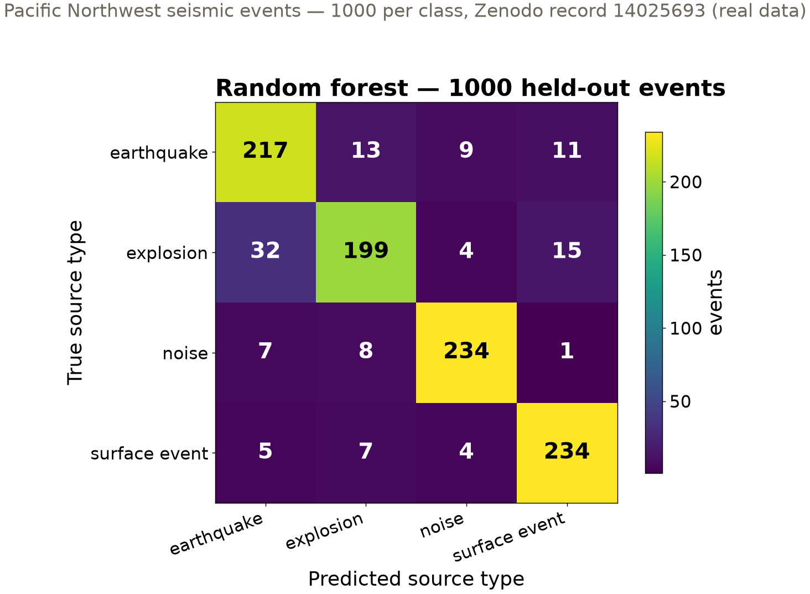
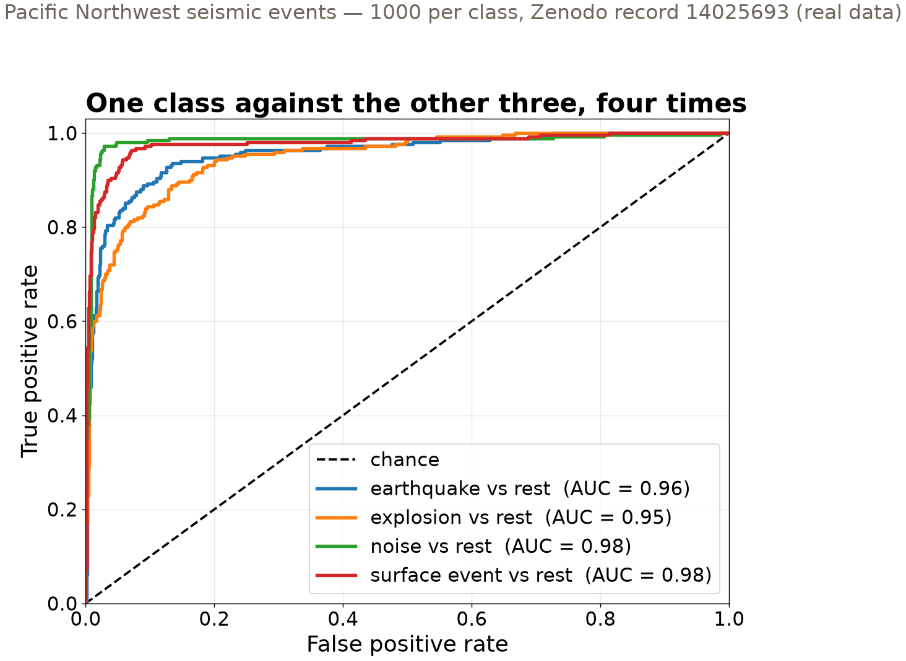

## {background-color="#faf7f2"}

[🏆]{.lecture-icon}

### Today's question

A leaderboard turns your classifier into one number.

**What has to be true of the design for that number to mean anything?**

::: {.dim}
Reading: [3.5 Multiclass classification](https://geo-smart.github.io/mlgeo-book/multiclass-classification)
:::

::: {.notes}
Frame the session: today the class competition opens — the classification leaderboard runs from now until Tuesday Nov 24. Two threads run in parallel and are the same thread: how to evaluate a four-class classifier per class (confusion matrices, one-vs-rest ROC, macro-F1), and how to design a competition so the winning number reflects skill. Ask the room: who has looked at a Kaggle leaderboard? What stops people from just tuning to the public score? Hold that question — the answer is the last three slides.
:::

## This lecture in the literature {.smaller}



::: {.takeaway}
The field is actively writing this story — new papers land monthly. These four anchor today's ideas.
:::

::: {.notes}
Two minutes. Ni et al. is the provenance of everything we touch today: the curated PNW catalog assembled here at UW — earthquakes, explosions, surface events, noise — labeled by regional network analysts; our Zenodo feature tables derive from that effort. Linville et al.: the ✓ story — deep classifiers separating quarry blasts from earthquakes on the Utah network, evaluated per class, deployed as an aid beside analysts, not a replacement. Kaufman et al.: the ✗ canon on leakage — competition after competition where the winning entry exploited an artifact (an ID column, a timestamp) instead of the phenomenon; the vocabulary of today's honesty slide comes from here. Blum & Hardt: the mechanism slide 9 uses — repeatedly querying a public leaderboard overfits it, and a held-back set restores the guarantee. Refs file updates as the field moves — bring candidates.
:::

## Four sources of shaking, one catalog

::: {.big-number}
4 × 1000 [earthquake · explosion · surface event · noise]{.unit}
:::

::: {.big-number}
61 [physical waveform features per event]{.unit}
:::

::: {.dim}
Real Pacific Northwest events, curated and archived on Zenodo (record 14025693). Balanced by curation — real catalogs are not.
:::

::: {.takeaway}
The seismometer records all four. The network needs to know which one it just felt.
:::

::: {.notes}
The geoscience first: a regional seismic network's daily job is triage. A quarry blast tagged as an earthquake pollutes the catalog and the hazard statistics built on it; a landslide (surface event) missed is a missed hazard. The features are physical descriptions of the waveform — durations, envelope shape, kurtosis, band energies, spectral statistics — engineered exactly the way Chapter 2.11 taught. Stress provenance: real PNW data, curated at UW, 1000 per class, on Zenodo with a DOI and checksums. The balance is a curation choice for teaching; in the wild, noise windows outnumber earthquakes by orders of magnitude — which is why the graded metric (slide after next) weights classes equally.
:::

## Where the errors live

{.r-stretch}

::: {.takeaway}
32 explosions called earthquakes — the biggest cell off the diagonal. Quarry blasts and shallow earthquakes shake alike at regional distances.
:::

::: {.notes}
Read the matrix aloud: rows are truth, columns are the model's call; a perfect classifier is diagonal. Random forest, 88% accurate overall — but the errors are not spread evenly. The explosion row loses 32 events to the earthquake column; the physics makes this plausible: both excite similar frequency content at regional distances, so their engineered features overlap. Noise and surface events are nearly clean. One number (accuracy 0.88) hides this structure; the matrix is the per-class autopsy. The other two models in the notebook (support-vector machine 0.877, nearest-neighbors 0.83) show the same confusion pattern. Trivial baseline: always guess one class = 0.25 — every model must be read against that floor.
:::

## One class against the rest

{.r-stretch}

::: {.takeaway}
ROC is a two-class tool. For four classes: binarize — each class versus the other three. Explosions are the hardest to separate.
:::

::: {.notes}
Define the axes aloud: each curve sweeps the decision threshold; up-and-left is better; the dashed diagonal is coin-flipping. AUC — area under the curve — is threshold-free separability: 1.0 perfect, 0.5 chance. The one-vs-rest move is the standard trick for taking any binary metric to multiclass: four binary problems, one curve each. Notice the ranking agrees with the confusion matrix: explosion has the lowest AUC (0.95), noise and surface events the highest (0.98). Implementation names live in the notebook (label binarization, a linear support-vector machine per class); the concept — reduce multiclass to repeated binary questions — is what transfers.
:::

## The graded metric: macro-F1

::: {.big-number}
0.88 [random forest, macro-F1, held-out events]{.unit}
:::

::: {.dim}
Per class: F1 = harmonic mean of precision and recall. **Macro** = average the four F1 scores with equal weight — the rarest class counts as much as the commonest.
:::

::: {.takeaway}
Accuracy lets a model coast on easy, common classes. Macro-F1 makes every source type count equally.
:::

::: {.notes}
Define the parts aloud, per class: precision = of the events I called explosion, how many were; recall = of the true explosions, how many I caught; F1 balances the two. Macro-averaging is a value judgment, made explicit: on this balanced set, macro-F1 ≈ accuracy (0.88 both) — but on a real catalog where noise swamps everything, accuracy rewards ignoring rare classes and macro-F1 refuses to. The leaderboard grades macro-F1 precisely because your feature engineering must serve the explosion class, not just pad the noise class. This choice is on the quiz and in the leaderboard CI.
:::

## The leaderboard contract

- **One canonical design**: everyone trains on the same random 75%, stratified by class — one shared line, defined in the notebook, seeded
- **Predict the shared held-out 1000 events**, submit predictions by pull request
- **CI scores macro-F1** and posts the standings
- Opens today · closes **Tue Nov 24**

::: {.takeaway}
Any model, any features. Model choices are made by cross-validation inside the training set — never by peeking at the held-out events.
:::

::: {.notes}
Walk the contract. The canonical line is in section 3 of the notebook — a random train/test division, stratified so class proportions survive, with a fixed seed; changing it disqualifies the comparison because everyone must answer the same question. War story from the book: an earlier edition divided without shuffling a class-ordered table — whole classes landed in the held-out set that the model had never seen. Submission mechanics: a CSV of predictions keyed by sample position, pull request to the course repo, CI does the scoring — so grading is code, not judgment. The rule that matters: develop with rotating validation subsets carved from the training data (lesson 3.8 formalizes this); the held-out events are spent on your final model only.
:::

## Honest by design — what the random line hides

- **No event ID, station, or origin time** in the tables → nothing to group by
- The same quarry, blasted many times, can **straddle the line** — credit for recognition, not generalization
- So the **public score is diagnostic**; the grade rides on a **hidden set**, regenerated yearly from private seeds

::: {.takeaway}
Naming what your evaluation cannot test is part of the evaluation. Monday (3.8): the full ladder of designs this dataset cannot run.
:::

::: {.notes}
This slide is the lesson. We are running a random design while telling the room exactly why it is the weak rung: grouping needs metadata (event, station, time) that these feature tables simply lack — the honesty admonition is boxed in the notebook. Consequence one: scores here answer "can you recognize sources like the ones you trained on," not "can you classify a source you have never seen" — repeated quarries and swarm events blur the line. Consequence two, the integrity design: because everyone can tune against a public score (Blum & Hardt's adaptive-overfitting result), top submissions are re-scored on an instructor-held set regenerated from private seeds; a gap between your public and hidden scores is the measured size of your leaderboard-tuning. Connect forward twice: 3.8 on Monday builds the ladder of designs; 6.3 next week applies the same move — build the eval before trusting the score — to AI agents.
:::

## What we built today

| Tool | The question it answers | Today's answer |
|---|---|---|
| Confusion matrix | which sources get mistaken for which | explosions → earthquakes, 32 of 250 |
| One-vs-rest ROC | is each class separable at any threshold | AUC 0.95–0.98; explosions lowest |
| Macro-F1 | skill with every class weighted equally | 0.88 vs a 0.25 floor |
| Hidden test set | did you tune to the public score | public = diagnostic, hidden = grade |

::: {.takeaway}
Per-class evaluation plus an evaluation design you can defend — that pair is the deliverable, today and in your project.
:::

::: {.notes}
Leave the table up during questions — it is the session in one screen. Row by row: the matrix locates errors, ROC measures separability without committing to a threshold, macro-F1 is the single number we grade because it encodes a value (all source types matter), and the hidden set is the design feature that keeps the single number honest. The habit to carry to projects: whenever you present one score, be ready to name the design that produced it and what that design cannot test.
:::

## Now run it yourself — open 3.5

1. `pixi run jupyter lab` → `3.5_multiclass_classification.ipynb`
2. Run the canonical split cell (`train_test_split`, `random_state=2026`, `stratify=y`) — then the three classifiers
3. Beat 0.88: engineer features, try any model — select by cross-validation on `X_train` only
4. Write `results/predictions_<uwnetid>.csv` and open your leaderboard pull request

::: {.dim}
Leaderboard closes Tue Nov 24 · Wed: logistic regression + calibration (3.6), HW-CML assigned · Mon: robust training (3.8)
:::

::: {.notes}
Timing for the 80-minute block (10:00–11:20): pulse talks ~10 min, this deck ~20 min, guided notebook ~40 min, synthesis ~10 min. During the exercise, circulate on task 3 — the most common mistake is scoring candidate models on X_test repeatedly; that is exactly the public-leaderboard trap from slide 9, in miniature. Get every student to at least a valid submission file (task 4) before the session ends; the first pull requests can be merged live so the standings page exists by tonight. API names live here and in the notebook: train_test_split, stratify, classification_report, macro-F1 via f1_score(average='macro'), OneVsRestClassifier. Synthesis question to collect: what metadata would this dataset need for a grouped design — and what would you group by? That seeds Monday's 3.8 session.
:::
