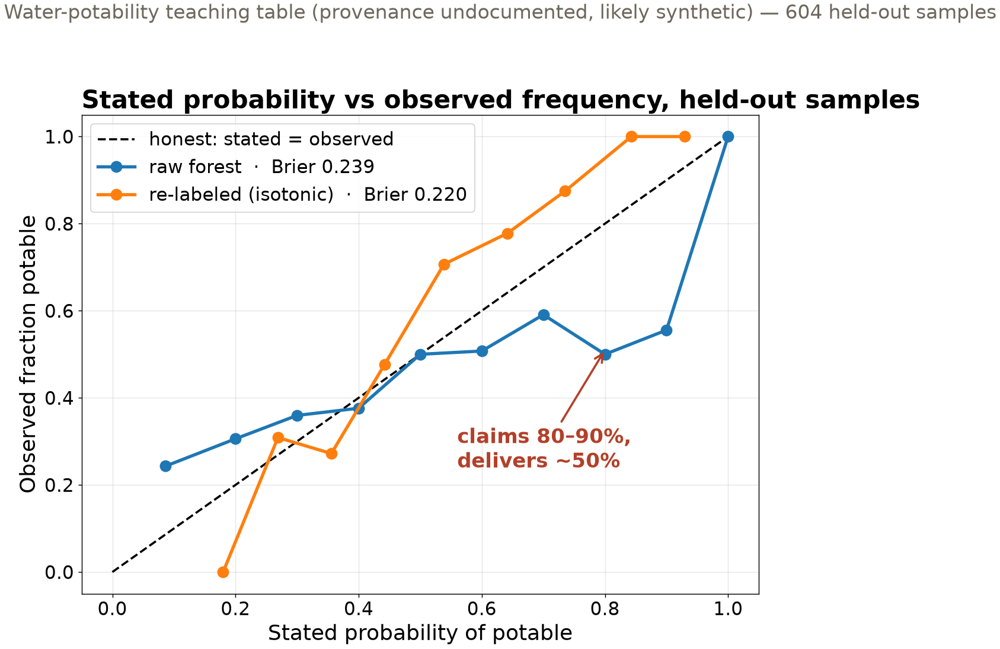

## {background-color="#faf7f2"}

[🎯]{.lecture-icon}

### Today's question

A model tells a hazard office "80% chance."

**Should anyone act on that number?**

::: {.dim}
Reading: [3.6 Logistic regression](https://geo-smart.github.io/mlgeo-book/logistic-regression)
:::

::: {.notes}
Frame the session: Monday we graded labels; today the model outputs a probability, and in most geoscience deployments the probability itself is the deliverable — it feeds someone else's threshold. Two acts: first, the one lesson of the course where we open the black box completely — loss, gradient descent, automatic differentiation, nothing hidden; second, the question the title asks — when a model says 80%, does 80% happen? Ask the room: who has ever reported a probability from predict_proba? Did anyone check what it meant?
:::

## This lecture in the literature



::: {.takeaway}
The field is actively writing this story — new papers land monthly. These four anchor today's ideas.
:::

::: {.notes}
Two minutes. Brier 1950: the ✓ pride point — calibration is a geoscience invention; operational weather forecasting has scored stated probabilities against observed frequencies for 75 years, and today's score still carries Brier's name. Niculescu-Mizil & Caruana: the systematic survey — boosted trees and support-vector machines push probabilities toward the extremes, naive Bayes distorts the other way, and the two standard repairs (a sigmoid re-fit and the order-preserving re-labeling we use today) fix most of it. Guo et al.: the ✗ — modern deep networks became more accurate *and* less calibrated between 2012 and 2017; accuracy and honesty are different axes, and progress on one bought regress on the other. Gneiting et al. gives the clean target: maximize sharpness subject to calibration — say the most decisive thing you can *while staying honest*. Refs file updates as the field moves — bring candidates.
:::

## The one lesson where we open the box

- A **weighted sum** of the features: one score per data sample
- A **squash to probability**: large score → near 1, small → near 0
- A **loss that punishes confident errors**: wrong at 99% costs far more than wrong at 55%
- **Follow the slope downhill**: nudge every weight against its gradient, repeat

::: {.takeaway}
Every neural network in Chapter 4 is this loop, stacked. See it once with nothing hidden.
:::

::: {.notes}
Name the parts as you point: the weighted sum is z = b + x·w; the squash is the sigmoid; the loss is cross-entropy; the loop is gradient descent. Define gradient aloud: the direction in which the loss climbs fastest — so step the other way, scaled by a learning rate. The third piece of the notebook is automatic differentiation: PyTorch records every operation and produces exact gradients — the notebook checks them against the hand-derived calculus, digit for digit, for one observation. That machinery, not the logistic model, is why this lesson exists: Chapter 4 trains everything with the same loop. On our data the loop converges in 155 iterations. Implementation spellings (torch.sigmoid, backward(), torch.optim.SGD) live in the notebook.
:::

## An honest near-null result

::: {.big-number}
0.597 [always predict "not potable" — the trivial baseline]{.unit}
:::

::: {.big-number}
0.598 [logistic regression, held-out accuracy]{.unit}
:::

::: {.dim}
Water-potability teaching table: 9 chemistry features, 2011 samples. Provenance undocumented, likely synthetic — a classroom table, not a water study.
:::

::: {.takeaway}
Nine features, combined linearly, carry almost no signal — and the model says so. That honesty is worth more than an inflated score.
:::

::: {.notes}
Walk the three numbers from the notebook: baseline 0.597, training accuracy 0.606, held-out 0.598. No leak, no drama — the features are simply weakly informative, and a linear model admits it. Contrast with the alternative culture: an earlier edition of this lesson scored the model on its own training data, which is how weak models get published as strong ones. State the data caveat plainly — this table circulated on Kaggle without provenance and is probably synthetic; we use it as a sandbox for binary classification, never for conclusions about actual drinking water. The interesting question this sets up: the model's *probabilities* hover around the base rate (they span only ~0.27–0.57). It never claims certainty. Is that a bug? Next slide: it is exactly what honesty looks like when signal is weak.
:::

## Calibrated, defined

- A model is **calibrated** when its stated probabilities match observed frequencies: of all samples given "70%", about 70% come true
- **Reliability diagram**: stated probability (x) vs observed frequency (y) — honest models track the diagonal
- **Brier score**: mean squared error of the probability. A wrong 0.99 costs three times a wrong 0.55

::: {.takeaway}
Accuracy only sees which side of 50% you were on. The Brier score reads the number itself.
:::

::: {.notes}
Define both tools before showing any curve, so the figure lands. Reliability diagram mechanics: bin the held-out samples by stated probability, plot each bin's observed fraction of positives against its mean stated probability; the diagonal is truth-telling. Sampling noise caveat from the book: with ~60 samples per bin, observed fractions wobble by roughly ±0.06 — do not over-read small departures. Brier score: (probability − outcome)² averaged; being wrong at 0.99 contributes ~0.98, wrong at 0.55 contributes ~0.30 — hence "punishes confident errors." Our logistic model scores Brier 0.243 and tracks the diagonal loosely: roughly honest, weakly informative — sharpness is what it lacks, in Gneiting's vocabulary. Now bring in a challenger with the opposite personality.
:::

## A confident competitor, repaired

{.r-stretch}

::: {.takeaway}
The overfit forest beats logistic on accuracy (0.62 vs 0.60) — and lies exactly where a user would act. Re-labeling repairs it: Brier 0.239 → 0.220.
:::

::: {.notes}
The competitor: a small forest of 10 deep trees, each nearly memorizing the training set (training accuracy 0.974). Its "probability" is the fraction of trees voting potable — with 10 overfit trees, that lands on extreme values like 0.9 or 1.0. Read the blue curve: where the forest claims 80–90%, the observed frequency is ~50%. Test accuracy (0.619, better than logistic!) gives no hint — this is the slide's punch: accuracy and honesty are different axes. The repair, in geoscience-first terms: hold samples out, record how often samples scored near 0.9 actually turn out potable, and re-label each score to that observed frequency — allowing only order-preserving corrections, so if the forest ranked A above B, corrected A stays at or above corrected B. The ranking survives; the numbers attached to it become honest. Result: Brier 0.239 → 0.220, and accuracy rises to 0.664 (partly a small ensemble bonus from averaging refits — not the point). Implementation names for the notebook: scikit-learn calls the order-preserving fit isotonic regression, wrapped in CalibratedClassifierCV with rotating held-out folds — the 3.8 idea, already at work.
:::

## The probability is the deliverable

- A geotechnical engineer reports **probability of liquefaction** → enters a building-code check
- A water manager acts on **probability of a harmful algal bloom**
- A floodplain map encodes **probability of flood exceedance**

**The threshold owner is not the model trainer** — they take your number at face value.

::: {.takeaway}
A miscalibrated 90% that means 55% silently moves your modeling error into someone else's decision.
:::

::: {.notes}
Slow down here; this is the "why" of the whole session. In each example the person who sets the decision threshold — how much probability justifies the cost of acting — is downstream: a code official, an operations manager, an insurer. They cannot see your training curves; they see the number. So the reporting standard follows: whenever your model's probabilities feed a threshold you do not own, a reliability diagram and a Brier score belong next to the accuracy, as routinely as error bars belong on a measurement. Connect back to Brier 1950 — weather forecasting institutionalized exactly this discipline, and "there is a 70% chance of rain" means something because of it. Connect forward: ensemble disagreement gives a complementary uncertainty view on Friday (3.9), and lesson 4.5 runs this same reliability check on deep ensembles.
:::

## What we built today

| Tool | The question it answers | Today's answer |
|---|---|---|
| Baseline + held-out score | is there signal at all | 0.598 vs 0.597 floor — barely |
| Gradient descent + autodiff | how every model in Ch. 4 learns | loss falls, gradients match calculus |
| Reliability diagram | does stated 80% happen 80% of the time | forest: no — delivers ~50% |
| Brier score + re-labeling | how wrong, and can it be repaired | 0.239 → 0.220, ranking preserved |

::: {.takeaway}
Two honest deliverables: a probability that means what it says, and a report that shows you checked.
:::

::: {.notes}
Leave the table up for questions. Row by row: the near-null result is a feature of honest evaluation, not a failure; the opened box is the training loop the rest of the course reuses; the reliability diagram is the lie detector; the Brier-scored repair is the fix that preserves what the model ranked well. If one sentence survives the week, make it the takeaway of the previous slide: the threshold owner is not the model trainer.
:::

## Now run it yourself — open 3.6

1. `pixi run jupyter lab` → `3.6_logistic_regression.ipynb`
2. Verify autodiff: run the one-observation cells — PyTorch's gradients vs your calculus
3. Train the loop (`torch.optim.SGD`), then score: baseline, train, test
4. Calibrate: reliability diagrams and Brier scores; repair the forest with `CalibratedClassifierCV(method='isotonic')`

::: {.dim}
HW-CML assigned today, due Fri Nov 20 · Fri: trees, forests, ensembles (3.7 + 3.9) · leaderboard open through Nov 24
:::

::: {.notes}
Timing for the 80-minute block (10:00–11:20): pulse talks ~10 min, deck ~20 min, notebook ~40 min, synthesis ~10 min. In the exercise, task 2 is where the box-opening becomes real — insist students compare the printed gradient values to the formulas, not just run the cells. Task 4 misconception to circulate for: students expect calibration to raise accuracy; say plainly that the repair targets the probabilities, and the small accuracy gain here is an ensemble side effect. HW-CML goes out today: rock-lithology classification on a synthetic geochemistry survey (mlgeo_synth, hidden-seed variant for spot checks) — data prep through model comparison and feature importance, so this week's lessons are its toolkit. Synthesis question: in your project, who owns the decision threshold — you, or someone downstream? Collect three answers aloud; they seed the check-in on Nov 16.
:::
