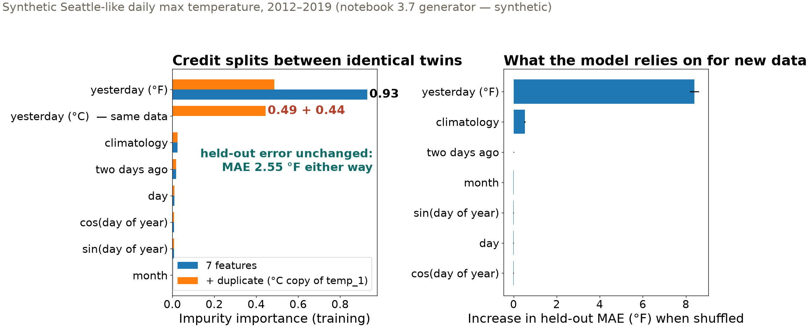
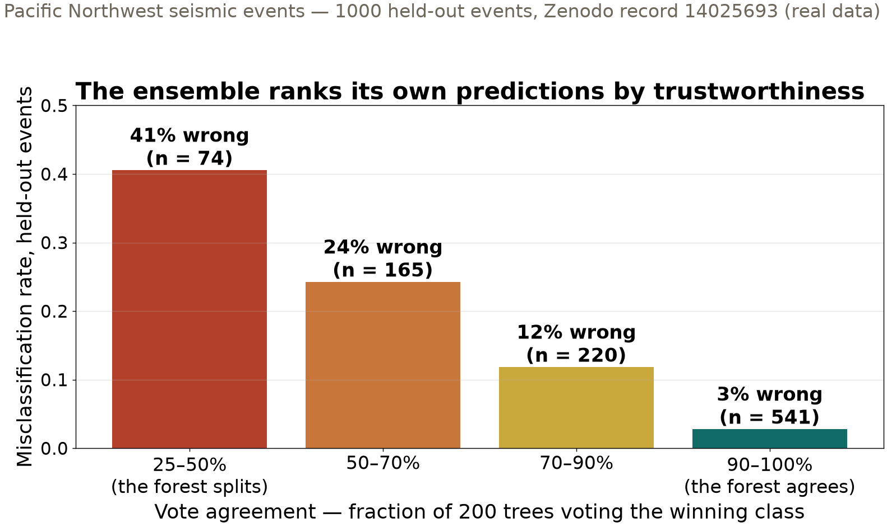

## {background-color="#faf7f2"}

[🌲]{.lecture-icon}

### Today's question

Ensembles of trees win on feature tables.

**When the forest points at a feature — or votes with one voice — what exactly is it telling you?**

::: {.dim}
Reading: [3.7 Random forests](https://geo-smart.github.io/mlgeo-book/randomforest-regression) · [3.9 Ensemble learning](https://geo-smart.github.io/mlgeo-book/ensemble-learning)
:::

::: {.notes}
Frame the session: one story from a single decision tree to boosted ensembles — the workhorses of tabular geoscience ML — and then the honest-reading skills: what feature importance does and does not mean, how the spread of ensemble votes doubles as a first uncertainty estimate, and what aggregate accuracy hides about individual classes. Ask the room: who has seen a feature-importance bar chart in a paper in their subfield? What claim was it supporting? Hold the answer for slide 6.
:::

## This lecture in the literature {.smaller}



::: {.takeaway}
The field is actively writing this story — new papers land monthly. These four anchor today's ideas.
:::

::: {.notes}
Two minutes. Breiman 2001: the source paper — bagging plus per-split feature randomness, with two gifts that matter today: out-of-bag error (a free honest score) and variable importance (today's double-edged sword). Rodriguez-Galiano: the ✓ — forests classifying land cover from satellite imagery, one of the studies that made forests a remote-sensing standard: robust to noise, small training sets, importances read cautiously. Strobl: the ✗ — impurity importance systematically favors features with more split points and splits credit among correlated features; fields that ranked "drivers" straight from the bar chart were misled, and the repair (permutation-based, held-out) is what our notebook uses. Lakshminarayanan: where the vote-spread idea lands next — deep ensembles, the 4.5 connection. Refs file updates as the field moves — bring candidates.
:::

## One story: average the many, or correct the last

- **One tree**: readable rules, learned thresholds — but memorizes its sample
- **Bagging**: train many trees on bootstrap resamples; **vote**. Errors average out
- **Random forest**: bagging + a random feature subset at each split, so the trees disagree more — and the vote gets stronger
- **Boosting**: train trees *in sequence*, each fitting the residuals of the last

::: {.takeaway}
Two ensemble philosophies: average away variance, or chip away at error. Boosted trees are the 2026 default for feature tables.
:::

::: {.notes}
Tell it as one arc. A single tree is the interpretable unit — flowchart of threshold tests, the kind of rules a field geologist could read — but deep trees overfit their sample. Bagging (bootstrap aggregating): resample the training data with replacement, fit a tree per resample, average the votes — variance drops like averaging noisy measurements. The forest adds feature randomness per split to decorrelate the trees; correlated errors are the enemy of averaging. Boosting is the other philosophy: shallow trees in sequence, each fitting what the ensemble still gets wrong. Free gift of bagging to mention aloud: each bootstrap leaves out ~37% of samples, so every tree carries its own held-out set — the out-of-bag score; on today's seismic data it lands within 1.4 points of the true test score (0.875 vs 0.889). Implementation names (RandomForestRegressor, HistGradientBoostingRegressor, LightGBM) stay in the notebook.
:::

## First, beat the baseline {.smaller}

::: {.big-number}
3.25 °F [predict the calendar-day average — climatology baseline, MAE]{.unit}
:::

::: {.big-number}
2.55 °F [random forest of 300 trees, held-out MAE]{.unit}
:::

::: {.dim}
Synthetic Seattle-like daily max temperature (notebook generator): seasonal cycle + weak warming trend + day-to-day persistence. Gradient boosting: 2.53 °F.
:::

::: {.takeaway}
The margin over climatology — not the score alone — is the evidence that the lag features carry real information.
:::

::: {.notes}
The regression setting for 3.7: predict today's maximum temperature from yesterday's, two days ago, the calendar-day climatology, and date features. State the science tag honestly: this record is synthetic, generated in-notebook (the 2024 edition's downloaded CSV died with its link), with known structure — which is exactly why it is good teaching data. The baseline discipline from 3.5 and 3.8 again: climatology is the geoscientist's persistence-class baseline; a forest that couldn't beat 3.25°F would have learned nothing beyond the seasonal cycle. It does beat it — 2.55 vs 3.25 — because day-to-day persistence is real signal. Boosting edges it (2.53°F) at similar cost; on bigger tables boosting's advantage grows, which is why it is the default. Also worth saying: MAE in °F, a physical unit the room can feel, next to R² (0.92) — the lec18 pairing, already in use.
:::

## The importance trap, demonstrated

{.r-stretch}

::: {.takeaway}
Add a unit-converted copy of one feature: its "importance" halves (0.93 → 0.49 + 0.44) while held-out error doesn't move. Importance is bookkeeping, not physics.
:::

::: {.notes}
Walk the left panel: same forest, same data, one new column — yesterday's temperature converted to Celsius, information content identical. Impurity importance splits the credit almost evenly between the twins, because at each node the trees grab whichever copy is offered. Predictions are untouched: MAE 2.55°F either way. Nothing about yesterday's temperature became less informative — only the credit assignment changed. Real features correlate the same way (the two lags through persistence; climatology with the seasonal date features), so read any impurity ranking as how this model distributes credit among the inputs it was given. Right panel: permutation importance asks the better question — shuffle one feature and measure how much the held-out error degrades; computed on data the model never trained on. The two rankings agree here; Strobl's paper shows how badly they can disagree. Close with the caution that outlives the slide: importance is not causation — shuffling yesterday's temperature breaks the model, not the weather. Implementation names for the notebook: feature_importances_, permutation_importance.
:::

## When the forest disagrees with itself, listen

{.r-stretch}

::: {.takeaway}
Vote spread is a free uncertainty estimate: 41% wrong when the forest splits, 3% when it speaks with one voice. Route the split votes to an analyst.
:::

::: {.notes}
Back to the real PNW seismic events from Monday, now with 200 bagged trees. Each tree votes a source type; the fraction voting the winner is a confidence the ensemble hands you for free, before any label is revealed. The bars: below 50% agreement, 41% of predictions are wrong; above 90%, 3%. The ensemble ranks its own predictions by trustworthiness — in an operational catalog, the low-agreement events are the ones a duty seismologist should re-examine. Name the distinction from the book: disagreement among trees trained on different resamples estimates epistemic uncertainty — what the model hasn't learned, shrinkable with more data — not aleatoric uncertainty, the noise in the measurement itself, which no dataset size removes. Wednesday's calibration theme continues here: a vote fraction is a score, not yet a calibrated probability — the reliability tools from 3.6 apply to it too. Same recipe returns as deep ensembles in 4.5 (Lakshminarayanan).
:::

## What aggregate accuracy hides

| Across all seven ensembles (held-out) | range |
|---|---|
| Test accuracy | 0.87 – 0.90 |
| Recall: noise | 0.92 – 0.94 |
| Recall: surface event | 0.90 – 0.94 |
| Recall: earthquake | 0.87 – 0.89 |
| **Recall: explosion** | **0.77 – 0.84** |

::: {.takeaway}
Every ensemble misses explosions two to three times as often as other classes — and no aggregate accuracy says so. Report per-class recall.
:::

::: {.notes}
The 3.9 notebook fits seven ensembles — voting, bagged trees, AdaBoost, two gradient boosters, stacking — on Monday's canonical design. All land between 0.87 and 0.90 accuracy; the interesting structure is in the per-class recall. Define recall aloud once more: of the true explosions, the fraction caught. Explosions sit at 0.77–0.84 for every model — the earthquake–explosion confusion from Monday's matrix is not a quirk of one classifier, it is a property of where these classes overlap in feature space. For a monitoring network, that is the operative number: it says which source type needs better features (Monday's synthesis question), more data, or a human in the loop. This is why the leaderboard grades macro-F1 — an aggregate that refuses to let the explosion class hide. Habit: whenever you report one accuracy, put per-class recall next to it.
:::

## What we built today

| Idea | The question it answers | Geoscience use |
|---|---|---|
| Forest vs baseline | did the model learn beyond climatology | 2.55 vs 3.25 °F daily max temperature |
| Permutation importance | what does the model rely on, on new data | which waveform features drive a detection |
| Vote spread | which predictions should a human re-check | route split-vote events to the analyst |
| Per-class recall | which class is quietly failing | explosions at 0.77–0.84, all models |

::: {.takeaway}
Ensembles give you the score, the credit assignment, and the self-doubt — read all three, honestly.
:::

::: {.notes}
Leave the table up for questions. The through-line to say out loud: a fitted ensemble answers more questions than "what is the label" — it carries its own honest error estimate (out-of-bag), a map of what it relies on (permutation importance), a confidence on every prediction (vote spread), and per-class accounting (recall) — but each of these is a statement about the model under a data design, not about the world; the duplicated-feature demo is the two-minute proof students should be able to reproduce cold.
:::

## Now run it yourself — open 3.7, then 3.9

1. `pixi run jupyter lab` → `3.7_randomForest_regression.ipynb`: baseline, forest, `permutation_importance` — then add your own duplicate feature and watch the credit split
2. `3.9_ensemble_learning.ipynb`: voting, bagging (`oob_score=True`), boosting, stacking — reproduce the vote-agreement bars
3. Compare models by cross-validation on the training set only; spend the test set once
4. Your team's data: which feature would a skeptic accuse of being a duplicate-in-disguise?

::: {.dim}
Flipped for Monday: [3.10 what became of AutoML](https://geo-smart.github.io/mlgeo-book/automl) — Optuna + the verification checklist; examined by the Ch 3 quiz (Tue–Thu) · HW-CML due Fri Nov 20
:::

::: {.notes}
Timing for the 80-minute block (10:00–11:20): pulse talks ~10 min, deck ~20 min, notebook ~40 min split roughly 20/20 across the two notebooks, synthesis ~10 min on task 4 — collect two or three suspected duplicate-in-disguise features from project teams; they seed the data-audit check-in on Nov 16. The 3.10 flipped reading closes the chapter: hyperparameter search with Optuna (grid vs adaptive sampling), and the audit-an-AI-script exercise — three planted flaws: a silently dropped class, a scaler fit before the division, and model selection by training-set score; the Ch 3 quiz (opens Tue, closes Thu) draws scenarios from it, so tell students explicitly that the reading is examinable. Monday is 3.8 — robust training, the full session on why the random design flatters and what to do about it.
:::
