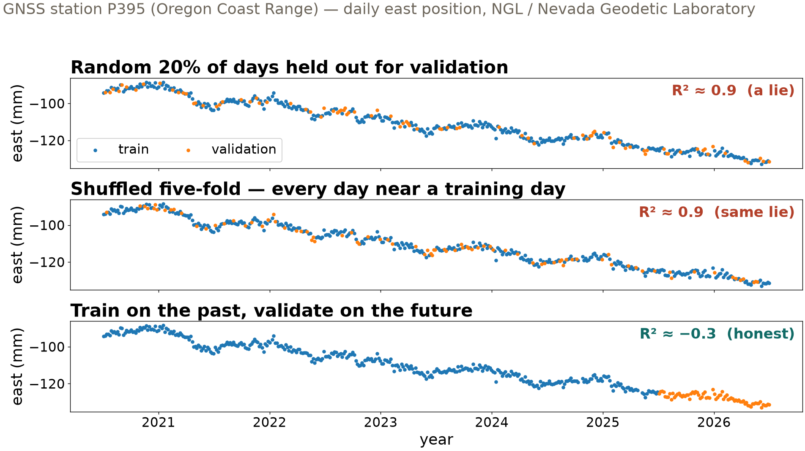
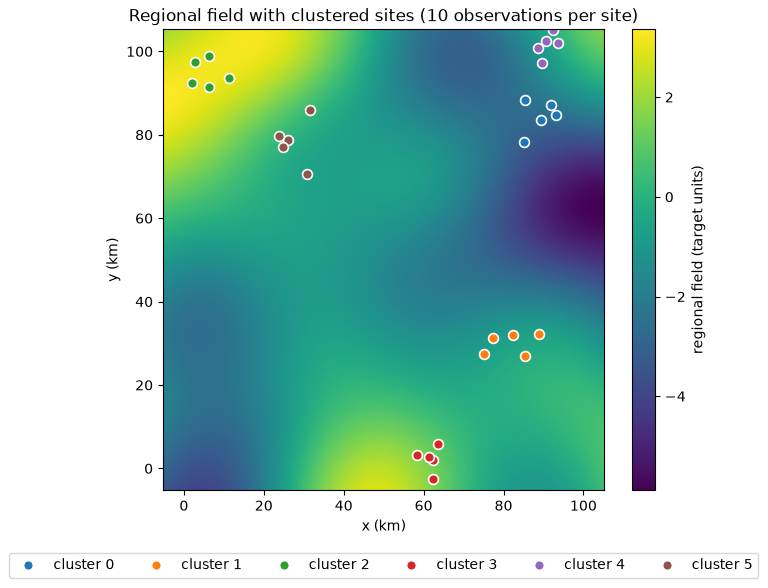

## {background-color="#faf7f2"}

[🗺️]{.lecture-icon}

### Today's question

Every score is an answer to a question.

**Which question is your train / validation / test design asking?**

::: {.dim}
Reading: [3.8 Robust training](https://geo-smart.github.io/mlgeo-book/robust-training)
:::

::: {.notes}
Frame the session: we never grade a model, we grade a model *under a data design*. Train = what the model fits; validation = what steers our choices; test = touched once, at the end. Today is about what happens when the validation data secretly resemble the training data. Ask the room: who has reported a validation score this quarter? What question was it answering?
:::

## This lecture in the literature



::: {.takeaway}
The field is actively writing this story — new papers land monthly. These four anchor today's ideas.
:::

::: {.notes}
Spend two minutes here; the goal is that students see today's concept as live science, not course furniture. Ploton: pan-tropical forest biomass maps scored beautifully under random validation, then collapsed when validated on held-out regions — exactly today's ladder, at Nature-paper scale. DeVries/Mignan: a deep aftershock model celebrated, then matched by one neuron — the persistence-baseline discipline from slide 6, in the wild. Roberts is the reading for students who want the full framework; Meyer & Pebesma is where the field is heading (knowing *where* a model applies). Tell students the refs file updates as new papers land — bring me candidates.
:::

## A model that looked great

::: {.big-number}
R² = 0.90 [validation days shuffled into training years]{.unit}
:::

::: {.big-number}
R² = −0.3 [validation days in the future]{.unit}
:::

::: {.dim}
R² measures skill against predicting the mean: 1 = perfect, 0 = no better than the mean, negative = worse than the mean.
:::

::: {.takeaway}
Same random forest, same GNSS data. Only the train/validation design changed.
:::

::: {.notes}
The model: a random forest predicting daily GNSS east displacement from date features (book 3.8). Define R² *before* using it — most of the room is domain, not data science. Emphasize: neither number is a bug. They answer different questions: "can I reproduce days like the ones I trained on?" vs "can I predict next year?" Only the second matches deployment.
:::

## Three ways to cut the same series

{.r-stretch}

::: {.takeaway}
Real ground motion: tectonic drift + seasonal hydrologic loading. Shuffled designs hand the model the neighbors of every validation day — only the last panel ever predicts the future.
:::

::: {.notes}
Walk the panels top to bottom. Blue = training days, orange = validation days; same station P395, Oregon Coast Range. Panels 1–2: validation days sit surrounded by training days from the same week — the forest interpolates its neighbors. Panel 3: all validation days come after all training days. Connect to the physics: the smooth drift is plate motion, the wiggles are seasonal water loading — that smoothness is exactly what leaks.
:::

## Data correlation is the leak

- Consecutive samples share the signal — today looks like yesterday
- Shuffling puts correlated samples on both sides of the train/validation line
- The model memorizes the neighborhood, not the physics

::: {.takeaway}
Leakage is not cheating — it is a data design that ignores correlation.
:::

::: {.notes}
Data correlation in plain terms: any process with memory — ground motion, river discharge, temperature — produces samples that are not independent. A shuffled design turns prediction into interpolation. This is a property of the data, not of any particular tool. Preview: the same argument applies across locations, events, and whole regions.
:::

## The baseline to beat: persistence

*Persistence: predict that tomorrow equals today.*

::: {.big-number}
1.7 mm [persistence — mean absolute error]{.unit}
:::

::: {.big-number}
16 mm [tuned random forest, honest future validation]{.unit}
:::

::: {.dim}
R² said "worse than the mean"; MAE says by how much, in millimeters. Same validation days, same metric, both models.
:::

::: {.takeaway}
Report a physical-units error (MAE) next to any skill score. Baselines before models.
:::

::: {.notes}
Reconcile the metrics explicitly: R² is unitless skill (good for "is this better than nothing"), MAE is physical error (good for "does 16 mm matter for my science"). Why does the forest lose? Trees cannot extrapolate the 12 mm/yr trend beyond their training labels — persistence follows the drift for free. The simplest physical baseline encodes the strongest structure. This is the Mignan & Broccardo move from the literature slide: before crediting the complex model, ask what a one-line rule achieves.
:::

## Regions leak the same way

{.r-stretch}

::: {.takeaway}
Measurement locations cluster; the field varies smoothly over ~25 km. Random designs let the model interpolate the map instead of predicting new ground. Synthetic regional field (mlgeo_synth).
:::

::: {.notes}
Shift domains: a regional field (think groundwater recharge, ground shaking, a soil property) sampled at clustered locations — clustering is how real networks get built (access roads, campaigns, permits). A validation location 2 km from a training location is the spatial version of "tomorrow looks like today." This figure is synthetic (mlgeo_synth) — we planted the truth, so the next slide can measure exactly how much each design flatters us. (The notebook's code labels locations `site_id` — same thing.)
:::

## The validation ladder

| Held out from training | R² | The question it answers |
|---|---|---|
| Random samples | **0.72** | Conditions like my training data? |
| Whole locations | **0.36** | A new location near my network? |
| Whole regions | **−0.84** | A new region entirely? |

::: {.dim}
Grouped validation: all samples that share one label — a location, an event, a well — stay on the same side of the train/validation line.
:::

::: {.takeaway}
None of these numbers is wrong. They answer different questions — match the design to your deployment.
:::

::: {.notes}
Define grouped validation before the table settles — it is a statistical idea, not a software feature. Ladder logic: hold out random samples → validation locations appear in training → easiest question. Hold out whole locations → new-location question. Hold out whole regions → the score collapses below zero: worse than predicting the mean, because the model must extrapolate the field. Students choose their rung by asking where the model will actually be used. Implementation names for the notebook: scikit-learn calls these KFold, GroupKFold, and leave-cluster-out is GroupKFold on the region label — the concepts are what transfer.
:::

## Small, correlated, imbalanced — the usual case

- 300 case histories · 12% positive class · several soundings per location
- Measurements from one location must stay together → grouped validation
- But one fold drew **zero** positive cases → the skill score is undefined

**Fix: stratified grouped validation** — keep each location's samples together *and* spread the rare positives across folds.

::: {.takeaway}
The norm in geotechnical engineering, hydrology, and geology — not an edge case.
:::

::: {.notes}
Concrete setting: liquefaction case histories — several soundings per location, positives rare. Walk the failure: grouping is *required* (soundings from one location are near-duplicates), but with 12% positives, chance gives a fold with no positive cases, and any score needing both classes (AUC) is undefined. Stratification adds the constraint that each fold keeps roughly the class balance. This small/correlated/imbalanced triple is what most domain datasets look like; the big clean benchmarks are the exception. Implementation: scikit-learn's StratifiedGroupKFold — named in the notebook, not memorized here.
:::

## Before you validate: name what your samples share

| Shared structure | Why samples are correlated | Validation principle |
|---|---|---|
| **Time** | consecutive samples share weather, season, drift | train on the past, validate on the future |
| **Location** | repeated measurements at one location are near-duplicates | grouped validation by location |
| **Event** | one physical event (an earthquake, a storm) reaches many instruments | grouped validation by event |
| **Region** | nearby locations lie on the same smooth field | leave a region out, with a buffer |

::: {.takeaway}
This is Chapter 2.13's data audit applied at validation time: find the correlation, then keep it on one side of the train/validation line.
:::

::: {.notes}
This table is the lecture in one screen — leave it up while fielding questions. Each row is a case from today: time (the P395 panels), region (the field map), location and event (the ladder and the case-history example). The principles are statistical, tool-independent; the notebook shows the scikit-learn spellings, and a coding agent can always produce the syntax — naming the correlation is the part only the scientist can do.
:::

## Now run it yourself — open 3.8

1. `pixi run jupyter lab` → `3.8_robust_training.ipynb`
2. Run the ladder: random samples vs grouped-by-location vs leave-region-out
3. Break it: put the coordinates in the features and watch the random-samples score inflate
4. Your team's data: which row of the table applies? (Bring the answer to Monday's check-in.)

::: {.dim}
Friday: the same discipline applied to AI agents (6.3) · HW-CML due Fri Nov 20
:::

::: {.notes}
Timing for the 80-minute block (10:00–11:20): pulse talks ~10 min, slide deck ~20 min, guided notebook exercise ~40 min on the four tasks (circulate; the break-it task is where misconceptions surface), synthesis ~10 min collecting answers to task 4 — that question seeds Monday's data-audit check-in. The deck introduces; the exercise teaches. The notebook is where the scikit-learn names live (TimeSeriesSplit, GroupKFold, StratifiedGroupKFold); students' coding agents know them too — the concept-to-deployment mapping is the skill being graded.
:::
