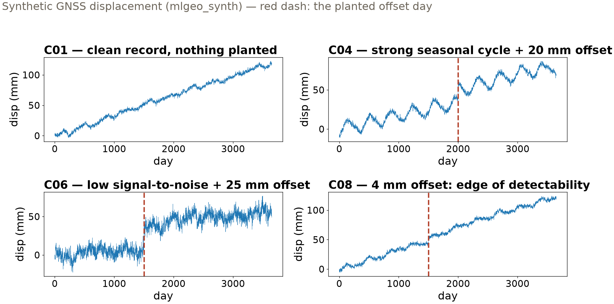

## {background-color="#faf7f2"}

[🧪]{.lecture-icon}

### Today's question

Monday you learned to distrust a validation score. Today's task:

**Before you delegate a task to an agent — what exam would it have to pass?**

::: {.dim}
Reading: [6.3 Build an eval set](https://geo-smart.github.io/mlgeo-book/build-an-eval-set) + [6.4 Disclosure and norms](https://geo-smart.github.io/mlgeo-book/disclosure-and-norms)
:::

::: {.notes}
Frame the week as one idea applied twice: Monday (3.8) was fair evaluation of models — the validation design decides what the score means. Today is the same move for agents: an agent is a model with tools, so it gets the same machinery — a held-out exam with known answers, built before trust. The difference that makes agents *easier*: with physically motivated synthetic data, we generate the ground truth ourselves, unlimited and exact. The worked case: an agent asked to report secular velocity and flag coseismic offsets in raw daily GNSS series — the exact task from the 6.2 lab, now with the roles reversed: then you graded one answer; today you design the whole exam. Announce up front: reading-arc stage 4 is assigned today — the pre-submission review agent, evaluated with today's machinery, due Thu Dec 10.
:::

## This lecture in the literature



::: {.takeaway}
Three measurements of AI systems — each one an eval set somebody bothered to build.
:::

::: {.notes}
Two minutes; the meta-point is that every entry IS today's lesson practiced on frontier models. Zheng et al. wanted to use GPT-4 as a judge of chatbot answers — and first built the eval to measure the judge: position bias (prefers the first answer shown), verbosity bias (prefers longer), self-enhancement. That is "design the exam before trusting the student" verbatim. Liu et al. planted a fact at controlled positions in long documents and measured retrieval: a U-shaped curve — strong at the edges, weak in the middle. Nobody would have predicted that from vibes; the eval found it. Sharma et al. measured sycophancy: models trained on human preference learn that agreement and praise are rewarded. All three transfer directly to the review agent students will build: judge biases at scoring time, context effects when it reads a long paper, flattery instead of criticism.
:::

## Twelve cases, truth planted by us

{.r-stretch}

::: {.takeaway}
Sweep every knob that changes the physics; include cases where the right answer is "nothing there"; include one at the edge of detectability.
:::

::: {.notes}
The spec came first — written before any agent ran: input columns pinned (the agent cannot peek at truth columns), an output schema (velocity, offset flag, offset day), and numeric tolerances (±1.5 mm/yr; offset day within 30 days). Then the exam: twelve synthetic GNSS series sweeping record length (10 yr vs 2 yr), noise level, seasonal amplitude, offset size (25 mm down to 4 mm), and one negative velocity for sign conventions. Walk the four panels: C01 clean with nothing planted — a detector is only meaningful if it can stay silent; C04 a 20 mm offset hiding inside an 8 mm annual cycle; C06 the same size offset under flicker noise; C08 a 4 mm offset that is invisible to the eye — whether the agent SHOULD find it is a genuine scientific question, and writing the eval set forced us to ask it before any agent ran. That is coverage design, and it is a scientist's job, not a programmer's.
:::

## The agent that would have shipped

::: {.big-number}
3/12 [cases passed — agent v1, straight-line fit + jump detector]{.unit}
:::

::: {.dim}
Velocity within tolerance on 6/12; offset calls right on 9/12. On any *single* series, its answer looks reasonable.
:::

::: {.takeaway}
Failures come in groups: velocity wrong whenever an offset is present; small offsets missed; one false alarm in low signal-to-noise.
:::

::: {.notes}
Agent v1 is the analysis a hasty analyst — human or artificial — produces: straight-line fit for velocity, largest 30-day-mean jump for offsets. Read the failure groups like a diagnosis, because each names its own fix: (1) C02/C04/C06/C10 — the unmodeled step leaks into the slope, so a missed model term corrupts a reported number: correlated failures, the outputs are not independent; on the 2-year record the bias reaches ~18 mm/yr. (2) C07/C08 — the hard-coded 12 mm jump threshold cannot see 8 or 4 mm steps; the spec never said what the minimum detectable offset should be — the eval made that gap visible. (3) C05 — flicker noise wanders enough to trip the detector with no earthquake at all: the negative cases earn their keep. The fix is a spec fix as much as an agent fix: spec v2 adds a required method clause — least squares with seasonal terms and a step function, the physical model from Chapter 2. Agent v2: 10/12.
:::

## The scorer must survive a malformed answer

*The most common live-agent failure is not a wrong number — it is output that breaks the schema.*

```
{"velocity_mm_yr": "about 12 mm/yr", "offset": False}
→ pass: False · malformed: "missing key 'offset_day';
                            'velocity_mm_yr' has type str"
```

::: {.takeaway}
A scorer that crashes on bad output cannot record the very failure it most needs to record.
:::

::: {.notes}
Step 3 of the notebook, and worth saying slowly because it is the least intuitive rubric row: the scorer validates the output schema first, and converts every violation into a scored failure with a written reason — never an exception. Why it matters: a live, sampled model wraps numbers in prose, forgets keys, returns strings where floats belong. If your scorer raises KeyError there, your eval dies exactly on the runs that carry the most information about the agent. The notebook proves the guard works by feeding it a deliberately malformed result — the one on the slide — before trusting it. This is also a graded criterion in the assignment (Scorer soundness, 20 points): a pure function of result, truth, and spec; judgment lives in the spec, none at scoring time.
:::

## Where does ±3.0 come from? We measured it

::: {.big-number}
1.85 mm/yr [95th-percentile velocity error on 2-yr records — 50 fresh realizations]{.unit}
:::

::: {.dim}
On 10-yr records the same measurement gives 0.28 mm/yr — the original ±1.5 was comfortable there, and never achievable on 2 years of colored noise.
:::

::: {.takeaway}
Spec v3 sets ±3.0 for short records: ~1.5× the measured 95th percentile — a property of the physics, not a curve drawn after the exam.
:::

::: {.notes}
Agent v2's two remaining failures are both 2-year records, and they are not the agent's fault: velocity uncertainty under colored GNSS noise scales roughly as 1/T, so two years of flicker noise cannot deliver ±1.5 mm/yr no matter who analyzes it. The spec demanded something the data cannot give — the second thing eval sets catch: unreasonable specs. The wrong fix is relaxing the tolerance until failures vanish (grading on a curve you drew after seeing the exam). The right fix: we own the generator, so run the estimator on 50 fresh offset-free realizations per record length — seeds disjoint from the eval set — and read the error distribution. 10-yr: median 0.09, 95th percentile 0.28. 2-yr: median 0.78, 95th percentile 1.85. Spec v3 writes ±3.0 for records under 5 years (≈1.5× the 95th percentile; headroom because 50 trials pin the tail only loosely). Final: 12/12, with an audit trail — which capabilities were tested, which tolerances the physics supports, what the agent could not do until its method changed. That table is what "I trust this agent" should mean.
:::

## When there is no number to check {.smaller}

*Your stage-4 review agent outputs a judgment. Two substitutions keep the machinery:*

- **Rubric as scorer** — binary checks; plant defects in the papers so "found the flaw" is computable again
- **Measure the rubric itself** — two raters, same output: your 6.2 partner-swap data

::: {.big-number}
92% agreement, κ = 0.00 [two lenient raters who pass nearly everything]{.unit}
:::

::: {.takeaway}
Percent agreement flatters; Cohen's kappa subtracts chance. Report both.
:::

::: {.notes}
The bridge to the reading arc. A review has no velocity_mm_yr — but ground truth for a subjective task is engineered, not found: feed the review agent papers with planted defects (a leakage bug, a fabricated citation, a threshold tuned on test) and score "found the plant" as binary checks. Then the rubric itself must pass an exam: two raters apply it to the same output and you compute agreement. The notebook's honest pair: 83% agreement, kappa 0.63 — real but imperfect. The punchline pair: two lenient raters agree on 92% of checks and kappa is exactly 0.00 — every bit of that agreement is what two yes-sayers produce by chance (kappa = observed minus expected agreement, over one minus expected). Low kappa is a rubric defect before it is a rater defect: each disagreement marks a criterion whose wording two readers resolved differently — reword, re-score, re-measure. This is where the score vectors from the 6.2 partner swap get spent. When the second rater is a model, add the Zheng controls: swap presentation order, score per-check rather than holistically, blind the judge to which output is yours.
:::

## One run is a coin flip

::: {.big-number}
0.4 ± 0.22 [pass rate, planted flaw "single seed, no spread" — runs: 0 1 0 1 0]{.unit}
:::

::: {.dim}
Recorded review agent, N = 5 runs per case. A sampled model does not return the same answer twice.
:::

::: {.takeaway}
Report rates, not verdicts; fix N in the spec; believe a change only when the margin beats the standard error.
:::

::: {.notes}
The deterministic stand-in returns the same dict every run; a live sampled LLM does not. The notebook's recorded transcripts: the same review agent, run five times per case on six short analyses with planted defects. P01 (leakage) caught 5/5; the figure-units error only 1/5; the run pattern on the slide — 01010 — is P04. A single-run eval calls that case pass or fail on a coin flip: run once and ship, and your conclusion depends on the draw. The binomial standard error at N=5 is ±0.22 near p=0.5 — so one agent version scoring 3/5 against another's 2/5 is not evidence of improvement; increase N until the error bars separate. Three consequences written into the stage-4 assignment: rates not verdicts, N fixed in the spec before running, margins compared to standard errors. Same discipline as seed-to-seed spread in 5.2 — sampling noise is run-to-run variance under a new name.
:::

## The examinee can read the exam

- An agent with repo access can open the generator source — noise model, truth parameters, **the twelve printed seeds**
- No intent required: if it can look, it is in context — contaminated by construction
- Defense: truth the agent cannot reach — **fresh private seeds** drawn at evaluation time, never committed

::: {.takeaway}
Same principle as the class leaderboard's hidden test set — an eval you iterate against is a validation set; final trust needs unseen cases.
:::

::: {.notes}
The sharper form of Monday's leakage lesson. This notebook prints its twelve seeds, and mlgeo_synth's source lives a few directories away — any agent working in the repository can read the exam machinery, the answer key, and the grading script. That is not cheating; it is context. Assume the agent sees everything committed. The defense is not hiding code (security through obscurity dies at the first `grep`); it is truth generated outside the agent's reach: fresh seeds drawn at evaluation time and never committed, and for high stakes, held-out parameter ranges. Map it onto Chapter 3 vocabulary: the eval set you iterate against plays the validation role; the fresh-seed run is the test set, spent once. For stage 4: your review agent must be scored on at least some planted-defect papers it has never seen in any form.
:::

## Say what the agent did — and what you verified

- **Disclose tool + task + what you verified** — the third column is the graded one
- **AI is not an author**: humans own correctness; "the model made that mistake" is not a defense
- **You may be examined**: any line, any number, orally, without notes — whoever wrote it

::: {.takeaway}
An eval set is what turns "we used an agent" into a verifiable statement. Disclosure is where you say so.
:::

::: {.notes}
One slide for 6.4, because its rules are short and firm. Journal and society policies (AGU, Nature, Science, 2023–2025 wave) converge on three points: disclose tools and roles specifically; AI cannot be an author because authorship means taking responsibility; the listed humans vouch for every number regardless of what produced it. The course format: every submission carries a three-column table — tool, task, what we verified — and the third column is what gets graded; "we verified nothing" is honest and costs less than a verification claim that collapses under one question. Institutions add their own layer: check employer and sponsor policy, classify data before it touches a hosted model, retain agent transcripts like a lab notebook. And the oral-defense rule: this course reserves the right to run a verification interview on the final project — if you cannot explain it, you cannot submit it. Today's machinery is what makes that defensible: an eval set is evidence, on the record, of exactly what you checked. Ch 6 quiz opens Monday and covers 6.1–6.4.
:::

## The eval-driven loop {.smaller}

| Step | This notebook | Your stage-4 agent |
|---|---|---|
| Spec | schema + tolerances, v1→v3 | your quality rubric, binary checks |
| Cases | 12 series, planted offsets | ≥6 papers, planted defects + one clean |
| Scorer | tolerance checks, survives malformed output | rubric checks + two-rater kappa |
| Run | deterministic, once | sampled, N runs → pass rates ± s.e. |
| Failures | grouped: agent, spec, or physics? | grouped: agent, rubric, or genuinely hard? |

::: {.takeaway}
Same loop as Chapter 3 model development — the eval set is the held-out test set, and you write the truth.
:::

::: {.notes}
The lecture in one screen; leave it up for questions. Each row is a slide from today, and the right column is literally the stage-4 assignment structure — students can photograph this table and use it as their checklist. Emphasize the diagnosis row: failure analysis means grouping and attributing (agent limitation, spec defect, physical impossibility), not listing. And the warning from the notebook: the most common way to lose points is an eval set your agent passes 10/10 on the first try — that is not a good agent, that is an easy exam.
:::

## Now run it yourself — open 6.3

1. `pixi run jupyter lab` → `6.3_build_an_eval_set.ipynb`
2. Run spec v1 → agent v1: reproduce **3/12** and read the failure groups
3. Break the scorer: feed it your own malformed dict — does it record or crash?
4. Re-derive the ±3.0: rerun the 50-realization spread with your own seeds
5. Start your **stage-4 eval**: pick the agent task, draft spec v1 before Monday

::: {.dim}
Arc stage 4 assigned today, due Thu Dec 10 · Ch 6 quiz Mon–Wed · HW-CML due Fri Nov 20 · check-in #1 Monday
:::

::: {.notes}
Timing for the 80-minute block (10:00–11:20): pulse talks ~10 min, deck ~20 min, notebook ~40 min, synthesis ~10 min. Tasks 2–4 are guided; task 5 is the on-ramp to stage 4 (assigned today, four weeks of runway — due Thu Dec 10). Circulate on task 3: students discover their instinct is to fix the malformed input rather than score it — exactly backwards for an eval harness. Task 4 lands the deepest idea (tolerances are measured properties of estimator + physics); students with fast machines can push to 200 realizations and watch the 95th percentile stabilize. Synthesis: collect one candidate agent task per team and stress-test two of them aloud against the coverage checklist (difficulty axes? negative cases? edge of detectability?). Optional enrichment in the notebook: the same harness against a live local model via Ollama (OLMo 2) — nothing about it is graded. Monday is check-in #1: data audit, baseline, split design — bring the 3.8 answers.
:::
