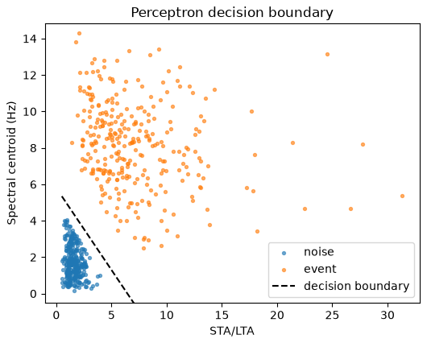
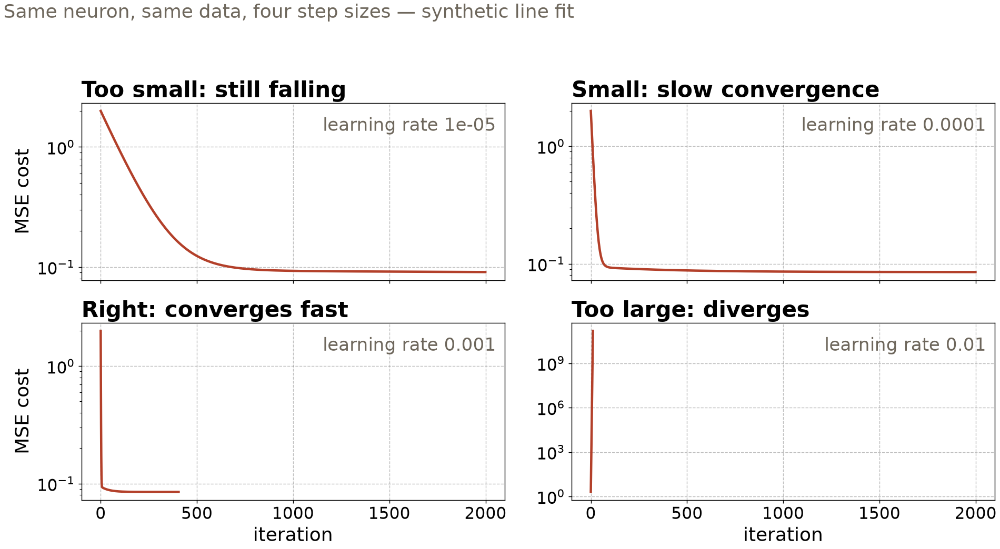

## {background-color="#faf7f2"}

[🧠]{.lecture-icon}

### Today's question

A neural network is a stack of very small machines.

**What does one neuron do — and when does stacking neurons buy anything?**

::: {.dim}
Reading: [4.0 Perceptrons](https://geo-smart.github.io/mlgeo-book/mlgeo-4-0-perceptrons) · [4.1 Neural networks](https://geo-smart.github.io/mlgeo-book/mlgeo-4-1-nn) · [4.2 MLPs](https://geo-smart.github.io/mlgeo-book/mlgeo-4-2-mlp)
:::

::: {.notes}
Frame the session: deep learning starts today, and it starts embarrassingly small — one neuron, built by hand, trained by a rule you can write on the board. By the end of class the same idea, stacked, matches the random forests from Chapter 3 on the same Pacific Northwest data. Ask the room: who thinks a neural network is fundamentally different from the regressions we have been fitting? Hold that thought — the first slide of math says otherwise. Reminder: the Chapter 6 quiz closes today.
:::

## This lecture in the literature



::: {.takeaway}
The neuron is from 1958; the honest-comparison discipline is from this decade. Both are today's material.
:::

::: {.notes}
Two minutes. Rosenblatt: the perceptron was hardware — a room-sized machine for image recognition; the learning rule we implement today is his. Hornik: the universal-approximation result is why "just add units" is a defensible strategy — but it says nothing about whether training finds the approximation, which is why the rest of the chapter exists. DeVries/Mignan returns from lecture 18, now with its architecture in focus: the celebrated aftershock model was exactly the kind of fully connected network we build today, on tabular features, and one logistic neuron matched it — capacity without a baseline check misleads. Ni et al. is the curated Pacific Northwest benchmark; the 61-feature table we train on all week descends from that curation effort. Refs file updates as the field moves — bring candidates.
:::

## One neuron, in full

$y = f\left(\sum_i w_i x_i + b\right)$

- A weighted sum of the inputs, **one bias per neuron**, then an activation $f$
- The activation names the unit: step → a hard yes/no (threshold logic unit); sigmoid → a probability — **logistic regression is a one-neuron classifier**
- No activation → plain linear regression

::: {.takeaway}
Everything you fit in Chapter 3 is already here. A network is this, repeated.
:::

::: {.notes}
Slow down on this slide — it carries the chapter. Walk the equation: weights multiply inputs, one bias shifts the threshold (one per neuron, not one per input — a common misreading), activation decides the output's character. With a step activation the neuron makes hard decisions: that unit is the classic threshold logic unit. Swap in a sigmoid and the same neuron outputs a probability — it *is* the logistic regression from 3.6. So the room has already trained neurons without knowing it. The word "perceptron" historically means a single layer of threshold units; today it survives in "multi-layer perceptron." Vocabulary to define aloud: activation function, bias.
:::

## A neuron finds earthquakes — with a rule from 1958

{.r-stretch}

::: {.takeaway}
Two detector features, 600 windows, convergence in 2 epochs — but only because we removed the overlap first. One line separates only linearly separable data. Synthetic (mlgeo_synth).
:::

::: {.notes}
The setup: seismic detector features from the course generator — STA/LTA ratio and spectral centroid per 30-s window, event vs noise. The perceptron learning rule: predict, and if wrong, nudge each weight toward the mistake; sweep the data until an epoch has zero mistakes. It converged in 2 epochs here ([42, 0] mistakes). The honesty caveat is the point: we filtered out the overlap band to *make* the classes linearly separable, because the rule never converges otherwise — that is the perceptron's famous limitation, and the reason the field stalled until multi-layer networks and gradient losses. Real detector data has overlap; hold that as the motivation for hidden layers.
:::

## Training is a loop you can write

1. **Predict** with the current weights
2. **Measure** the cost (mean squared error, cross-entropy)
3. **Step** the weights against the gradient
4. Repeat until the cost stops moving

::: {.takeaway}
The course rule: write the loop out — no hidden helpers. Every deep model this quarter trains with exactly these four lines.
:::

::: {.notes}
This is the no-hidden-helpers rule made explicit: in 4.0 the loop is bare NumPy (the gradient of MSE for a linear neuron is one matrix product); in 4.1 the same four steps reappear as the PyTorch idiom — zero the gradients, forward pass, loss, backward pass, optimizer step. Students must be able to point at each of the four steps in any training code they use, including code an agent wrote for them. Also define epoch (one pass through the training data) and minibatch (the loop steps on small batches, not the full set). Gradient descent on the linear neuron lands on the same line as ordinary least squares — the benchmark in the notebook — which is the sanity check that the loop works.
:::

## One knob can break everything

{.r-stretch}

::: {.takeaway}
The learning rate sets the step size: too small crawls, too large diverges. Watch the cost curve, always.
:::

::: {.notes}
Same neuron, same data, same zero start — only the learning rate changes. Bottom right is the panel to burn in: at 0.01 the cost grows without bound because each step overshoots the minimum; training silently produces garbage weights. The failure is visible only because we plotted the cost per iteration — that habit (plot the learning curve, every time) is the takeaway. In the notebook there is an interactive widget to explore this; the exercise asks them to find the divergence boundary. Adam, the optimizer we use from 4.1 on, adapts the step per weight but does not remove the knob.
:::

## Stack it: the PNW source classifier

::: {.big-number}
2,116 [weights — one hidden layer of 32 neurons]{.unit}
:::

::: {.big-number}
87% [test accuracy, four source types]{.unit}
:::

::: {.dim}
4,000 seismic events from the Pacific Northwest — earthquake, explosion, noise, surface event — 61 waveform features each. Chapter 3's tuned random forest: the same 80–90% range.
:::

::: {.takeaway}
On a small feature table, a one-hidden-layer network and a tuned forest land in the same place. That is the honest headline.
:::

::: {.notes}
The running example: the 61-feature Pacific Northwest table (real data — the same four-class set from Chapter 3, from the curated PNW benchmark; one all-NaN feature column dropped from the original 62). A hidden layer is neurons whose outputs feed other neurons: linear map to 32 units, ReLU, linear map to 4 class scores. 4.1's exact numbers: 87.1% test accuracy, 88.5% validation. The deeper 4.2 model — three hidden layers plus dropout and batch normalization — reaches 89.0%: two points for triple the machinery. Say the comparison plainly: deep learning does not dominate on small tabular data; forests remain the strong default there — a result the tabular-benchmark literature keeps reconfirming. The payoff of the network form comes when structure — order, position — matters; that is Friday. Confusion matrix in the notebook: earthquakes and explosions confuse each other most, noise separates cleanly — same physics-driven pattern as Chapter 3.
:::

## What the network still cannot see

- To an MLP the 61 features are an unordered list — shuffle the columns (consistently) and nothing changes
- Feed it a raw 3,000-sample waveform and a P wave learned at second 9 is **not recognized** at second 14
- Every weight is glued to one input position: no translation invariance

::: {.takeaway}
Earthquakes arrive whenever they like. Friday's fix: convolution — one pattern detector, slid everywhere.
:::

::: {.notes}
This is the bridge slide — spend time here. The MLP's power (fully connected: every input to every neuron) is also its blindness: it has no notion of *where* in the input a pattern sits. On the feature table that is fine, because features are genuinely unordered. On a waveform it is fatal: a network trained with arrivals 9 s into the window has learned weights tied to samples 900-and-something, and an arrival at 14 s hits entirely different weights. You could train on every possible shift — or build shift-handling into the architecture and pay for the pattern once. That is the convolution idea, and it is why Friday's detector has 4,658 parameters instead of millions. Ask the room: what other geoscience data has "pattern can occur anywhere" structure? (Spectrogram tremor, dune fields in imagery, storm cells in radar.)
:::

## From Chapter 3 to Chapter 4 — what actually changed

| Idea | Chapter 3 name | Chapter 4 name | Geoscience example |
|---|---|---|---|
| One neuron, sigmoid | logistic regression | one-layer classifier | event vs noise windows |
| Fit by gradient steps | optimization | the training loop | every model this week |
| Held-out steering set | validation set | validation per epoch | PNW source classes |
| Model capacity control | regularization | dropout, early stopping | the 4.2 exercise |

::: {.takeaway}
Chapter 4 renames Chapter 3, then adds one thing: layers you can stack to fit the structure of your data.
:::

::: {.notes}
Leave this up during questions — it demystifies. Row by row: the sigmoid neuron *is* logistic regression; training loops are gradient optimization with bookkeeping; the train/validation/test triple carries over unchanged (4.1 splits 60/20/20, stratified, scaler fit on train only — leakage discipline from 3.8 intact); dropout and checkpointing are regularization wearing new clothes. What is genuinely new: differentiable building blocks that mirror data structure — dense for tables, convolution for grids and signals (Friday), recurrence and attention for sequences (Monday). The scientist's job is unchanged: name the structure, pick the block.
:::

## Now build one — open 4.0, then 4.1

1. `pixi run jupyter lab` → `mlgeo_4.0_perceptrons.ipynb`: train the perceptron rule; swap `spectral_centroid_hz` for `kurtosis` — why does convergence break?
2. `mlgeo_4.1_NN.ipynb`: run the full PyTorch loop on the PNW features; read the learning curves
3. `mlgeo_4.2_MLP.ipynb`: retrain with `p_drop=0.0` — watch the train/validation gap open
4. Note your test accuracy — Friday's CNN must be judged against a baseline too

::: {.dim}
PyTorch names live here: `nn.Module`, `nn.Linear`, `nn.CrossEntropyLoss`, `Adam`, `DataLoader` · Ch 6 quiz closes today · HW-CML due Fri · Friday: CNNs (4.3)
:::

::: {.notes}
Timing for the 80-minute block (10:00–11:20): pulse talks ~10 min, this deck ~20 min, guided notebook work ~40 min, synthesis ~10 min. Priorities if time is short: task 1's exercise (separability is the concept that transfers) and task 3 (seeing the overfitting gap open is worth ten slides). The PyTorch spellings students will meet: `nn.Module` subclass with `__init__`/`forward`, `nn.Linear`, `nn.ReLU`, `nn.CrossEntropyLoss` (softmax lives inside the loss, not the model — a standard trip-up), `torch.optim.Adam`, `Dataset`/`DataLoader`, `model.train()` vs `model.eval()` (dropout and batchnorm behave differently — 4.2 section 4.4). Their coding agents know the syntax; the graded skill is pointing at the four loop steps and reading the curves. Synthesis question to collect: where in your project data does position/order matter — and would an MLP see it?
:::
