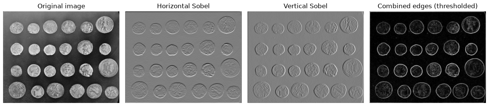
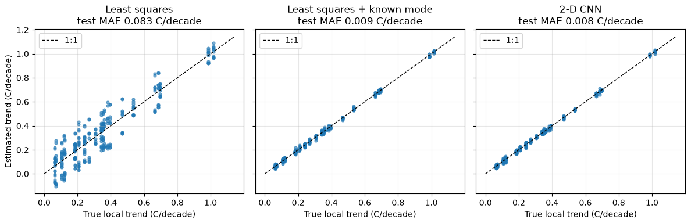
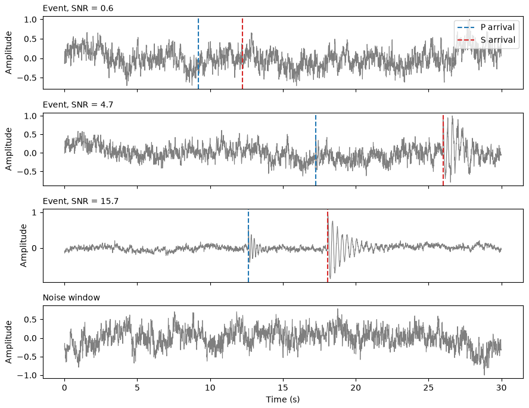
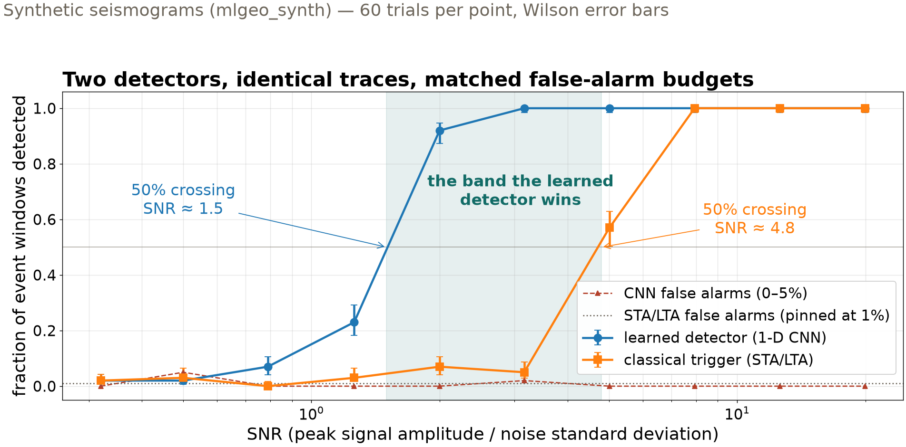
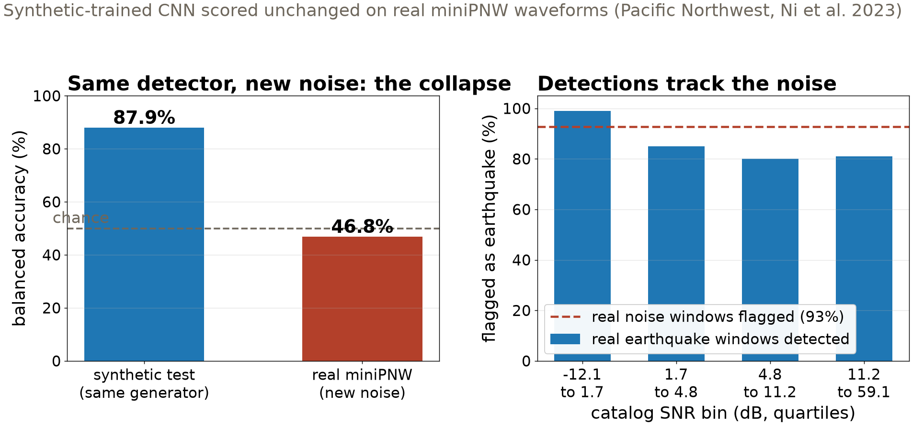

## {background-color="#faf7f2"}

[📡]{.lecture-icon}

### Today's question

Observatories have run one detector for fifty years.

**When does a learned detector beat the classical one — and how would you know?**

::: {.dim}
Reading: [4.3 Convolutional neural networks](https://geo-smart.github.io/mlgeo-book/mlgeo-4-3-cnn)
:::

::: {.notes}
Frame the session: Wednesday's MLP could not see a pattern that moves. Today's fix — convolution — is also the day the course puts a deep model head-to-head against a classical method, twice, with the deck ending on a number that fails. Both reality checks are the lesson, not embarrassments. Ask the room: who has run an STA/LTA trigger (they all did, in 2.10)? Today it defends its title. HW-CML is due today.
:::

## This lecture in the literature



::: {.takeaway}
From digits (1998) to earthquake catalogs (2018) — and the shortcut failure mode we will measure ourselves today.
:::

::: {.notes}
Two minutes. LeCun: LeNet-5, the architecture we warm up on, read checks for banks in the 1990s — convolution is not new, compute and data are. Perol/Gharbi/Denolle: ConvNetQuake, an early 1-D CNN on continuous seismograms in Oklahoma, found events the catalog missed — the research-scale version of today's toy detector; modern pickers (PhaseNet, EQTransformer) scaled the idea to global catalogs. Geirhos: names "shortcut learning" — networks that pass the test by keying on an unintended cue; hold that word for the last figure, where our detector turns out to key on the noise model, not the earthquakes. Bergen: the survey that maps where learned methods actually displaced classical pipelines in solid Earth geoscience — useful for placing today's crossover plot in context.
:::

## Convolution: one pattern detector, slid everywhere

{.r-stretch}

::: {.takeaway}
A 3×3 kernel finds edges wherever they occur. A CNN learns its kernels from data — early layers rediscover edge detectors on their own. (Sample photograph, scikit-image.)
:::

::: {.notes}
Define convolution physically: a small set of weights (the kernel) slides across the input, computing the same weighted sum at every position. Hand-designed kernels the room may know: the mean filter blurs, Sobel filters approximate the gradient and light up edges — that is what this figure shows. The CNN's move: stop designing kernels, learn them by gradient descent, and stack layers so later kernels combine earlier features into larger-scale patterns. The key vocabulary, stated carefully (the book's corrected sentence): a convolution layer is translation *equivariant* — shift the input and the feature map shifts with it, so a pattern learned anywhere is detected everywhere. Approximate translation *invariance* — the same final answer wherever the pattern sits — comes from the pooling layers that discard position as they downsample. Equivariance in the features, invariance from pooling: that division of labor is the whole architecture.
:::

## 2-D case: reading a warming trend from a gridded field

{.r-stretch}

::: {.takeaway}
The CNN beats naive least squares 10× (0.008 vs 0.083 °C/decade MAE) — but give the classical fit the one confounding mode it was missing and it matches the CNN at 0.009. A 10× win over an underspecified baseline. Synthetic (mlgeo_synth).
:::

::: {.notes}
The task: regress each 8×8-pixel patch's local warming trend (°C per decade) from 30 annual-mean anomaly maps stacked as channels — channels-as-time, the standard trick for time-evolving fields. Split is grouped by field (18 train, 6 test), the 3.8 doctrine applied: patches from one field never straddle the boundary. Walk the three panels left to right: naive straight-line fit, MAE 0.083 — scattered; same fit plus one extra regressor (the generator's known 5-year interannual mode, which aliases into a straight-line slope over 30 years), MAE 0.009; the 17,953-parameter CNN, 0.008 — indistinguishable from the informed classical fit. The honest reading, say it verbatim: what the network extracted from 18 training fields is the confounding mode — deep models earn their keep when the confounders are unknown or unwritable; when you can write the physics down, the classical fit with the right regressors matches the CNN at a fraction of the cost. This is the lecture's thesis, and the 1-D detector gets the same treatment next.
:::

## 1-D case: an earthquake detector in 4,658 weights

{.r-stretch}

::: {.takeaway}
Event windows at low SNR are invisible by eye — exactly the regime where a detector must be measured, and where real catalogs cannot measure it. Synthetic (mlgeo_synth).
:::

::: {.notes}
The data: 1,600 30-second windows at 100 Hz from the course generator — a P arrival then a stronger S on colored noise, or noise alone — each with exact metadata: arrival times and SNR (peak signal amplitude over noise standard deviation). Point at the top trace: SNR near 0.6, nothing visible; that is where we want to know detector behavior, and real data can never tell us, because catalogs only contain the events someone already found — a bias against exactly the low-SNR regime. The model: three Conv1d–ReLU–MaxPool blocks, global average pooling, a 2-class head — 4,658 parameters against LeNet's 61,706. Per-trace standardization first, so the network cannot classify on amplitude alone. Synthetic test accuracy: 87.9%, imperfect because the set deliberately includes near-undetectable events. The interesting question is not the average — it is *where* it fails. Next slide.
:::

## Reality check 1: same traces, classical opponent

{.r-stretch}

::: {.takeaway}
At matched ~1% false alarms: CNN crosses 50% at SNR ≈ 1.5, the trigger at ≈ 4.8. At SNR 2 the CNN catches 92% of events; STA/LTA catches 7%. Half a decade of SNR is the entire territory the learned detector wins.
:::

::: {.notes}
The design makes the comparison fair, and each choice is worth naming: identical traces for both detectors; the trigger's threshold set from noise alone (99th percentile of 600 noise-only windows → 1% false alarms by construction, no peeking at events); CNN false alarms measured at 0–5%, comparable, so the detection curves can be read directly; 60 trials per point with binomial error bars. Three regimes: below SNR ~0.8 both detectors sit at their false-alarm floor — no algorithm rescues a signal buried in noise of the same color; above ~8 both detect everything, and there the classical trigger is the right engineering choice — free to train, impossible to drift. The shaded band is the CNN's whole case. Whether that band matters is a scientific question, not an architectural one — in seismology it is where most small earthquakes live, which is why learned detectors displaced energy triggers in catalog building (Perol et al.; the pickers that followed). Also in the notebook: template matching, the classical method that beats both at low SNR when the source repeats — narrower question, different tool.
:::

## Reality check 2: real waveforms, no retraining

{.r-stretch}

::: {.takeaway}
87.9% on synthetic test → 46.8% on real miniPNW: chance. The network flags 93% of real *noise* windows — it responds to Pacific Northwest microseism noise, not to earthquakes. The gap is the measurement. Real data: miniPNW (Ni et al. 2023).
:::

::: {.notes}
The uncomfortable question the book insists on asking: every number so far came from the same generator that produced the training data — so score the unchanged detector on real labeled miniPNW waveforms (a few hundred earthquake windows, P pick 7 s in, plus matched pre-event noise windows; preprocessing mirrors training exactly, no threshold moved, no bandpass chosen to fix things afterward). Left panel: balanced accuracy collapses 41 points to chance. Right panel is the diagnosis: detection is *highest* (99%) in the lowest-SNR quartile — where the window is mostly noise — and the whole curve is indistinguishable from the 93% false-alarm line. The network is not responding to earthquakes at all: it learned "synthetic event vs the one synthetic noise model," and real nonstationary, microseism-dominated noise resembles neither, so nearly everything triggers. Name the concept: **distribution shift** — train and deployment data drawn from different distributions — and this is Geirhos's shortcut learning measured by us. The sentence to leave in the room: a model validated only on synthetic data has not been validated. Closing the gap takes real data on the training side (fine-tune on miniPNW, or physics-informed noise from 2.10) — that path is the notebook's, and 4.6 continues it.
:::

## Two baselines, two verdicts

| Case | Naive classical | Informed classical | CNN | Verdict |
|---|---|---|---|---|
| Warming trend (2-D) | 0.083 °C/dec | **0.009** °C/dec | 0.008 °C/dec | write the physics down and they tie |
| Detection floor (1-D) | 50% at SNR ≈ 4.8 | — | 50% at **SNR ≈ 1.5** | CNN wins the low-SNR band |
| Real miniPNW | — | — | **46.8%** (chance) | synthetic-only validation is not validation |

::: {.takeaway}
The learned detector earns its keep only where the classical method cannot reach — and only on data from the world it was trained in.
:::

::: {.notes}
Leave this up for questions; it is the lecture in one screen. Row 1: the CNN's 10× headline dissolves when the classical baseline gets the one regressor it was missing — always ask what the baseline was denied. Row 2: with matched false-alarm budgets on identical traces, the CNN genuinely extends detection half a decade of SNR deeper — the honest win, and the reason this architecture took over catalog building. Row 3: the same detector, on real ground motion, is a coin flip — distribution shift eats the entire margin. The three rows are one discipline applied three times: baseline first, matched conditions, report the failure as measured. Connect forward: Monday's forecasting shootout carries a persistence baseline row for exactly the same reason.
:::

## Now measure it yourself — open 4.3

1. `pixi run jupyter lab` → `mlgeo_4.3_CNN.ipynb`: run the convolution and LeNet warm-up quickly
2. Run the detection-floor sweep; estimate both 50% crossings from the printed table
3. Retrain with only 2 epochs, rerun the sweep: whose floor moves — the CNN's or STA/LTA's, and why?
4. Run the miniPNW reality check; report the balanced-accuracy gap as measured

::: {.dim}
PyTorch names live here: `nn.Conv1d`/`nn.Conv2d`, `nn.MaxPool1d`, `nn.AdaptiveAvgPool1d`, `torchinfo.summary` · HW-CML due today · Mon: sequence models (4.4), HW-DL assigned
:::

::: {.notes}
Timing for the 80-minute block (10:00–11:20): pulse talks ~10 min, this deck ~20 min, guided notebook work ~40 min, synthesis ~10 min. If time is short, cut task 1 to a skim — tasks 2–4 are the payload. Task 3 is the conceptual trap worth circulating for: the CNN's floor rises when undertrained, STA/LTA's does not move because it has no parameters to undertrain — that is what makes it a stable baseline. Section 7 of the notebook (recoding the Rouet-Leduc tremor CNN from its published architecture table, verified by shape checks with `torchinfo.summary`) is the take-home skill for reading papers — flag it for project teams reproducing published models. Synthesis question to collect: for your project, what is your STA/LTA — the zero-parameter method your model must beat on identical data? That question is graded in check-in #2.
:::
