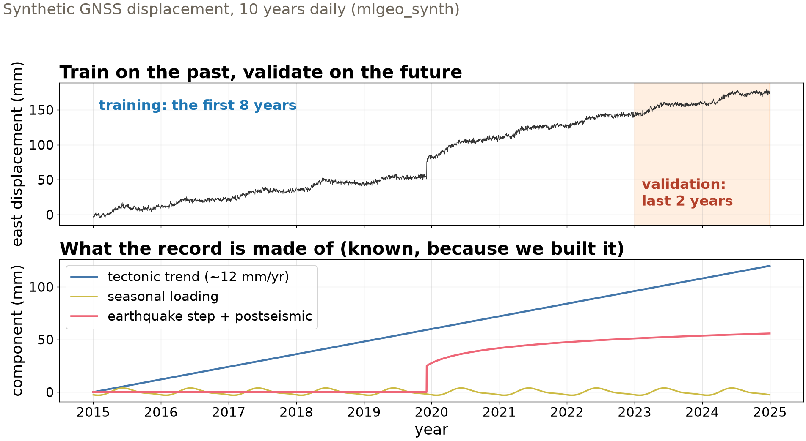
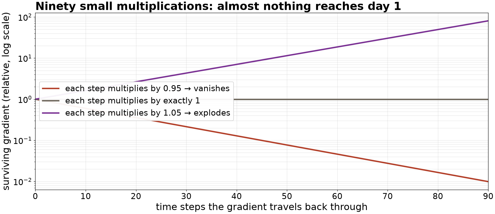

## {background-color="#faf7f2"}

[🔁]{.lecture-icon}

### Today's question

A forecast reads the past to write the future.

**How does a network carry information across 90 days — and does it beat "tomorrow equals today"?**

::: {.dim}
Reading: [4.4 Sequence models](https://geo-smart.github.io/mlgeo-book/mlgeo-4-4-rnn) · HW-DL assigned today
:::

::: {.notes}
Frame the session: Friday's convolution slides one pattern across time; today's architectures *carry state* across time — memory. We build four of them on one forecasting task and end at a table where the winner is a baseline question, not an architecture question. Announce: HW-DL is assigned today, due Fri Dec 4 — it uses everything from 4.1 through today. Also: the classification leaderboard closes tomorrow. Ask the room: who can define "forecast horizon" from their own field (weather, hydrology, aftershocks)?
:::

## This lecture in the literature



::: {.takeaway}
Memory (1997) → attention (2014) → attention only (2017) → the weather (2023). One thread, and today we build each link.
:::

::: {.notes}
Two minutes. Hochreiter & Schmidhuber: the LSTM predates most of the room; it solved a specific measured pathology (vanishing gradients — slide 5) with gates, and ran everything from speech recognition to flood forecasting for two decades. Bahdanau: attention entered as a *fix bolted onto* recurrent translation models — the attribution the book is careful about, because popular history starts at 2017; Vaswani et al. then showed the recurrence could be dropped entirely. Makridakis: the M-competition finding that fashionable ML forecasters lost to simple statistical methods across thousands of series — the field had skipped its baselines; today's persistence row is that discipline in miniature. Bi et al.: Pangu-Weather, a 3-D transformer that beat the operational ECMWF forecast on its own headline metrics — attention applied at planetary scale *and* judged against the right baseline. The arc: mechanism first, honest scoreboard always.
:::

## The task: 90 days in, 30 days out

{.r-stretch}

::: {.takeaway}
Context window = what the model reads; forecast horizon = what it must write. Temporal split, no window crossing the boundary — lecture 18's rule, unchanged.
:::

::: {.notes}
Define the two terms of the day: context window (the stretch of past the model reads — 90 days here) and forecast horizon (how far it must predict — 30 days). The record: 10 years of daily synthetic GNSS displacement with known components — ~12 mm/yr tectonic trend, seasonal loading, an earthquake step with postseismic relaxation, noise. We know the components because we built them; that is what lets us diagnose the models later. Data design: standardize using training-portion statistics only; slide a window to build (90-in, 30-out) pairs; first 8 years train, last 2 validate, no window straddles the boundary — a random split would let a validation window overlap two training windows almost entirely. One subtlety worth saying aloud: each window is *anchored* — the model forecasts change relative to its last observed day — because the trend puts validation windows at absolute levels training never saw; without anchoring every model would extrapolate outside its range and the saturating activations would fail. All four models share windows, loss, optimizer, and metric: mean absolute error over the 30-day horizon, in millimeters.
:::

## Why the plain recurrent network forgets

{.r-stretch}

::: {.takeaway}
Training pushes the gradient back through all 90 steps — a product of ~90 factors. Slightly under one → vanishes; slightly over → explodes. Simple recurrent memory tops out at tens of steps.
:::

::: {.notes}
First the mechanism: a recurrent neuron receives the current input *and* its own previous output — the hidden state is the memory, updated each day as h_t = tanh(Wx·x_t + Wh·h_(t-1) + b). Training unrolls the network over the 90 steps and backpropagates through time: the gradient reaching day 1 is a product of roughly 90 Jacobians, one per step. The figure is just powers of a single number, and that is the entire argument: 0.95^90 ≈ 0.01, 1.05^90 ≈ 80. When the product shrinks (the common case with tanh), early steps receive no training signal — the network cannot learn that something 80 days back matters, because the lesson never travels that far. Exploding is controlled by gradient clipping; there is no equally simple fix for vanishing. That asymmetry motivated both fixes on the next slide. Our vanilla RNN still forecasts respectably here (2,110 parameters, 1.83 mm) — because this series needs mostly recent context; the pathology bites when long memory is genuinely required.
:::

## Two escapes: gates, or drop the recurrence

- **LSTM (1997)**: a cell state updated by *addition*, guarded by learned forget / input / output gates — gradients cross long sequences without shrinking
- **Attention (2014)**: every day looks directly at every other day — each position asks a **query**, offers a **key**, passes a **value**; softmax-weighted average, no 90-step product anywhere
- **Transformer (2017)**: attention only, stacked, plus positional encodings — because attention alone is blind to order

::: {.takeaway}
One attention head is ~15 lines of code — and you will write them, from scratch, today.
:::

::: {.notes}
LSTM in one breath: alongside the hidden state runs a cell state modified additively — the forget gate decides what to keep, the input gate what to write, the output gate what to expose; addition, not repeated multiplication, is why gradients survive. Cost: ~4× the parameters of a plain cell. Attention in one breath: give every position three learned views of itself — query ("what am I looking for?"), key ("what do I contain?"), value ("what do I pass on") — score every query against every key (a 90×90 matrix), softmax each row into weights, average the values. Day 5 and day 85 connect at identical cost. The attribution, per the book: Bahdanau et al. introduced this as an add-on to recurrent sequence-to-sequence models; the Transformer (Vaswani et al.) removed the recurrence entirely. The catch students must articulate: pure attention is permutation-blind — shuffle the 90 days and the mean-pooled output is unchanged — so Transformers add positional encodings (fixed sinusoids per position) to restore order. The notebook builds the ~15-line head first, then uses PyTorch's encoder block.
:::

## The shootout — baselines first

| Model | Parameters | Val MAE, 30-day horizon |
|---|---|---|
| **Persistence** (tomorrow = today) | 0 | **2.10 mm** |
| **Seasonal naive** (value 365 d ago) | 0 | 15.53 mm |
| Vanilla RNN | 2,110 | 1.83 mm |
| LSTM | 5,470 | 1.86 mm |
| Attention (from scratch) | 4,126 | 1.87 mm |
| Transformer encoder | 18,142 | 1.84 mm |

::: {.dim}
Same windows, same loss, same optimizer, same metric — MAE in millimeters over the 30-day horizon, so the numbers are directly comparable.
:::

::: {.takeaway}
The learned models beat persistence by ~13% — real but modest. Seasonal naive fails because the 12 mm/yr trend makes last year systematically low: a baseline informs only when it matches the structure it targets.
:::

::: {.notes}
Read the baseline rows first — always. Persistence: every forecast day equals the last observed day; zero parameters, 2.10 mm, and any learned forecaster that loses to it has learned nothing. The four architectures land at 1.83–1.87 mm: about 13% better, the correct headline for a series dominated by smooth trend and seasonality that a 90-day context largely pins down. Seasonal naive is the teaching failure: 15.53 mm, worse than doing nothing fancy — because on a 12 mm/yr trend, the value 365 days earlier is systematically ~12 mm low. It is the right baseline for a purely seasonal series and the wrong one here; a baseline is a hypothesis about structure, and it informs only when the hypothesis matches. Then the architecture rows: the four scores sit within noise of each other — rerun with a different seed and the ranking shuffles. Say it plainly: **the ranking is not the lesson; the mechanics are** — how each model moves information across time and what that costs in parameters, training time (4.5 s to 24 s here), and gradient behavior. Echo Makridakis from the literature slide: entire fields have skipped this table's first row.
:::

## Same discipline, three lectures

| Session | Learned model | The baseline it faced | Verdict |
|---|---|---|---|
| Wed — MLP | PNW source classifier | Chapter 3 random forest | tie on tabular features |
| Fri — CNN | earthquake detector | STA/LTA at matched false alarms | wins half a decade of SNR |
| Today — sequence | GNSS forecasters | persistence, 0 parameters | +13%, all four architectures |

::: {.takeaway}
Architecture follows data structure: dense for tables, convolution for patterns that move, memory or attention for sequences. The baseline row decides whether any of it mattered.
:::

::: {.notes}
The week in one screen — leave it up for questions. The pattern students should carry to projects: pick the block that mirrors the data's structure (unordered features → dense; translation structure → convolution; order and long-range dependence → recurrence or attention), then earn the complexity against the strongest zero- or few-parameter baseline you can write. Also worth saying: attention is the block behind the pretrained weather and time-series forecasters now entering the geosciences (Pangu on the literature slide) — the mechanics built today are the reading skills for that literature. Wednesday continues into the model-training lab (4.5, data curation and label quality); the forecasting rematch on real data is 4.10 in week 10, where the persistence row returns with a leaderboard attached.
:::

## Now race them yourself — open 4.4

1. `pixi run jupyter lab` → `mlgeo_4.4_RNN.ipynb`: build the windows, check no pair crosses the 8-year boundary
2. Train all four models; reproduce the comparison table *with its baseline rows*
3. Double the horizon to 60 days, retrain: which errors grow, and why?
4. **HW-DL assigned today** (due Fri Dec 4): the full pipeline on new data — start this week

::: {.dim}
PyTorch names live here: `nn.RNN`, `nn.LSTM`, `nn.TransformerEncoderLayer`, `register_buffer` for positional encodings · classification leaderboard closes Tue · Wed: training lab I (4.5)
:::

::: {.notes}
Timing for the 80-minute block (10:00–11:20): pulse talks ~10 min, this deck ~20 min, guided notebook work ~40 min, synthesis ~10 min. The models are tiny and train on CPU in seconds to half a minute (the notebook deliberately pins CPU — recurrent layers launch one small op per step, so accelerator overhead dominates); nobody needs a GPU today. Circulate during task 3: the per-lead-day error growth (day 60 much worse than day 31) is where forecast-horizon intuition forms. Implementation spellings: `nn.RNN`/`nn.LSTM` are one-line swaps in the same module; the from-scratch attention head uses plain `nn.Linear` maps for Q, K, V; `nn.TransformerEncoderLayer` wraps attention + feed-forward + residuals + layer norm. HW-DL guidance to say aloud: it chains 4.1→4.4 skills; teams should budget the Thanksgiving-short week — Wednesday's lab is the last new scaffolding before it. Synthesis question to collect: what is the persistence forecast in your project's domain, and what would seasonal-naive's failure mode be on your data?
:::
