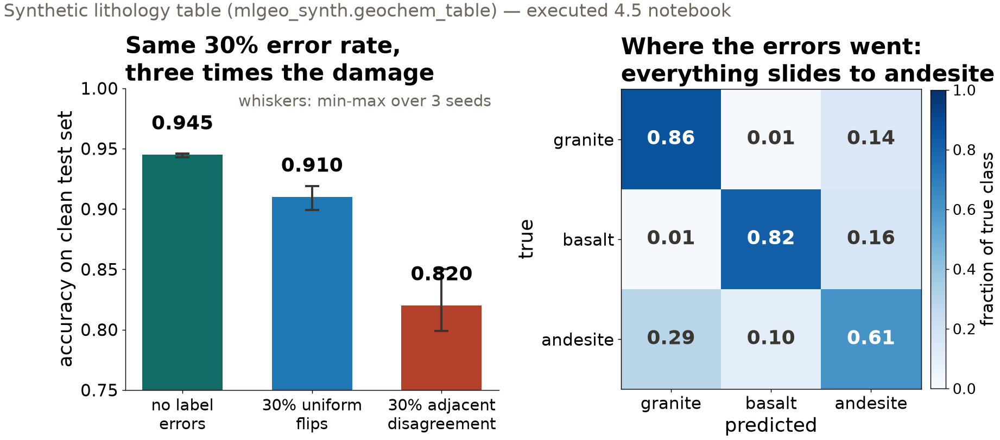
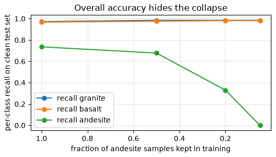

## {background-color="#faf7f2"}

[🔬]{.lecture-icon}

### Today's question

A working model rests on three pillars: **the training data, the architecture, the training strategy.**

**How high can any architecture score when the labels themselves disagree?**

::: {.dim}
Lab notebook: [4.5 The three pillars of model development](https://geo-smart.github.io/mlgeo-book/mlgeo-4-5-modeltraining) — sections 1–3 today, 4–5 on Monday.
:::

::: {.notes}
This is a lab day: the deck takes ten minutes, then the room works the notebook for the rest of the session. Frame the three pillars: training data (quality, balance, noise), architecture (the function family), training strategy (loss, optimizer, stopping rule). Most model failures trace to exactly one pillar, and each fails with a recognizable signature. The lab holds one task fixed — classify granite / basalt / andesite from 9 geochemical and physical features — and breaks each pillar on purpose. The generator is ours (mlgeo_synth), so we control the corruption exactly and the test set stays clean: that is how we measure what each defect costs. Today is pillar 1 only. The answer to the question on screen is the session's punchline: the labels set a ceiling no architecture can raise.
:::

## This lecture in the literature



::: {.takeaway}
Labels are interpretations. The disagreement between experts is measurable — and it caps what any model can demonstrate.
:::

::: {.notes}
Two minutes. Northcutt: the team audited the test sets of ten canonical ML benchmarks and found roughly 3% of labels wrong — enough that model rankings flip when the errors are corrected; the graded exam itself carried the errors. Bond: hundreds of interpreters were handed the same seismic image, and their structural interpretations diverged along their prior training — the geoscience demonstration that a label records what one expert concluded, not what is there. Rolnick is the reassurance side: uniform random label noise is surprisingly harmless at scale, which is exactly why today's structured-disagreement experiment is the one to watch — real disagreement is not uniform. Refs file updates monthly; bring candidates.
:::

## Same error rate, different damage

{.r-stretch}

::: {.takeaway}
30% uniform flips cost 3.5 points. 30% adjacent-class disagreement costs 12.5 — the two mappers vote coherently, and more data makes the model more confident in their shared mistake.
:::

::: {.notes}
Walk the left panel: same model, same 3000 training samples, same training budget, clean test set throughout. Random flips scatter in all directions and cancel — cross-entropy averages over samples, the correct majority still pins the boundaries. The third bar is the two-mappers experiment: two simulated geologists split the field area; each mislabels 30% of their samples, but only ever between adjacent lithologies on the differentiation axis — granite slides to andesite, basalt slides to andesite, never basalt to granite. That is how real mapping disagreement behaves. Right panel: the errors all pour into andesite, which annexes its neighbors' boundary zones — 14% of true granites and 16% of true basalts come back andesite; andesite recall falls to 0.61. Say the consequence plainly: inter-rater agreement is a ceiling on the accuracy any model can demonstrate, because the model is graded against labels that carry the disagreement. Ask the room: for your project labels, what would two independent experts disagree on?
:::

## The rare class disappears quietly

{.r-stretch}

::: {.takeaway}
Shrinking the rare class: overall accuracy drifts 0.946 → 0.881, while andesite recall collapses 0.735 → 0.000. Report per-class recall and the confusion matrix; never accuracy alone. Synthetic lithology table (mlgeo_synth).
:::

::: {.notes}
Synthetic lithology table again (mlgeo_synth); andesite is the rare class by construction, and we shrink it further. Two columns to read against each other: overall accuracy loses a few points — nothing a dashboard would flag — while the model stops predicting the rare class entirely. Note the head start: even at full data, andesite recall is 0.74 against 0.97 for the majority classes. This is the most common silent failure in geoscience classification, because the rare class is the one the model exists for: the eruption, the induced event, the landslide. Fixes belong to the lab: class weights in the loss, oversampling, augmented minority examples — and the check is that the fix shows up in recall, not just in the loss. Echo of 3.4's imbalance lecture, now in the deep learning setting.
:::

## The metadata you are throwing away

::: {.big-number}
0.933 [mixed lab- and field-grade data, variance ignored]{.unit}
:::

::: {.big-number}
0.946 [same data, loss weighted by 1/σ²]{.unit}
:::

::: {.dim}
All-lab-grade reference: 0.950. Heteroscedastic = the noise level varies sample to sample — and the metadata usually says by how much.
:::

::: {.takeaway}
One line of loss code recovers most of what mixed data quality costs. Any column named `uncertainty`, `std_err`, or `pick_weight` is an invitation.
:::

::: {.notes}
The setup: half the geochemistry from a laboratory XRF with tight analytical error, half from a portable field unit several times worse — and the metadata says which is which, because analytical uncertainty is reported per sample. Standard cross-entropy treats every sample as equally trustworthy; weighting each sample's loss by inverse variance is the classification analogue of weighted least squares. The seed bands of the two schemes do not overlap (0.932–0.935 vs 0.939–0.951), so the gain is not initialization luck. Down-weighting is also the honest alternative to deleting the noisy half: field-grade samples still carry signal, just less per sample, and the weights price that in. Seismic catalogs, geochemical databases, and GNSS solutions all ship such a column; most pipelines drop it at ingest.
:::

## What pillar 1 buys, in one table

| Defect | Signature | First fix |
|---|---|---|
| Uniform label noise | validation ceiling sags only on small datasets | audit labels; more data |
| Structured disagreement | one class annexes its neighbors; ceiling capped | measure inter-rater agreement, relabel |
| Class imbalance | accuracy fine, rare-class recall collapsing | class weights; check recall |
| Heteroscedastic noise | mixed-provenance table underperforms | weight the loss by 1/σ² |

::: {.takeaway}
Fixing a thousand labels usually beats adding a million parameters.
:::

::: {.notes}
Leave this up while questions come in — it is the session in one screen, and each row is an experiment the students are about to run themselves. The closing line is the notebook's own: before spending a month on architectures, spend a day measuring how often two experts agree on your labels. That number tells you when to stop tuning and start relabeling.
:::

## Now run it yourself — open 4.5, sections 1–3

1. `pixi run jupyter lab` → `mlgeo_4.5_ModelTraining.ipynb`
2. Run the label-noise sweep in both data regimes; read the seed bands before trusting any difference
3. Run the two-mappers experiment and the imbalance sweep; find where the errors went in the confusion matrix
4. Run the heteroscedastic comparison; then the learning curve — would more data help *your* project?
5. **Stop at the marked lab checkpoint** (end of Section 3). Monday resumes at Section 4.

::: {.dim}
Monday: session II — uncertainty you can defend (4.5 §4–5) · HW-DL due Fri Dec 4 · classification leaderboard closed Nov 24
:::

::: {.notes}
Timing for the 80-minute block (10:00–11:20): no pulse talks on 4.5 lab days; deck ~10 min, lab ~60 min with the instructor circulating, synthesis ~10 min at the end — collect one observation per team about which defect their own project data most resembles. The checkpoint matters: the notebook is built for two sessions and nothing below Section 3 depends on today's sweeps except the summary tables. Students who finish early: raise the sample counts, or start the learning-curve exercise on their own project data. Implementation details (the make_data corruption knobs, train_weighted) live in the notebook's lab helpers — read them once, carefully; every experiment is a few lines calling them.
:::
