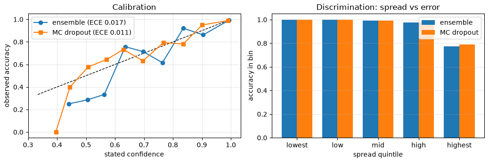
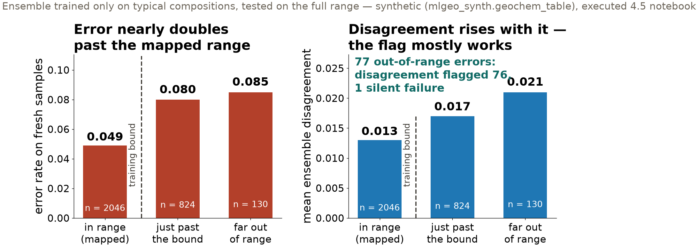

## {background-color="#faf7f2"}

[🎲]{.lecture-icon}

### Today's question

Two ways to get an uncertainty estimate: five training runs, or one.

**When your model says 80%, should anyone believe it — and did you check?**

::: {.dim}
Resume at Wednesday's checkpoint: [4.5](https://geo-smart.github.io/mlgeo-book/mlgeo-4-5-modeltraining) §4–5 · Ch 5 flipped reading assigned today (quiz closes Thu Dec 3)
:::

::: {.notes}
Second lab session on the same notebook; ten minutes of deck, then the room resumes at the marked checkpoint (restart the kernel, rerun the Section 1 setup and helper cells, continue from Section 4). Today's arc: two uncertainty methods head-to-head, then two distinct questions to ask of any uncertainty estimate — can I trust the ranking (discrimination), can I trust the number (calibration) — and finally what happens when the model leaves the range it was trained on. Announce the flipped Ch 5 reading (5.1–5.5, reproducibility through data at scale) — it is examinable through the quiz that closes Thursday, and Friday's session discusses it. The question on screen is the session's discipline: every probability you report is a claim someone else may act on.
:::

## This lecture in the literature



::: {.takeaway}
Both methods are canon. Which one your project needs is a measurement, not a doctrine — today you make it.
:::

::: {.notes}
Two minutes. Lakshminarayanan: deep ensembles — train the same architecture from several seeds, use the disagreement; the standard expensive method, and the notebook cites it. Gal & Ghahramani: MC dropout — keep dropout active at prediction time, sample the network many times; one training run, and the notebook cites it too. Guo is the cautionary tale: nobody had audited the confidences of modern networks until 2017, and they were far too sure of themselves — calibration went unmeasured while the field celebrated accuracy. Ovadia is the large-scale head-to-head under distribution shift, where ensembles genuinely earn their cost — useful context for why our small-MLP verdict below is not a general law. That tension — method reputation vs measured behavior on your task — is today's lab.
:::

## Five training runs vs one

| | test accuracy | ECE | models trained |
|---|---|---|---|
| Deep ensemble (5 members) | 0.949 | 0.017 | 5 |
| MC dropout (T = 50 passes) | **0.952** | **0.011** | **1** |

::: {.dim}
ECE, expected calibration error: the average gap between stated confidence and observed accuracy. The 50 dropout passes are the cheap side; training runs are the expensive one.
:::

::: {.takeaway}
On this task, the single dropout model matched the 5-member ensemble at a fifth of the training cost. The numbers refuse to crown the expensive method.
:::

::: {.notes}
The honest comparison: same data, same test set, cost stated next to the scores. MC dropout matches on accuracy (the 0.003 gap sits inside a single run's seed spread), edges the ensemble on calibration, and draws the same discrimination curve — accuracy in the highest-spread quintile 0.79 vs 0.77, the other four quintiles agreeing to three decimals. When one training run takes a week, this table is a budget decision. Why ensembles survive in practice anyway: their documented calibration advantage appears on large networks under distribution shift (the Ovadia result), members train in parallel, and their disagreement comes from genuinely independent solutions — the property the out-of-range experiment uses. The final-project milestone asks for one of these two analyses on your own model.
:::

## Calibration is a measurement, not a method property

{.r-stretch}

::: {.takeaway}
An earlier draft of the book claimed the ensemble improves calibration. The measurement said no — on this task there was nothing to fix. "Well calibrated" is a number you attach after running the cell. Synthetic lithology table (mlgeo_synth).
:::

::: {.notes}
Synthetic lithology task (mlgeo_synth), clean test set. Left: reliability — bin samples by stated confidence, plot observed accuracy; the diagonal is honesty; both methods hug it, ECE 0.011 vs 0.017. Right: discrimination — bin by spread, watch accuracy fall across quintiles; both fall the same way. Keep the two diagnostics distinct in write-ups: the quintile plot answers "can I trust the ranking?" (routing samples to an analyst — only order matters); the reliability diagram answers "can I trust the number?" (required whenever the probability feeds a decision threshold someone else owns — lesson 3.6's warning). Reporting one as evidence for the other is the exact error the earlier draft contained, and it survives peer review depressingly often. The published literature's ensemble-calibration advantage is real on large networks under shift; our two-layer MLP was simply not miscalibrated enough to fix. Both claims can be true — that is the point.
:::

## Out of range: does disagreement warn you?

{.r-stretch}

::: {.takeaway}
Disagreement flagged 76 of the 77 extrapolation errors. The one silent failure is today's discussion: its features drifted into a *neighboring* class's familiar territory, so all five members confidently agreed — on the wrong label.
:::

::: {.notes}
The setup: the field campaign mapped only typical granites, basalts, andesites — training keeps samples within one standard deviation of each unit's typical composition — then the test draw spans the full range, including compositions the model never saw. Error nearly doubles across the training bound (4.9% → 8.0% → 8.5%); mean disagreement rises with it. The mechanism to memorize is the one failure the flag missed: an extreme composition that came to *look* familiar. Disagreement flags unfamiliar regions of feature space; it cannot flag a sample whose label changed while its features landed somewhere the model knows. Under a larger shift, that one sample becomes a population. Second caution from the notebook's scatter: the in-range and out-of-range disagreement distributions overlap heavily — no threshold on the spread reconstructs the training bound. The bound is metadata only you have. Connect back to 3.8: interpolation and extrapolation are different claims, and the split decides which claim your score supports.
:::

## Your training distribution is a contract

- Every number this lab produced is valid **inside** the ranges the training data covered
- No diagnostic computed in range certifies behavior out of range
- State the ranges when you release the model; predictions beyond them are unwarranted until labels say otherwise

::: {.takeaway}
The range statement belongs next to the model, in writing — it cannot be inferred from the model's behavior.
:::

::: {.notes}
This is the slide to hold for a beat. Deployment breaks the in-range assumption routinely: the mapped area ends, the next pluton is more evolved than anything in the survey, the new station sits on softer ground. Accuracy, ECE, the quintile plots — all terms of a contract whose jurisdiction is the training ranges. For final projects this becomes a required sentence in the report: the ranges your training data covered, stated alongside every score. Ask each team to draft that sentence during synthesis.
:::

## Now run it yourself — resume 4.5 at Section 4

1. Restart the kernel; rerun the Section 1 setup and helper cells; continue from **Section 4**
2. Train the 5-member ensemble, then the MC dropout model; reproduce the head-to-head table
3. Run the reliability and quintile diagnostics — which question does each answer?
4. Run the out-of-range experiment; find the silent failure and explain its mechanism
5. Section 5 sweeps (learning rate, batch size, early stopping) + the six broken runs — diagnose before opening the solution

::: {.dim}
Wed: forecasting shootout (4.10), leaderboard opens · Ch 5 quiz closes Thu Dec 3 · HW-DL due Fri Dec 4
:::

::: {.notes}
Timing for the 80-minute block (10:00–11:20): no pulse talks on 4.5 lab days; deck ~10 min, lab ~60 min, synthesis ~10 min — collect each team's one-sentence training-range contract, and one diagnosis from the six broken runs. The six broken runs are the exam real projects keep administering: overfitting, leakage, learning rate too high/too low, label noise, underfitting — curves first, code after. Implementation names live in the notebook (dropout stays in train() mode for MC passes; reliability helper computes ECE). Students short on time: prioritize tasks 2–4; Section 5's sweeps can be homework-adjacent since HW-DL exercises the same diagnostics.
:::
