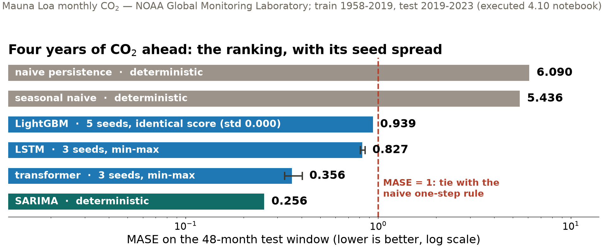
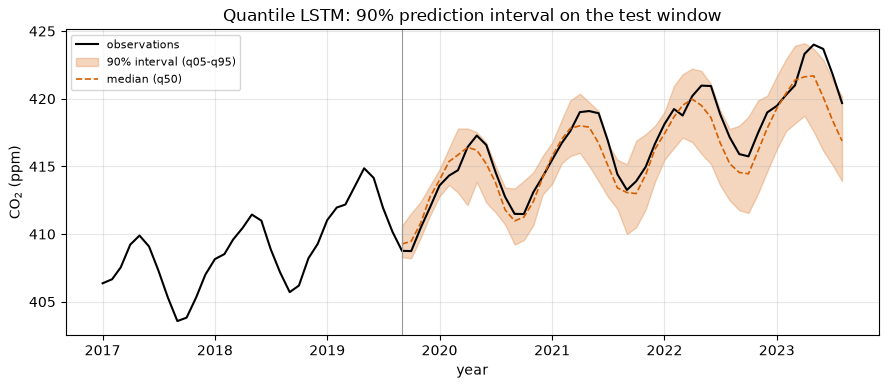
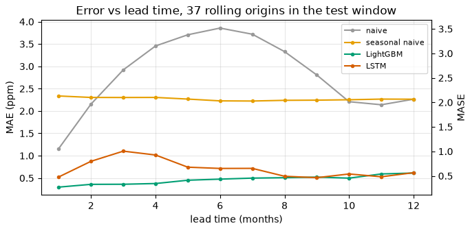
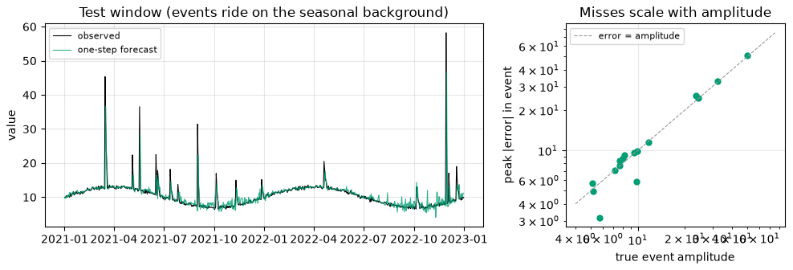

## {background-color="#faf7f2"}

[🔮]{.lecture-icon}

### Today's question

Every forecast competes with a one-line rule: *tomorrow equals today*.

**When does a trained model actually beat it — at which lead time, on which samples, by how much?**

::: {.dim}
Reading: [4.10 Time series forecasting](https://geo-smart.github.io/mlgeo-book/mlgeo-4-10-timeseriesforecast) · Forecasting leaderboard opens today
:::

::: {.notes}
Geoscience runs on forecasts: atmospheric CO2, river discharge, glacier flow, groundwater, space weather. Today is a shootout — five model families, two real series, one temporal split, one metric helper, one programmatically built table — and then the three questions a single score hides: is the ranking stable across seeds, do the intervals mean what they claim, and where does skill run out (in lead time, and in event size). The persistence baseline discipline from 3.8 returns as the denominator of the day. Announce: the forecasting leaderboard opens today and closes Wed Dec 9; the Ch 4 quiz opens tomorrow.
:::

## This lecture in the literature



::: {.takeaway}
Forty years of forecasting competitions keep returning one verdict: baselines embarrass complexity — until verification discipline puts complexity to work.
:::

::: {.notes}
Two minutes. Hyndman & Koehler: the metric paper — why percentage errors mislead near zero, and the origin of MASE, the scale-free score the leaderboard uses (MASE < 1 = beats the naive one-step rule at its own game). Makridakis: across large forecasting-competition collections, popular ML methods ranked below classical statistical baselines — the field-scale version of what today's table shows in miniature. Gneiting: the verification creed, sharpness subject to calibration — first make the intervals honest, then make them tight; today's coverage and CRPS checks implement it. Lam (GraphCast): the counterpoint — a learned model judged on the atmosphere's own verification suite, error curves per lead time, and it beat the operational ECMWF model; deep forecasting wins exactly when it submits to this discipline. Refs update monthly; bring candidates.
:::

## The shootout

- **Series**: Mauna Loa monthly CO₂ (real — NOAA GML, 1958–2023); Jakobshavn ice speed, the hard case
- **Contestants**: persistence → seasonal naive → SARIMA → gradient boosting → LSTM → transformer
- **Protocol**: one temporal split — train through 2019-08, test 48 months; features from the past only

::: {.dim}
The 2024 edition split these data samples randomly and typed its table by hand. Both went wrong; neither survives here.
:::

::: {.notes}
The friendly case first: CO2 is long, regular, strongly seasonal, smooth trend — the sawtooth is northern-hemisphere vegetation drawing down CO2 each summer. Any model that cannot beat "repeat last year's shape" should embarrass its author. Protocol details that matter: a random split of a lag-feature table lets test rows sit between training rows from adjacent months — the temporal version of 3.8's leakage — and an unshifted rolling mean smuggles the target month into its own features; the 2024 edition did both, and its scores looked better than any real forecast could be. Every number today comes out of one metric helper, and the table is built programmatically from the stored predictions — never typed. Implementation names for the notebook: statsmodels SARIMAX, LightGBM with recursive one-step feedback, torch LSTM and transformer encoder forecasting all 48 months directly with anchoring.
:::

## The ranking, and what it cost

{.r-stretch}

::: {.takeaway}
SARIMA wins with a handful of parameters: it encodes exactly what this series is made of. Problem structure, not model capacity, is the bottleneck.
:::

::: {.notes}
Read bottom-up. Persistence ignores trend and season — the floor. Seasonal naive copies last year's shape but freezes the trend, so it drifts below the observations by roughly the trend times the horizon; in this run every trained model clears it, but forecasting benchmarks keep finding runs where it does not — that is the recurring lesson. SARIMA: one differenced trend, one 12-month seasonal cycle, textbook order (1,1,1)×(1,1,1)₁₂ — very hard to beat on a series that is exactly trend plus cycle. The deep pair must learn that structure from 655 windows and needs anchoring (subtract the last context value) just to cope with levels it never saw — trees have the same problem, which is why LightGBM predicts the one-month *change*. The whiskers are the next slide's story. Ask the room before advancing: which entries could even produce a different number on a re-run?
:::

## The seed that was never consumed

::: {.big-number}
0.000 [LightGBM MASE spread across 5 seeds]{.unit}
:::

::: {.big-number}
0.327–0.403 [transformer MASE across 3 seeds]{.unit}
:::

::: {.dim}
As configured — no row or feature subsampling — LightGBM is deterministic: the seed is an inert knob. The transformer moves by a tenth of its own mean from initialization, batch order, and dropout alone.
:::

::: {.takeaway}
"We varied the seed" is evidence of robustness only when the algorithm actually consumes the seed. Report mean and spread; let the reader see whether the gaps beat the noise.
:::

::: {.notes}
A table entry from one training run is a sample from a distribution over seeds; reporting a sample as the mean is the same sin as reporting a point forecast without an interval. The zero is its own lesson: five identical scores do not demonstrate stability, they demonstrate that nothing random was running — check what your seed actually feeds before citing it. Here the ranges do not overlap, so the shootout order survives the seeds — a conclusion stated with evidence instead of hope, and not a general law: on the short Jakobshavn series the gaps between models are the same size as these spreads, so its ranking should not be trusted from a single run. Deterministic entries (baselines, SARIMA) have no spread by construction.
:::

## From a number to a range — and a check

{.r-stretch}

::: {.takeaway}
The 90% interval caught 44 of 48 test months — 91.7% measured coverage. Nobody told the model that uncertainty compounds with lead time: the interval grows 2.3 → 6.3 ppm on its own. Mauna Loa CO₂ — NOAA GML.
:::

::: {.notes}
Real data: Mauna Loa CO2, NOAA GML. The machinery: give the LSTM a quantile head — 48 × 19 outputs, one per horizon step per quantile level — trained on the pinball loss, which charges tau per unit of under-prediction and 1−tau per unit of over-prediction; its minimizer is exactly the tau-quantile. q05 and q95 give the 90% interval; q50 is a median forecast for free. The claim becomes verifiable, and verification is the point: coverage is computed, never assumed — quantile regression aims at calibration but nothing enforces it out of sample. Honest caveat from the notebook: 48 consecutive months from one forecast origin are strongly correlated, so this coverage estimate is itself noisy — another window could return 80% or 100%. Sorting quantiles at prediction time repairs the occasional crossing.
:::

## Score the whole distribution: CRPS

::: {.big-number}
0.766 ppm [quantile LSTM — mean CRPS]{.unit}
:::

::: {.big-number}
0.886 ppm [point-forecast LSTM — MAE (= its CRPS)]{.unit}
:::

::: {.dim}
CRPS — the continuous ranked probability score, forecast verification's standard — scores the full predictive distribution in data units; for a point forecast it reduces exactly to MAE. SARIMA's point forecast: 0.281 ppm.
:::

::: {.takeaway}
Spreading probability honestly earns real score even when the center is imperfect — but a well-placed point still wins. Sharpness, subject to calibration.
:::

::: {.notes}
The three numbers in one argument. The quantile model's CRPS beats its own median's MAE (1.051) and the point LSTM's 0.886: that comparison is the entire case for probabilistic forecasting in one line of output. Then the humility: SARIMA's point forecast at 0.281 beats the honestly wide distribution — calibration does not excuse a diffuse center, which is Gneiting's slogan operating in both directions. CRPS is the number atmospheric ensemble systems report; because it collapses to MAE, probabilistic and point forecasts compete on one scale. Estimator: twice the pinball loss averaged over the quantile grid — with 19 levels it slightly undervalues the extreme tails. Natural next contestant for the eager: SARIMA's own forecast distribution via get_forecast().conf_int().
:::

## Where does skill run out? Plot error vs lead time

{.r-stretch}

::: {.takeaway}
On CO₂ (Mauna Loa — NOAA GML) the learned models beat persistence at every lead tested — their skill horizon lies beyond a year. Weather's is two weeks. The horizon is a property of the *series* as much as of the model.
:::

::: {.notes}
Rolling-origin evaluation, the way operational systems are scored: models frozen as trained, the origin slides month by month through the test window, errors averaged per lead over 37 origins. Vocabulary: the skill horizon is the lead beyond which a model stops beating the reference — beyond it the model adds nothing over "no change". Weather models lose to climatology around two weeks because atmospheric chaos destroys the information in the initial state; monthly CO2 keeps its skill at every lead we measured because the structure carrying the forecast — trend plus annual cycle — never stops applying. That is the opposite answer to the same question, and the reason to always ask it. The references are instructive too: seasonal naive beats persistence only at intermediate leads (3–9) — near lead 12, persistence lands back in the same season. A single-number summary hides this whole dimension. For a series where the horizon arrives almost immediately, the notebook points at Jakobshavn.
:::

## The largest event, missed in full

{.r-stretch}

::: {.takeaway}
Bulk MAE 0.97 — excellent. The largest injected event, amplitude 50.2, was missed by 50.8: the model forecast the seasonal background and the flood happened anyway. Stratify your scoring by event size. Synthetic series (mlgeo_synth).
:::

::: {.notes}
Synthetic on purpose (mlgeo_synth.inject_rare_events): we need ground truth about event amplitudes, which is exactly what a bulk metric never sees. Eight years of daily seasonal background, ~6 events per year, amplitudes drawn from a generalized Pareto tail (shape 0.5) — the extreme-value regime of real flood and surge records, where the largest future event routinely exceeds the largest yet observed. The forecaster gets every advantage (one-step-ahead, yesterday always in the features) and still: quiet days 0.62, mid-size events ~10.6, largest stratum 18.3 — thirty times the quiet floor, hidden because event samples are 56 of 730 test days. Both causes are structural: onsets are unpredictable from lag features, and the heavy tail guarantees the exam contains a magnitude the textbook never showed — 4.5's out-of-range lesson, now in amplitude instead of feature space. The repair is in the metric: stratified tables, event-window recall, or amplitude-weighted losses. A leaderboard scored on overall MAE would congratulate this model — which is the bridge to the next slide.
:::

## The leaderboard contract: two tracks

| Track | Series | Holdout | Weight |
|---|---|---|---|
| A — CO₂, 12 months | real (NOAA) | **public** — the truth file is in the repo | diagnostic, none |
| B — hidden synthetic, 90 days | GNSS-like (mlgeo_synth) | private seed, instructor's machine only | **graded** |

::: {.dim}
Track A is trivially gameable and the book says so in print: copying public numbers scores a perfect 0.0 — and defeats only the diagnostic. Metric: MASE, denominator from the training history.
:::

::: {.takeaway}
A leaderboard is only as meaningful as its holdout is inaccessible. Saying that out loud is the lesson.
:::

::: {.notes}
Honesty as pedagogy: the CO2 holdout months are public NOAA data, cached on every student's own disk by the notebook's download call, and the truth file is committed to the repo — so that track exists to exercise the submission pipeline and compare honest attempts, on your honor. The grade sits on Track B: a daily displacement series from mlgeo_synth.gnss_series (secular trend, annual and semi-annual cycles, colored noise — the GNSS records of Chapter 2), generated from a private seed and regenerated every year; students forecast the 90 days past the last history date, and the truth is never committed. Same design as 3.5's classification leaderboard: public score diagnostic, hidden test carries the weight — the fair-evaluation thread of the course, one more time. Submission: CSV via pull request; CI scores Track A and lists Track B as received. Opens today, closes Wed Dec 9.
:::

## What today adds to your toolkit

| Question | Tool | On the CO₂ benchmark |
|---|---|---|
| Better than "no change"? | persistence baseline + MASE | naive MASE 6.09; four models beat 1.0 |
| Is the ranking real? | seed spread per entry | spreads don't overlap — order stands |
| Can I trust the range? | coverage of the interval | 91.7% measured vs 90% nominal |
| Whole distribution? | CRPS (reduces to MAE) | 0.766 ppm vs point 0.886 |
| Where does skill end? | error vs lead time | beyond a year — opposite of weather |
| The events that matter? | tail-stratified scoring | largest event missed in full |

::: {.takeaway}
One temporal split, one metric helper, one computed table — and five questions no single score answers.
:::

::: {.notes}
The table stands alone as the session summary; each row is a section of 4.10 the students run today. If one thing survives the quarter: baselines before models, and every claimed skill number comes with the question it answers — the same discipline as 3.8's validation ladder, extended along lead time, probability, and event size.
:::

## Now run it yourself — open 4.10

1. `pixi run jupyter lab` → `mlgeo_4.10_timeseriesforecast.ipynb`
2. Run the CO₂ shootout; then Exercise 1 — drop `lag_12`/`lag_24` and explain the MASE change
3. Run the quantile head: check the printed coverage; compare CRPS against the point models
4. Produce both leaderboard files (`forecast_<uwnetid>.csv`, `forecast_hidden_<uwnetid>.csv`) and open the pull request
5. Ice series + rare events if time remains — expect the ranking to wobble, and say so

::: {.dim}
Enrichment: autoencoders (4.6) + PINNs (4.7) — required for 569, optional for 469 · Ch 4 quiz Thu Dec 3 → Mon Dec 7 · leaderboard closes Wed Dec 9
:::

::: {.notes}
Timing for the 80-minute block (10:00–11:20): pulse talks ~10 min, deck ~20 min, notebook exercise ~40 min (the shootout cells run in a few minutes; circulate during the leaderboard-file step — the PR mechanics trip more students than the modeling), synthesis ~10 min: collect one skill-horizon claim per team, phrased with its lead time and reference. Friday: Ch 5 discussion from the flipped reading plus communicating your science (7.1–7.2), and HW-DL is due. The scikit-learn/torch spellings live in the notebook (SARIMAX order (1,1,1)×(1,1,1,12), LGBMRegressor on lag features, pinball loss over 19 quantile levels); the concept-to-deployment mapping is the graded skill.
:::
