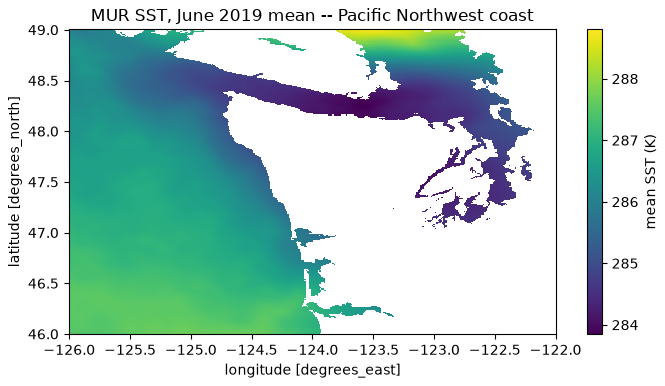

## {background-color="#faf7f2"}

[📦]{.lecture-icon}

### Today's question

Your model works. Two questions decide whether it counts:

**Can anyone rerun it? Can every audience that needs it trust what you say about it?**

::: {.dim}
Flipped reading: [Ch 5, 5.1–5.5](https://geo-smart.github.io/mlgeo-book/reproducibility) · today: [7.1 Audience translation](https://geo-smart.github.io/mlgeo-book/audience-translation) + [7.2 Downstream impact](https://geo-smart.github.io/mlgeo-book/downstream-impact) · **HW-DL due tonight**
:::

::: {.notes}
Final-push framing: presentations are one week from today, the report is due Dec 16, and this is the last new-material session of the quarter. Two movements: first, Chapter 5 — which the class read flipped — compressed into a handful of numbers worth keeping (the quiz already checked the reading; today we argue about it); second, Chapter 7 — how to say what you built without saying more than you measured, which the final project grades directly through the presentation, the audience-translation deliverable, and the downstream-impact statement. One sentence to set the tone: the last mile of a project is not more training, it is making the result rerunnable and tellable — that is what "ship" means in science.
:::

## This lecture in the literature



::: {.takeaway}
Workflow discipline has a literature — these three are its spine, and your final report is graded against their ideas.
:::

::: {.notes}
Two minutes. The National Academies report supplies the vocabulary the course has used all quarter: reproducibility = same data + same code + same conditions; replicability = new data, same question; and the trap worth saying aloud — a bug reproduces perfectly, so reproducibility certifies completeness, not correctness. Mitchell et al. invented the model card: a short standard statement of intended use and known limits; the "known limits" line is the one an agent cannot write for you, because it encodes what you did NOT test — your final repo includes one. Pineau et al. describe the NeurIPS reproducibility program: code submission policy, the reproducibility checklist, and community challenges — evidence that a field can move its norms deliberately. The missing ✗ (a geoscience replication failure) is an open TODO in the refs file — students who find a well-documented candidate get it added with credit.
:::

## A bug reproduces perfectly

- Reproducible = same data, code, environment → same result **within a stated tolerance**
- Reproducibility certifies the pipeline is deterministic and complete — **not that it is right**
- Agents write code faster than you can review it → make the checks executable: lock file, scripted transforms, CI

::: {.takeaway}
When you delegate the typing, you must not delegate the verification.
:::

::: {.notes}
The three ideas of 5.1 in one slide. Tolerance first: ML training has randomness and floating-point non-determinism, so bit-for-bit is the wrong standard — you state a tolerance and defend it, which is why the checklist says "reported numbers match the rerun within your stated tolerance." Then the trap: exact reproduction of a leaked feature is still a leaked feature; validation on held-out data catches what reproduction cannot. Then the 2026 reason the stakes rose: an agent can generate a fluent, internally consistent, wrong analysis in minutes, and you cannot review at that speed — so the checks become machinery: pixi.lock pins the environment, raw data is immutable with every transform scripted, and CI re-executes everything on every change. This book is its own worked example: every notebook executes in CI at the commit you are reading. Quick poll for the discussion block: who can rerun their own pipeline from a fresh clone today?
:::

## Chapter 5 in two numbers, part 1 {.smaller}

::: {.big-number}
30 lines [a complete experiment tracker — params, metrics, artifacts, code version]{.unit}
:::

::: {.big-number}
0.002 [the "winning" configuration's margin — smaller than the seed-to-seed spread]{.unit}
:::

::: {.takeaway}
A difference smaller than your run-to-run variance is not a finding. Know the spread before you compare.
:::

::: {.notes}
5.2's two lessons. The tracker: one JSON file per run recording parameters, metrics, artifact paths, and the git commit — that is the entire data model of MLflow and Weights & Biases, which add a UI, artifact storage, and collaboration on top of the same four records. Use the real tools for the team project; never mistake them for the discipline. The 0.002: in the notebook's six-run study, the top four configurations sit within a few thousandths of validation macro-F1 — and rerunning the winner across seeds shows a seed-to-seed standard deviation of the same few thousandths. So "depth 8 beats depth 2 by 0.002" is not a result; the honest report is "indistinguishable at our run-to-run variance; we chose the cheapest." Same statistical discipline as the ±0.22 standard error on agent pass rates in 6.3 — sampling noise under different names. For final reports: any comparison you claim must come with its spread.
:::

## The data and the model have versions too

- **One hash**: `pooch.retrieve(url, known_hash=…)` — upstream file changes, your analysis fails loudly instead of drifting silently
- A saved model = weights **+ config + data version + metrics + seed** — provenance travels in the bundle
- Ten-line **model card**: intended use and known limits — the lines only you can write

::: {.takeaway}
"The model" in your report must mean a specific version a machine can retrieve and rerun.
:::

::: {.notes}
5.3 compressed. Git fails for data (size, binary diffs, the 100 MB limit), but the floor needs no new tools: immutable raw directory, recorded checksums, every processed product regenerable by a committed script. The pooch known_hash argument is a data-versioning system in miniature — this course's own datasets work exactly that way. Models are derived products: weights alone are an anecdote; the bundle (config, data version, code commit, metrics, seed) is provenance, and semantic versioning (major = interface, minor = behavior, patch = fix) makes "detector_v1.2.0" a claim someone can check. The model card's "known limits" and "intended use" lines encode judgment about what you did not test — Chapter 7.2 turns them into the downstream-impact statement due in the final report. CI ties it together: the book's twenty-line workflow pattern is copy-pasteable into project repos, and if your pipeline cannot finish even a reduced smoke test in CI, nobody — including you — can cheaply verify it.
:::

## 106 TiB, opened from a laptop

{.r-stretch}

::: {.takeaway}
MUR sea-surface temperature (JPL/NASA PO.DAAC, AWS Open Data): a 106.3 TiB Zarr store, opened in 12.9 s by reading **10.3 KiB** of metadata.
:::

::: {.notes}
Movement one's finale — 5.5, the executable version of "read in place." The dataset: MUR SST, daily global sea-surface temperature at ~1 km, 2002–2020, public on AWS. The map on the slide is the notebook's June 2019 monthly mean over the Pacific Northwest coast — computed by streaming, never holding more than a few chunks in memory. The opening move: one small object, the consolidated metadata, describes every array, chunk, and compressor in the store — so xarray + Zarr can open 106.3 TiB lazily off a 10.3 KiB read; no data values cross the network until you ask. Define chunk while the map is up: the store's atomic unit of I/O and compression — every read fetches whole chunks, so your access pattern pays in chunk-sized coins. The arithmetic that kills in-memory habits: one global timestep decodes to 4.8 GiB, three days exhausts a 16 GiB laptop — the fix is never a bigger compute, it is an algorithm that touches fewer chunks.
:::

## How many bytes actually moved? {.smaller}

::: {.big-number}
60.6 MiB [moved over the network — ten days, Pacific Northwest shelf]{.unit}
:::

::: {.big-number}
30.4 TiB [the temperature variable those bytes were pulled from]{.unit}
:::

::: {.dim}
One part in ~525,000. The answer itself: 9.2 MiB in RAM — the 6× overhead is chunk granularity, the tax of object storage.
:::

::: {.takeaway}
Laptop, cluster, or cloud — the deciding question is always: how many bytes must move?
:::

::: {.notes}
The measured punchline of 5.5, and the number pair to reuse in any proposal: a ten-day, 46–49°N / 126–122°W subset of a 30.4 TiB (decoded) variable moved 60.6 MiB of compressed chunk objects in about 20 s — because chunking makes partial reads cheap and laziness means only touched chunks travel. The 6× gap between 60.6 moved and 9.2 kept is chunk granularity: you fetch whole 20 MiB chunk objects even for a partial slice, which is why chunk shape should roughly match access pattern. Then the decision ladder from 5.4 in one breath: chunks-you-touch small → laptop, exactly as here; chunks-you-touch ≈ whole store (global climatology, training over every chunk) → move compute to the data — a cloud instance in the data's region, or HPC where a mirror already sits; either way the query travels to the data and only answers travel back. Mention the restricted-network reality: on lab and agency networks anonymous S3 is often blocked — the fallback is a mirror or a pre-staged 9.2 MiB subset through the approved gateway, hash-pinned.
:::

## Movement 2 — the words are part of the result

*The measured finding:* [detector recovers 92% of M>2 events at 1 false alarm/day; recall drops to 60% below SNR 3]{.dim}

**✗ "Our AI detects 92% of earthquakes."**

**✓ "9 out of 10 earthquakes above magnitude 2, with about one false alert a day for an analyst to dismiss."**

::: {.takeaway}
Jargon translation swaps words. Claim translation keeps the truth conditions. Both sentences are plain — only one is true.
:::

::: {.notes}
7.1's central move. The ✗ sentence is plain and false three ways: 92% was measured above M2, at a chosen false-alarm rate, on one network. The ✓ sentence is exactly as plain and still true — the qualifier that makes a claim true stays, in whatever words the audience can carry. The test for any translated sentence: could you defend it, standing alone, to the most skeptical member of that audience? Four audiences, four versions of this finding in the book (peers get the baseline comparison and failure regime; the engineer gets "completeness ~92% above M2, treat Mc as 2 when fitting recurrence" — their quantity, their consequence; the funder gets workload and readiness; the public gets what it does NOT mean: not prediction, no action needed). The graded exercise: draft the four versions with an AI freely, then run the verification pass yourself — mark every claim preserved / weakened / broken. You will find broken claims: models drop qualifiers under simplification pressure for the same reason hasty humans do. The verification pass cannot be delegated to the tool that produced the drafts. Adjacent subfields are the hardest audience — the three-row protocol (their quantity, their baseline, their hard regime) is in the book.
:::

## Five questions, and the direction of failure

- **Who could act** on this — named roles, not "stakeholders"
- **What decision changes** — if none, say "contribution to knowledge" honestly
- **What goes wrong, in which direction, on whom** — *a missed flood is not a false alarm*
- **Footprint vs the cheap baseline** · **what responsible deployment still lacks**

::: {.takeaway}
Model errors have a direction, and each direction lands on different people — cost both, name both.
:::

::: {.notes}
7.2 — the half-page downstream-impact statement in every final report, graded on specificity (30), honesty about limits (30), cost-benefit vs the cheap baseline (25), feasibility of the next step (15). The flood example carries the failure-direction point: a miss (predicted below flood stage, river floods) lands on unwarned commuters and spends the manager's credibility; a false alarm wastes stored water and, repeated, erodes trust until warnings are ignored — different costs, different people, and often people who never chose to deploy the model. Footprint honestly: the book's example justifies ~2 GPU-hours per basin against a 30% RMSE gain over persistence, and explicitly would NOT justify it for the 4% summer gain — "not worth deploying" is an acceptable, well-supported conclusion. Read the anti-pattern aloud: "this work could help save lives and protect infrastructure…" — names no actor, no decision, no cost, no gap; a language model generates it unprompted, and it reads as what it is. The specific chain is always more modest — not a coincidence: boilerplate inflates because it costs nothing. Every named stakeholder must survive "how do you know?" in the oral.
:::

## Ship-it checklist {.smaller}

| Discipline | The one-liner | Geoscience example |
|---|---|---|
| Reproducibility | rerun matches within stated tolerance | fresh clone re-derives the GNSS velocities |
| Tracking | every number traces to a run file | "the good run" is a file, not a memory |
| Versioning | data hashed, model bundled + carded | detector_v1.2.0: "not for early warning" |
| Data at scale | move the query, not the archive | 60.6 MiB answers a 30.4 TiB question |
| Translation | claims keep their truth conditions | "9 in 10 above M2," not "92% of earthquakes" |
| Impact | both failure directions costed, on named people | a missed flood ≠ a false alarm |

::: {.takeaway}
This table is the final-report rubric in disguise — every row is a section your report and presentation must survive.
:::

::: {.notes}
The quarter's shipping standards on one screen — leave it up through questions. Point out the lineage: rows 1–2 are Chapter 3's fair-evaluation thread wearing workflow clothes (tolerances, spreads, hidden tests); row 5 is 6.2's verification habit applied to your own prose; row 6 is the model card's "known limits" grown into a statement about people. Nothing on this table is new today — that is the message: the course has been teaching shipping all along, and the final report is where it all lands at once.
:::

## Today's work — no notebook, two conversations

1. **Ch 5 discussion (~30 min):** run your project down the 5.1 checklist — which rows pass *today*? Which one is cheapest to fix before Dec 16?
2. **Translate (~15 min):** your headline claim, for peers and for one non-peer audience — then swap with another team and hunt broken claims
3. **Start the impact statement:** answer the five questions in one sentence each, tonight

::: {.dim}
HW-DL due tonight · Ch 4 quiz closes Mon · forecasting leaderboard closes Wed · check-in #2 Mon (dry-runs + agent clinic) · presentations Fri Dec 11 · report + repository Dec 16
:::

::: {.notes}
Timing for the 80-minute block (10:00–11:20): pulse talks ~10 min, deck ~20 min, discussion + translation work ~40 min, synthesis ~10 min. Task 1 is the scheduled flipped-Ch-5 discussion: teams self-audit against the checklist (lock file committed? seeds controlled and spread measured? raw immutable? fresh-clone rerun? tolerance stated?) and publicly commit to the one cheapest fix — collect these in the synthesis; they become Monday's check-in agenda. Task 2 is the 7.1 exercise scaled to class time: the cross-team swap is where broken claims surface, because your own dropped qualifiers are invisible to you. Task 3 is homework framed honestly: five sentences tonight beats half a page during finals week. Close with the calendar and the arc: next week is application only — dry-runs and the agent clinic Monday (stage-4 review agents run on each other's drafts), buffer Wednesday, presentations Friday. Nothing new remains; everything from here is polish and honesty.
:::
