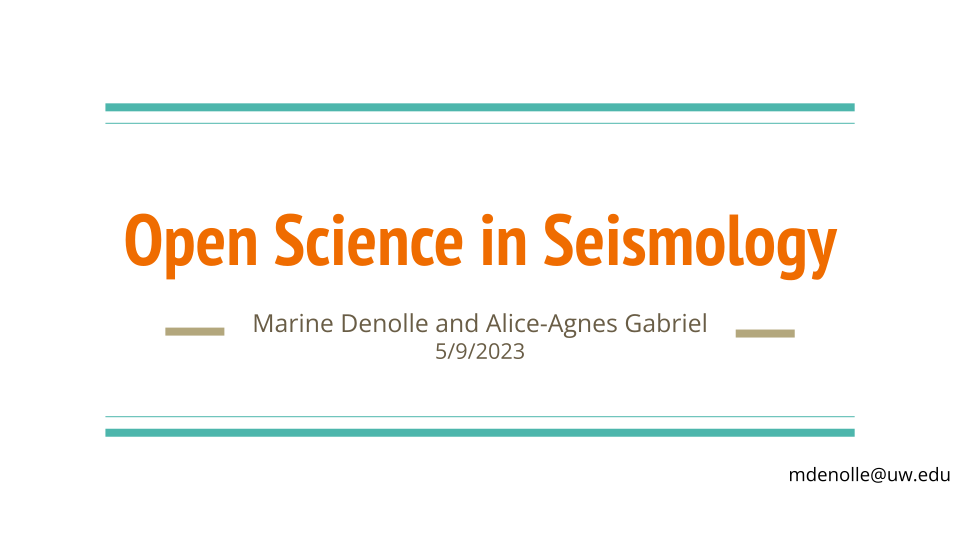

# 1.1 Ciencia abierta y reproducible

🖥️ [**Diapositivas — Sesión 01 (mié 30 sep)**](https://geo-smart.github.io/mlgeo-book/slides/2026/lec01_why_ml_geosciences.html)

La ciencia abierta y reproducible es el estándar de trabajo de este curso. Cada tarea y el proyecto final se califican, en parte, según si otra persona podría reejecutar su análisis y obtener su resultado. Esta página explica qué significa eso en la práctica: ciencia abierta, los principios FAIR, licencias, citación de datos, *preprints*, y por qué la reproducibilidad importa más ahora que la IA escribe buena parte del código.

Dos complementos de esta lección (no sustitutos, y por ahora en inglés):

[](https://docs.google.com/presentation/d/1SCrx65-Q_CB8JRMN81Uk-QniPvPE-wozRD7YDDQEapc/edit?usp=sharing)

[](https://www.youtube.com/watch?v=WeZ2vJxBuTg)

## ¿Qué es la ciencia abierta?

La ciencia abierta es la práctica de poner los productos de la investigación — datos, código, métodos y artículos — a disposición de otros para inspeccionarlos, reutilizarlos y construir sobre ellos. En las geociencias esto no es un ideal abstracto. La mayor parte de los datos que usamos en este libro (formas de onda sísmicas, posiciones GNSS, imágenes satelitales, reanálisis climáticos) existe porque agencias e investigadores los publicaron abiertamente: el Servicio Sismológico Nacional de México, el Centro Sismológico Nacional de Chile o el IDEAM colombiano publican sus catálogos y series igual que las agencias estadounidenses que verá en este libro. Cuando usted publica su propio trabajo de la misma manera, cierra el círculo.

La ciencia abierta tiene varios componentes:

- **Datos abiertos**: observaciones y conjuntos de datos derivados, depositados en archivos con documentación.
- **Código abierto**: código de análisis publicado bajo una licencia que permite la reutilización.
- **Métodos abiertos**: flujos de trabajo descritos (o programados) con suficiente detalle para repetirse.
- **Acceso abierto**: artículos legibles sin muro de pago, a menudo mediante *preprints*.

La reproducibilidad (*reproducibility*) es el hilo que une los cuatro. Un resultado es *reproducible* si alguien con su código y sus datos puede regenerar sus figuras y sus números. Es *replicable* si alguien con datos nuevos y código propio llega a la misma conclusión. Este curso califica lo primero y aspira a lo segundo.

## Principios FAIR

Los principios FAIR (Wilkinson et al., 2016) describen qué hace útiles los datos para otros:

- **Findable** (localizables): los datos tienen un identificador persistente (un DOI) y metadatos ricos, y están indexados en algún lugar donde se puedan buscar.
- **Accessible** (accesibles): los datos pueden recuperarse por un protocolo estándar (HTTPS, no «escríbale al autor»).
- **Interoperable** (interoperables): los datos usan formatos abiertos y documentados (CSV, NetCDF, HDF5, GeoTIFF) y vocabularios estándar, de modo que puedan leerse desde distintos lenguajes y herramientas.
- **Reusable** (reutilizables): los datos llevan una licencia clara y suficiente información de procedencia para que otra persona juzgue si sirven a su propósito.

Cuando arme un conjunto de datos listo para IA en el capítulo 2, aplicará estos principios a sus propios productos: archivar los datos, documentar la procedencia, adjuntar una licencia, obtener un DOI.

Los datos geocientíficos suelen ser datos sobre un lugar, y los datos sobre un lugar pueden acarrear obligaciones que un archivo de licencia no captura: regulaciones locales, acuerdos con comunidades o políticas nacionales de datos. Antes de asumir que publicar en abierto es apropiado, revise los términos bajo los cuales se recolectaron los datos.

## Licencias

Sin una licencia, otros no pueden legalmente reutilizar ni modificar su trabajo, aunque esté en un repositorio público. «Público» no significa «licenciado». Por eso, cada repositorio que usted cree en este curso lleva un archivo de licencia.

**Licencias de software.** Las opciones comunes de código abierto:

- **MIT** y **BSD**: permisivas. Cualquiera puede reutilizar el código, incluso con fines comerciales, siempre que conserve el aviso de derechos de autor. La mayoría de los paquetes científicos de Python (numpy, pandas, scikit-learn) las usan.
- **GPL**: *copyleft*. Se permite la reutilización, pero las obras derivadas deben llevar la misma licencia.

[choosealicense.com](https://choosealicense.com/) lo guía en la elección. Para el trabajo del curso, MIT es un valor por defecto sensato. El [capítulo de licencias de The Turing Way](https://book.the-turing-way.org/reproducible-research/licensing) ofrece una discusión más larga.

**Licencias de datos y texto.** Las licencias de software están escritas para código y se ajustan mal a los datos. Para conjuntos de datos, documentación y figuras, use Creative Commons:

- **CC-BY**: reutilización con atribución. La opción común para conjuntos de datos y artículos.
- **CC0**: dedicación al dominio público, sin condiciones. Común para datos donde rastrear la atribución es impracticable.

Un repositorio que contiene código y datos puede llevar dos licencias — por ejemplo, MIT para el código y CC-BY para los datos — con la separación declarada en el README.

## Qué contiene un repositorio reutilizable

Además de la licencia, un repositorio que otros (incluida su versión futura) puedan usar tiene:

- **README.md**: la pieza central de la documentación. Qué es el proyecto, cómo instalarlo, uso básico, cómo citarlo, dónde pedir ayuda. Vea buenos ejemplos en [awesome-readme](https://github.com/matiassingers/awesome-readme). Un bloque de citación en BibTeX pertenece aquí:

  ```
  @software{MLGeo,
  authors = {The GeoSMART team},
  year = 2023,
  doi = {10.5281/zenodo.7838345}
  }
  ```

- **LICENSE**: como arriba. Puede necesitar lenguaje separado para software y datos.
- **CONTRIBUTING.md**: qué contribuciones son bienvenidas y cómo hacerlas. [Awesome contributing guides](https://github.com/mntnr/awesome-contributing) tiene ejemplos.
- **Una especificación del entorno**: `pixi.toml` y `pixi.lock`, o `environment.yml`, o `requirements.txt`, para que el entorno de software pueda reconstruirse (vea [1.3](1.3_python_environment.md)).

Las lecciones [Intermediate Research Software Development](https://carpentries-incubator.github.io/python-intermediate-development/) de los Software Carpentries cubren esto en profundidad {cite:p}`software_carpentries_intermediate`.

## Citación de datos y DOI

Un DOI (identificador de objeto digital, *Digital Object Identifier*) es un identificador persistente que resuelve a un conjunto de datos, un artículo o una versión de software para siempre, aunque cambie la URL que lo aloja. Los datos con DOI pueden citarse como un artículo — así reciben crédito quienes los producen, y por eso los repositorios de datos exigen citar los datos que usted usa. Cuando este libro descarga datos GNSS del Nevada Geodetic Laboratory en [1.7](1.7_get_geodetic_gnss.ipynb), citamos a Blewitt et al. (2018). Haga lo mismo con cada conjunto de datos de su proyecto.

[Zenodo](https://zenodo.org), operado por el CERN, acuña DOI gratis y se integra con GitHub: enlace su repositorio una vez, y cada *release* de GitHub queda archivada en Zenodo con su propio DOI automáticamente. Así vuelve citable su proyecto final. GitHub documenta el flujo [aquí](https://docs.github.com/en/repositories/archiving-a-github-repository/referencing-and-citing-content). Los archivos disciplinarios (PANGAEA, EarthScope, los centros nacionales de datos) cumplen el mismo papel para datos observacionales.

## Preprints

Un *preprint* es el manuscrito publicado abiertamente antes de (o durante) la revisión por pares. En las ciencias de la Tierra, los servidores principales son [EarthArXiv](https://eartharxiv.org/) y [ESS Open Archive (ESSOAr)](https://essopenarchive.org/). Los *preprints* hacen disponibles los resultados meses o años antes que las revistas, llevan DOI y son citables. La mayoría de las revistas de geociencias permite publicarlos; revise la política de cada revista. Leer *preprints* también es parte del trabajo semanal de literatura en este curso, con la advertencia de siempre: un *preprint* aún no pasó por revisión por pares, así que léalo con el mismo ojo crítico que aprenderá a aplicar a la salida de la IA.

## Reproducibilidad en la era de la IA

Podría esperarse que los asistentes de IA vuelvan obsoleta la preocupación por la reproducibilidad: si el código puede regenerarse a demanda, ¿para qué archivarlo? Lo cierto es lo contrario.

- **El código generado por IA no es determinista.** Haga la misma pregunta dos veces al mismo asistente y obtendrá código distinto. El único registro de lo que usted realmente ejecutó es el código que confirmó (*commit*), en el entorno que fijó.
- **El volumen sube, el escrutinio por línea baja.** Un asistente puede producir en minutos un análisis que parece funcionar. Si calculó lo que usted cree que calculó es una pregunta aparte, y la respuesta vive en el código confirmado, no en su recuerdo del *prompt*.
- **La procedencia ahora incluye a la IA.** Declarar qué herramientas se usaron, y para qué, es parte de los métodos, exactamente igual que nombrar los paquetes de software y sus versiones. La política del curso está en [1.8](1.8_ai_in_your_workflow.md).
- **La verificación es el nuevo cuello de botella.** Cuando el código es barato, el artefacto reproducible — entorno fijado, datos anclados, flujo programado, salidas confirmadas — es lo que permite a un humano (usted, alguien de su equipo, quien revisa) comprobar el trabajo con eficiencia.

El capítulo 5 desarrolla esto en un flujo de trabajo completo: entornos como archivos de bloqueo, versionado de datos y seguimiento de experimentos. Por ahora, la regla es simple: todo lo que produjo una figura o un número en su proyecto está confirmado, licenciado y es reejecutable.

## Lecturas adicionales

- [The Turing Way](https://book.the-turing-way.org/) {cite:p}`the_turing_way_community_2022_6909298` — el manual de referencia de la investigación reproducible
- Wilkinson et al. (2016), [The FAIR Guiding Principles](https://doi.org/10.1038/sdata.2016.18)
