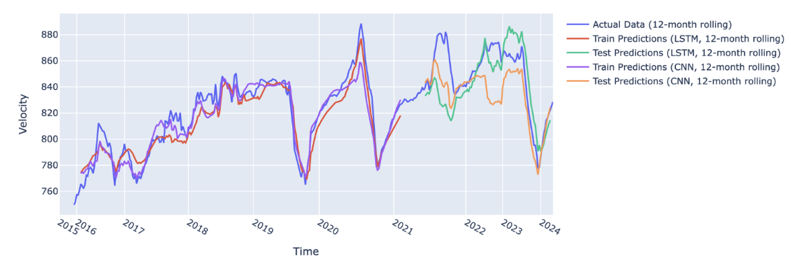

# 7.3 Galerie de cas d'usage

Des projets réels, issus de ce cours et de la communauté GeoSMART au sens large. Lisez chacun d'eux à travers les questions de ce chapitre : **qui était le public** du résultat, et **quel était le chemin d'impact** — qui pouvait agir sur ce résultat, et de quoi cette personne aurait-elle eu besoin que le projet fournissait, ou ne fournissait pas encore ? Cette galerie est aussi le meilleur étalon disponible pour dimensionner votre propre projet final : ces travaux ont été menés en dix semaines par des groupes comme le vôtre.

## La bibliothèque de cas d'usage GeoSMART

Le projet GEO-SMART maintient une collection de JupyterBooks exécutables présentant des cas d'usage de l'apprentissage automatique dans l'ensemble des géosciences — glaciologie, hydrologie, sismologie, planétologie — chacun constituant un flux de travail complet, des données à l'évaluation :

- [Livre des études de cas scientifiques GeoSMART](https://geo-smart.github.io/scm_geosmart_use_case/intro.html)
- [Site du projet GeoSMART](https://geo-smart.github.io/) — programme, cas d'usage et supports de *hackweek*

Ces documents sont écrits pour le public des *pairs de la discipline* (la première colonne de 7.1) : ils supposent que vous voulez réexécuter et adapter le flux de travail, si bien que le livrable est le livre exécutable lui-même.

## Projet de cours : prévision saisonnière de la vitesse de la glace — Claire Jensen (UW)

Prévision de séries temporelles de la vitesse de surface de la glace sur le Zachariæ Isstrøm, au nord-est du Groenland. Les données de vitesse de la glace sont des estimations dérivées de l'imagerie satellitaire issues du [Greenland Ice Sheet Mapping Project (GrIMP)](https://nsidc.org/grimp). Trois séries temporelles ont été agrégées en différents points du glacier, puis entraînées et testées séparément, avec des paramètres et des modèles optimaux différents pour chaque point. Des modèles classiques et profonds ont été comparés, dont LightGBM, RandomForest, LSTM, CNN et des *transformers* (Moirai).

- [Dépôt](https://github.com/cjense/seasonal-icevelocity-prediction) GitHub
- [Rapport](https://github.com/cjense/seasonal-icevelocity-prediction/blob/main/report%20and%20presentation/ESS_569_Final_Report.pdf) (étiquette de version 1cc81dd)
- [Présentation](https://github.com/cjense/seasonal-icevelocity-prediction/blob/main/report%20and%20presentation/ESS-569%20Final%20Presenation.pdf) (étiquette de version 1cc81dd)


**Figure** Moyenne glissante sur 12 mois des prévisions de vitesse à la fréquence de 6 jours, pour le CNN (entraînement en violet, test en jaune) et le LSTM (entraînement en rouge, test en vert), et la vérité terrain (en bleu).

*Au prisme du chapitre 7 :* le public visé est celui des glaciologues et de la communauté de la modélisation des calottes — le rapport parle dans leurs grandeurs (vitesse en des points nommés d'un émissaire glaciaire nommé, amplitude saisonnière) et se compare à leur référence par défaut (le modèle bat-il la climatologie saisonnière ?). Le chemin d'impact mène vers les projections de bilan de masse : un signal saisonnier de vitesse prévisible contraint les estimations de décharge à court terme pour l'un des plus grands émissaires encore en place au Groenland. Ce qu'un usage responsable en aval exigerait encore, dans les termes de 7.2 : une incertitude sur les prévisions et la preuve que les modèles point par point se transposent à des points, et à des années, sur lesquels ils n'ont pas été réglés — une déclaration de limites que le rapport assume franchement.

## Ajoutez votre projet

Anciennes et anciens étudiants : nous voulons que cette galerie s'étoffe. Ouvrez une *pull request* sur [le dépôt de ce livre](https://github.com/geo-smart/mlgeo-book) en ajoutant une entrée à cette page, selon le modèle ci-dessous. Gardez la figure sous 500 ko, pointez vers une version étiquetée de votre dépôt (pour que le lien désigne un état précis du travail), et incluez le paragraphe « au prisme du chapitre 7 » — c'est la partie dont les futurs étudiants apprennent le plus.

```markdown
## Course project: <Title> — <Name> (<Institution>, <year>)

<3-5 sentences: the question, the data (with link), the models compared,
and the headline result with its honest qualifier.>

- GitHub [repository](<url, at a version tag>)
- [Report](<url>) / [Presentation](<url>)


*Through the Chapter 7 lens:* <2-4 sentences: who the audience was and how
that shaped the deliverable; the impact path (who could act, on what
decision); and what responsible downstream use would still need.>
```
